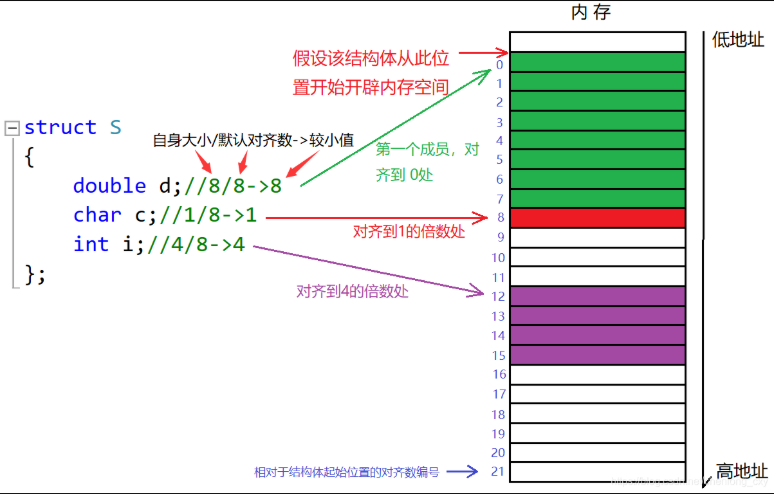

# 类

## 定义

1. 声明和定义全部放在类中。（如果成员函数在类中可能会被编译器当成内联函数）
2. 声明放头文件，定义放源文件。

## 访问限定符public/private/protected

1. public可以直接在类外访问
2. protected/private在类外不能访问
3. 访问权限从该访问限定符出现的位置开始直到下一个访问限定符出现时为止。
4. class的默认访问权限为private，struct为public（因为struct要兼容C）。

访问限定符只在编译时有用，数据映射到内存后没有区别。

## 作用域

类定义了一个新的作用域，类的所有成员都在类的作用域中。在类体外定义成员，需要使用“::”作用域解析符指明成员属于哪个类域。

**一个类的大小，实际就是该类中“成员变量”之和，当然也要进行内存对齐，注意空类的大小，空类比较特殊，编译器给了空类一个字节来唯一标识这个类（占位）。**

## 内存对齐



结构体也有自己的大小，但是**结构体的大小并不是简单地将每个结构体成员的大小相加就能得到。**

**对齐数** = 该结构体成员变量自身的大小与编译器默认的一个对齐数的较小值。

```c++
#pragma pack()
```

可以修改编译器的默认对齐数

## this指针

类的方法存放在代码段，那么怎么判断是哪个对象调用了这个方法呢？传入this指针。

**C++编译器给每个“非静态的成员函数”增加了一个隐藏的指针参数，让该指针指向当前对象（函数运行时调用该函数的对象），在函数体中所有成员变量的操作，都是通过该指针去访问的。只不过所有操作对用户是透明的，即用户不需要来传递，而是编译器自动完成。**

每个成员函数的第一个形参实际上是一个隐含的this指针。

特性：

1. this指针的类型：类类型* const。
2. this指针只能在“成员函数”的内部使用。
3. this指针本质上其实是一个成员函数的形参，是对象调用成员函数时，将对象地址作为实参传递给this形参。所以对象中不存储this指针。
4. this指针是成员函数第一个隐含的指针形参，一般情况由编译器通过ecx寄存器自动传递，不需要用户传递。

# 类默认六个成员函数

不写这六个函数编译器会自动生成

## 构造函数

~~~c++
class Date
{
public:
	Date(int year = 0, int month = 1, int day = 1)// 构造函数
	{
		_year = year;
		_month = month;
		_day = day;
	}
	void Print()
	{
		cout << _year << "年" << _month << "月" << _day << "日" << endl;
	}
private:
	int _year;
	int _month;
	int _day;
};
~~~

**一、构造函数的函数名与类名相同**

**二、构造函数无返回值**

这里所说的构造函数无返回值是真的无返回值，而不是说返回值为void。

**三、对象实例化时编译器自动调用对应的构造函数**

当你用类创建一个对象时，编译器会自动调用该类的构造函数对新创建的变量进行初始化。

**四、构造函数支持重载**

这意味着你可以有多种初始化对象的方式，编译器会根据你所传递的参数去调用对应的构造函数。

**五、无参的构造函数、全缺省的构造函数以及我们不写编译器自动生成的构造函数都称为默认构造函数，并且**

**默认构造函数只能有一个**

初学C++时，你可能认为只有当我们不写，编译器自动生成的构造函数才被称为默认构造函数。其实并不是这样

的，以下3种都叫做默认构造函数：

 1、我们不写，编译器自动生成的构造函数。

 2、我们自己写的无参的构造函数。

 3、我们自己写的全缺省的构造函数。

总而言之，无需传参就可以调用的构造函数就是默认构造函数。

**六、如果类中没有显示定义构造函数，则C++编译器会自动生成一个无参的默认构造函数，若用户显示定义了，**

**则编译器就不再生成**

## 析构函数

**一、析构函数的函数名是在类名前加上字符‘~’**

**二、析构函数无参数，无返回值 析构函数所谓的无返回值也是真的无返回值，而不是返回值为void。**

**三、对象生命周期结束时，C++编译器会自动调用析构函数**

 这就大大降低了C语言中栈空间忘记释放问题的发生，因为当栈对象生命周期结束时，C++编译器会自动调用析

构函数对其栈空间进行释放。

**四、一个类有且只有一个析构函数。若未显示定义系统会自动生成默认的析构函数**

编译器自动生成的析构函数机制：

 1、编译器自动生成的析构函数对内置类型不做处理。

 2、对于自定义类型，编译器会再去调用它们自己的默认析构函数。

**五、先构造的后析构，后构造的先析构**

 因为对象是定义在函数中的，函数调用会建立栈帧，栈帧中的对象构造和析构也要符合先进后出的原则。

## 拷贝构造函数

只有单个形参，该形参是对本类类型对象的引用（一般常用从const修饰），在用已存在的类类型对象创建新对象时由编译器自动调用。

特性：

**一、拷贝构造函数是构造函数的一个重载形式**

因为拷贝构造函数的函数名也与类名相同。

**二、拷贝构造函数的参数只有一个且必须使用引用传参，使用传值方式会引发无穷递归调用**

要调用拷贝构造函数就需要先传参，若传参使用传值传参，那么在传参过程中又需要进行对象的拷贝构造，如此循环往复，最终引发无穷递归调用。

**三、若未显示定义拷贝构造函数，系统将生成默认的拷贝构造函数**

**编译器自动生成的拷贝构造函数机制：**

 1、编译器自动生成的拷贝构造函数对内置类型会完成浅拷贝（值拷贝）。

 2、对于自定义类型，编译器会再去调用它们自己的默认拷贝构造函数。

**四、编译器自动生成的拷贝构造函数不能实现深拷贝**

## 赋值运算符重载

**函数原型：返回值 operator运算符(参数列表)**

1. 不能通过连接其他符号来创建新的操作符：比如operator@。
2. 重载操作符必须有一个类类型或枚举类型的操作数。
3. 用于内置类型的操作符，重载后其含义不能改变
4. 作为类成员的重载函数时，**函数有一个默认的形参this，限定为第一个形参**。
5. sizeof 、:: 、.* 、?: 、. 这5个运算符不能重载。

**一、参数类型设置为引用，并用const进行修饰**

 赋值运算符重载函数的第一个形参默认是this指针，第二个形参是我们赋值运算符的右操作数。
 由于是自定义类型传参，我们若是使用传值传参，会额外调用一次拷贝构造函数，所以函数的第二个参数最好使用引用传参（第一个参数是默认的this指针，我们管不了）。
 其次，第二个参数，即赋值运算符的右操作数，我们在函数体内不会对其进行修改，所以最好加上const进行修饰。

**二、函数的返回值使用引用返回**

 实际上，我们若是只以d2 = d1这种方式使用赋值运算符，赋值运算符重载函数就没必要有返回值，因为在函数体内已经通过this指针对d2进行了修改。但是为了支持连续赋值，即d3 = d2 = d1，我们就需要为函数设置一个返回值了，而且很明显，返回值应该是赋值运算符的左操作数，即this指针指向的对象。
 和使用引用传参的道理一样，为了避免不必要的拷贝，我们最好还是使用引用返回，因为此时出了函数作用域this指针指向的对象并没有被销毁，所以可以使用引用返回。

**三、赋值前检查是否是给自己赋值**

 若是出现d1 = d1，我们不必进行赋值操作，因为自己赋值给自己是没有必要进行的。所以在进行赋值操作前可以先判断是否是给自己赋值，避免不必要的赋值操作。

**四、引用返回的是*this***

 赋值操作进行完毕时，我们应该返回赋值运算符的左操作数，而在函数体内我们只能通过this指针访问到左操作数，所以要返回左操作数就只能返回*this。

**五、一个类如果没有显示定义赋值运算符重载，编译器也会自动生成一个，完成对象按字节序的值拷贝**

 没错，赋值运算符重载编译器也可以自动生成，并且也是支持连续赋值的。但是编译器自动生成的赋值运算符重载完成的是对象按字节序的值拷贝，例如d2 = d1，编译器会将d1所占内存空间的值完完全全地拷贝到d2的内存空间中去，类似于memcpy。
 对于日期类，编译器自动生成的赋值运算符重载函数就可以满足我们的需求，我们可以不用自己写。但是这也不意味着所有的类都不用我们自己写赋值运算符重载函数，当遇到一些特殊的类，我们还是得自己动手写赋值运算符函数的。

```c++
Date d1(2021, 6, 1);
Date d2(d1);
Date d3 = d1;
```

二行三行用的都是拷贝构造函数

**拷贝构造函数**：用一个已经存在的对象去构造初始化另一个即将创建的对象。

**赋值运算符重载函数**：在两个对象都已经存在的情况下，将一个对象赋值给另一个对象

## const成员

### const修饰类的成员函数

我们将const修饰的类成员函数称之为const成员函数，const修饰类成员函数，实际修饰的是类成员函数隐含的

this指针，表明在该成员函数中不能对this指针指向的对象进行修改。

例如：

```c++
void Print()const// cosnt修饰的打印函数
{
    cout << _year << "年" << _month << "月" << _day << "日" << endl;
}
//防止方法不小心修改对象数据
```

1. const对象可以调用非const成员函数吗？

   **不可以** 非const成员函数，即成员函数的this指针没有被const所修饰，我们传入一个被const修饰的对象，用没有被const修饰的this指针进行接收，属于权限的放大，函数调用失败。

2. 非const对象可以调用const成员函数吗？

   **可以** const成员函数，即成员函数的this指针被const所修饰，我们传入一个没有被const修饰的对象，用被const修饰的this指针进行接收，属于权限的缩小，函数调用成功。

3. const成员函数内可以调用其它的非const成员函数吗？

   **不可以** 在一个被const所修饰的成员函数中调用其他没有被const所修饰的成员函数，也就是将一个被const修饰的this指针的值赋值给一个没有被const修饰的this指针，属于权限的放大，函数调用失败。

4. 非const成员函数内可以调用其它const成员函数吗？

   **可以** 在一个没有被const所修饰的成员函数中调用其他被const所修饰的成员函数，也就是将一个没有被const修饰的this指针的值赋值给一个被const修饰的this指针，属于权限的缩小，函数调用成功。

## 取地址操作符和const取地址操作符

一般用编译器自动生成的

```c++
class Date
{
public:
	Date* operator&()// 取地址操作符重载
	{
		return this;
	}
	const Date* operator&()const// const取地址操作符重载
	{
		return this;
	}
private:
	int _year;
	int _month;
	int _day;
};
```

# 构造函数

初始化列表

注意事项：

**一、每个成员变量在初始化列表中只能出现一次**

 因为初始化只能进行一次，所以同一个成员变量在初始化列表中不能多次出现。

**二、类中包含以下成员，必须放在初始化列表进行初始化：**

**1.引用成员变量**

 引用类型的变量在定义时就必须给其一个初始值，所以引用成员变量必须使用初始化列表对其进行初始化。

**2.const成员变量**

 被const修饰的变量也必须在定义时就给其一个初始值，也必须使用初始化列表进行初始化。

**3.自定义类型成员（该类没有默认构造函数）**

 若一个类没有默认构造函数，那么我们在实例化该类对象时就需要传参对其进行初始化，所以实例化没有默认构造函数的类对象时必须使用初始化列表对其进行初始化。

在这里再声明一下，默认构造函数是指不用传参就可以调用的构造函数：
 1.我们不写，编译器自动生成的构造函数。
 2.无参的构造函数。
 3.全缺省的构造函数。

**三、尽量使用初始化列表初始化**

**四、成员变量在类中声明的次序就是其在初始化列表中的初始化顺序，与其在初始化列表中的先后顺序无关**

## explicit关键字

禁止单参数构造函数的隐式转换可以用explicit关键字

# static成员

**静态成员变量一定要在类外进行初始化**。

**一、静态成员为所以类对象所共享，不属于某个具体的对象**

**二、静态成员变量必须在类外定义，定义时不添加static关键字**

```c++
class Test
{
private:
	static int _n;
};
// 静态成员变量的定义初始化
int Test::_n = 0;
```

**三、静态成员函数没有隐藏的this指针，不能访问任何非静态成员**

**四、访问静态成员变量的方法**

1. 当静态类成员变量为共有时

   ```c++
   #include <iostream>
   using namespace std;
   class Test
   {
   public:
   	static int _n; //公有
   };
   // 静态成员变量的定义初始化
   int Test::_n = 0;
   int main()
   {
   	Test test;
   	cout << test._n << endl; //1.通过类对象突破类域进行访问
   	cout << Test()._n << endl; //3.通过匿名对象突破类域进行访问
   	cout << Test::_n << endl; //2.通过类名突破类域进行访问
   	return 0;
   }
   ```

2. 当静态类成员变量为私有时

   ```c++
   #include <iostream>
   using namespace std;
   class Test
   {
   public:
   	static int GetN()
   	{
   		return _n;
   	}
   private:
   	static int _n;
   };
   // 静态成员变量的定义初始化
   int Test::_n = 0;
   int main()
   {
   	Test test;
   	cout << test.GetN() << endl; //1.通过对象调用成员函数进行访问
   	cout << Test().GetN() << endl; //2.通过匿名对象调用成员函数进行访问
   	cout << Test::GetN() << endl; //3.通过类名调用静态成员函数进行访问
   	return 0;
   }
   ```

**五、静态成员和类的普通成员一样，也有public、private和protected这三种访问级别**

所以当静态成员变量设置为private时，尽管我们突破了类域，也不能对其进行访问。

**注意区分两个问题：**

**1、静态成员函数可以调用非静态成员函数吗？**

不可以。因为非静态成员函数的第一个形参默认为this指针，而静态成员函数中没有this指针，故静态成员函数不可调用非静态成员函数。

**2、非静态成员函数可以调用静态成员函数吗？**

可以。因为静态成员函数和非静态成员函数都在类中，在类中不受访问限定符的限制。


C++11支持非静态成员变量在声明时进行初始化赋值，但是要注意这里不是初始化，这里是**给声明的成员变量一个缺省值**。

```c++
class A
{
public:
	void Print()
	{
		cout << _a << endl;
		cout << _p << endl;
	}
private:
	// 非静态成员变量，可以在成员声明时给缺省值。
	int _a = 10; 
	int* _p = (int*)malloc(4);
	static int _n; //静态成员变量不能给缺省值
};
```

