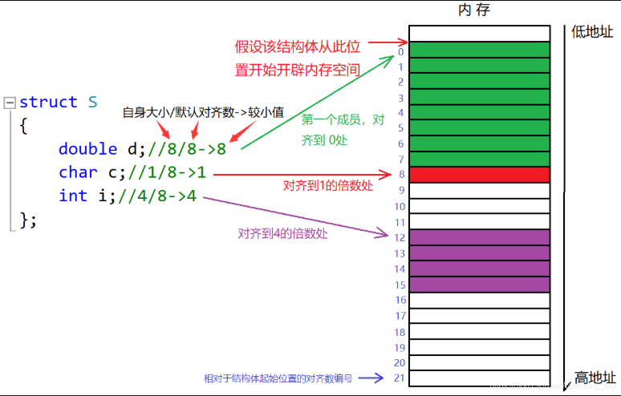

> [!NOTE]
>
> 类和对象

# 类

## 定义

1. 声明和定义全部放在类中。（如果成员函数在类中可能会被编译器当成内联函数）
2. 声明放头文件，定义放源文件。

## 访问限定符public/private/protected

1. public可以直接在类外访问
2. protected/private在类外不能访问
3. 访问权限从该访问限定符出现的位置开始直到下一个访问限定符出现时为止。
4. class的默认访问权限为private，struct为public（因为struct要兼容C）。

访问限定符只在编译时有用，数据映射到内存后没有区别。

关于三种不同的继承详细看继承章节笔记

## 作用域

类定义了一个新的作用域，类的所有成员都在类的作用域中。在类体外定义成员，需要使用`::`作用域解析符指明成员属于哪个类域。

**一个类的大小，实际就是该类中“成员变量”之和，当然也要进行内存对齐，注意空类的大小，空类比较特殊，编译器给了空类一个字节来唯一标识这个类（占位）。**

## 内存对齐



结构体也有自己的大小，但是**结构体的大小并不是简单地将每个结构体成员的大小相加就能得到。**

**对齐数** = 该结构体成员变量自身的大小与编译器默认的一个对齐数的较小值。

```c++
#pragma pack()
```

可以修改编译器的默认对齐数

举个内存对齐的例子

```c++
// 情况 A：顺序凌乱
struct BadLayout {
    char a;      // 1字节
    // 这里会填充 7 个字节的 Padding，为了让 b 对齐到 8 字节地址
    double b;    // 8字节
    int c;       // 4字节
    // 整体为了是 8 的倍数，末尾再填充 4 个字节
}; // sizeof = 24

// 情况 B：由大到小排序（最佳实践）
struct GoodLayout {
    double b;    // 8字节
    int c;       // 4字节
    char a;      // 1字节
    // 末尾填充 3 个字节，使整体大小为最大成员(8)的倍数
}; // sizeof = 16
```

> **面试官：** “在一个 64 位系统中，假设有一个类里面只有一个 `int` 成员和一个 `char` 成员，这个类的大小是多少？
>
> 如果我在这个类里增加一个虚函数，大小会变成多少？”

**第一问**：`int`(4) + `char`(1) = 5 -> 向上对齐到最大成员 4 的倍数 -> **8 字节**。

**第二问**：增加虚函数意味着增加了 `vptr`（虚表指针）。在 64 位系统中，指针是 **8 字节**。

- 此时最大成员变成了 8 字节。
- 内存布局：`vptr`(8) + `int`(4) + `char`(1) = 13 -> 向上对齐到 8 的倍数 -> **16 字节**。

> 内存对齐的其它例子

```c++
struct BadActor {
    char a;    // 1字节
    // 这里会填充 3 个字节的 Padding
    int b;     // 4字节
    char c;    // 1字节
    // 这里会填充 3 个字节的 Padding
}; // sizeof(BadActor) = 12 字节！明明只有 6 字节数据。
```

```c++
#include <iostream>

struct BadActorDouble {
    char a;     // 1 byte
    // padding 7 bytes
    double b;   // 8 bytes
    char c;     // 1 byte
    // padding 7 bytes
};//24字节
```

```c++
struct GoodActor {
    int b;     // 4字节
    char a;    // 1字节
    char c;    // 1字节
    // 后面填充 2 字节以对齐 4 字节边界
}; // sizeof(GoodActor) = 8 字节。
```

```c++
struct Example {
    char a;     // 1 byte，偏移 0
    // 填充 3 bytes（为了对齐int到4字节边界）
    int b;      // 4 bytes，偏移 4
    // 这里不需要填充，因为偏移 8 正好满足 double 的 8 字节对齐
    double c;   // 8 bytes，偏移 8
};
// sizeof = 16 bytes
```

## this指针

类的方法存放在代码段，那么怎么判断是哪个对象调用了这个方法呢？传入this指针。

**C++编译器给每个“非静态的成员函数”增加了一个隐藏的指针参数，让该指针指向当前对象（函数运行时调用该函数的对象），在函数体中所有成员变量的操作，都是通过该指针去访问的。只不过所有操作对用户是透明的，即用户不需要来传递，而是编译器自动完成。**

每个成员函数的第一个形参实际上是一个隐含的this指针。

特性：

1. this指针的类型：`ClassName* const this`
   - `ClassName*`保证了指针指向的是当前类类型的实例
   - `const`保证了指针本身是不可修改的
2. this指针只能在“成员函数”的内部使用。
3. this指针本质上其实是一个成员函数的形参，是对象调用成员函数时，将对象地址作为实参传递给this形参。所以对象中不存储this指针。
4. this指针是成员函数第一个隐含的指针形参，`this` 指针通常**不会通过栈传递**，而是直接通过**寄存器**传递。

### this指针的Thunk

# 空类

```c++
class Empty{
    
};
```

`sizeof`的结果是1字节。

如果你定义了一个 `Empty arr[10];`，如果空类的大小是 0，那么这 10 个对象的地址将完全相同。

违背了任何独立的对象都必须有**独一无二的内存地址**的规定。

若

```c++
class HasVirtual {
    virtual void Foo() {}
};
```

`sizeof`会变为8字节

> 如果类 `A` 是空类，类 `B` 继承自 `A` 且 `B` 也有一个 `int` 成员，那么 `sizeof(B)` 是多少？

直觉回答：`sizeof(A)` 是 1，`int` 是 4，加上对齐，应该是 8 吧？

专家回答：是 **4**。

原因：这被称为 **EBO（空基类优化）**。编译器意识到 `A` 是空的，为了节省空间，它允许子类 `B` 的第一个成员与父类共享地址，从而省去了那个没用的 1 字节占位符。

# 嵌套类

嵌套类的特点：

- 嵌套类和外层类是两个独立的类，只是作用域包在了一起。

- 在现代 C++ 中，**嵌套类是外层类的“天然好友”**。这意味着嵌套类可以直接访问外层类的 `private` 成员（通过外层类实例），反之亦然。这在实现**迭代器**模式时非常有用。
- 嵌套类仅仅是**作用域**的嵌套

嵌套类的构造函数：

1. 如果仅仅是**定义**了嵌套类，外层类初始化时**完全不会**调用嵌套类的构造函数（因为它根本没被实例化）。
2. 如果外层类持有一个嵌套类的**实例作为成员**，那么外层类初始化时**会自动调用**该成员的默认构造函数。

```c++
class Outer {
public:
    // 嵌套类定义（仅定义，不占 Outer 空间）
    class Inner {
    public:
        Inner() { std::cout << "Inner Constructed\n"; }
    };

    // 真正的成员对象
    Inner m_inner; 

    Outer() { std::cout << "Outer Constructed\n"; }
};

int main() {
    Outer o; 
    // 输出：
    // Inner Constructed
    // Outer Constructed
}
```

**初始化列表**：`Outer() : m_inner() {}`。这直接调用 `Inner` 的构造函数，一步到位。

**函数体赋值**：`Outer() { m_inner = Inner(); }`。

**函数体赋值代价**：编译器会先调用 `Inner` 的默认构造函数创建一个“空白”的 `m_inner`，然后创建一个临时的 `Inner` 对象，再调用 `operator=` 赋值给 `m_inner`，最后销毁临时对象。

# 聚合类

聚合类是**“可以直接初始化的数据集合”**。它没有复杂的虚函数、没有私有的成员，就像是一个简单的“数据包”。

满足聚合类的条件：

1. 没有用户定义的构造函数
2. 没有私有或保护的非静态数据成员
3. 没有虚函数
4. 没有基类（17之后允许public基类）

聚合类可以使用大括号初始化

```c++
struct Point{
    int x;
    int y;
};

Point p{10,20};
```

**零初始化开销**：聚合类的初始化往往被编译器优化为简单的内存拷贝，甚至在编译期就确定了布局。

**面试陷阱**：如果你在 `Point` 里加了一个构造函数 `Point(int _x, int _y) : x(_x), y(_y) {}`，它就**不再是**聚合类了。此时，`Point p = {10, 20};` 就不再是直接填充内存，而是通过调用你的构造函数来完成。

# 类默认八个成员函数

构造函数、析构函数、拷贝构造、赋值运算、移动构造、移动赋值、取地址、const取地址

不写这八个函数编译器会自动生成、但C++11后两个基本不会手动重载 因为很简单

```c++
T* operator&() { return this; }
const T* operator&() const { return this; }
```

C++11引入了`std::addressof`即使作死重载了 `operator&`，`std::addressof` 也会通过一系列复杂的 `reinterpret_cast` 和位操作，绕过你的重载函数，直接拿回对象在内存中的原始起始地址。

## 构造函数

~~~c++
class Date
{
public:
	Date(int year = 0, int month = 1, int day = 1)// 构造函数
	{
		_year = year;
		_month = month;
		_day = day;
	}
	void Print()
	{
		cout << _year << "年" << _month << "月" << _day << "日" << endl;
	}
private:
	int _year;
	int _month;
	int _day;
};
~~~

### 基础规则

**一、构造函数的函数名与类名相同**

**二、构造函数无返回值**

这里所说的构造函数无返回值是真的无返回值，而不是说返回值为void。

**三、对象实例化时编译器自动调用对应的构造函数**

当你用类创建一个对象时，编译器会自动调用该类的构造函数对新创建的变量进行初始化。

**四、构造函数支持重载**

这意味着你可以有多种初始化对象的方式，编译器会根据你所传递的参数去调用对应的构造函数。

**五、无参的构造函数、全缺省的构造函数以及我们不写编译器自动生成的构造函数都称为默认构造函数，并且默认构造函数只能有一个**

初学C++时，你可能认为只有当我们不写，编译器自动生成的构造函数才被称为默认构造函数。其实并不是这样

的，以下3种都叫做默认构造函数：

 1、我们不写，编译器自动生成的构造函数。

 2、我们自己写的无参的构造函数。

 3、我们自己写的全缺省的构造函数。

总而言之，无需传参就可以调用的构造函数就是默认构造函数。

**六、如果类中没有显示定义构造函数，则C++编译器会自动生成一个无参的默认构造函数，若用户显示定义了，则编译器就不再生成**

### 其它规则

关初始化列表：

**一、每个成员变量在初始化列表中只能出现一次**

因为初始化只能进行一次，所以同一个成员变量在初始化列表中不能多次出现。

**二、类中包含以下成员，必须放在初始化列表进行初始化：**

**1.引用成员变量**

引用类型的变量在定义时就必须给其一个初始值，所以引用成员变量必须使用初始化列表对其进行初始化。

**2.const成员变量**

被const修饰的变量也必须在定义时就给其一个初始值，也必须使用初始化列表进行初始化。

**3.自定义类型成员（该类没有默认构造函数）**

若一个类没有默认构造函数，那么我们在实例化该类对象时就需要传参对其进行初始化，所以实例化没有默认构造函数的类对象时必须使用初始化列表对其进行初始化。

**三、尽量使用初始化列表初始化**

**四、成员变量在类中声明的次序就是其在初始化列表中的初始化顺序，与其在初始化列表中的先后顺序无关**

### 其它问题

> `=default`与`{}`的性能与语义的区别

**`Player() {}`**：你定义了一个**用户提供**的构造函数。编译器认为你已经接管了构造过程。

**`Player() = default;`**：你显式要求编译器生成**标准定义**的默认构造函数。

**聚合类**：如果你写了 `{}`，这个类就不再是“聚合类”了，这意味着你不能使用大括号初始化，如 `Player p = {100};`。

**平凡性**：使用 `=default` 生成的构造函数可能是“平凡的”。在底层，这意味着 `std::vector` 或其他容器在处理这个类时，可以使用 `memmove` 或 `memset` 等极致的内存拷贝优化，而一旦你写了 `{}`，这些优化可能全部失效。

> 父类没有默认构造函数时，子类会发生什么？

1. 编译器在生成子类的构造函数时会尝试调用父类的默认构造函数
2. 如果父类定义了一个带参数的构造函数，编译器的默认构造函数就不再生成
3. 此时子类不显式的调用父类的带参构造函数，编译器就会因为找不到父类的默认构造函数而报错。

但是：

上面也说了，自己写的无参构造函数也是默认构造函数，此时不会发生编译器报错。

> 在一个类中，如果有两个成员变量 `int a;` 和 `int b;`。我在初始化列表中写成 `: b(10), a(b) {}`（先初始化 b 再用 b 初始化 a）。请问最终 `a` 的值一定是 10 吗？为什么？

成员变量的初始化顺序**只由它们在类中声明（定义）的顺序决定**，与你在初始化列表中写的先后顺序完全无关。

由于 `a` 在类中先声明，编译器会先执行 `a(b)`。但此时 `b` 的初始化逻辑还没运行，`b` 内存里还是随机的“垃圾值”。

## 析构函数

**一、析构函数的函数名是在类名前加上字符‘~’**

**二、析构函数无参数，无返回值 析构函数所谓的无返回值也是真的无返回值，而不是返回值为void。**

**三、对象生命周期结束时，C++编译器会自动调用析构函数**

这就大大降低了C语言中栈空间忘记释放问题的发生，因为当栈对象生命周期结束时，C++编译器会自动调用析构函数对其栈空间进行释放。

**四、一个类有且只有一个析构函数。若未显示定义系统会自动生成默认的析构函数**

编译器自动生成的析构函数机制：

 1、编译器自动生成的析构函数对内置类型不做处理。

 2、对于自定义类型，编译器会再去调用它们自己的默认析构函数。

**五、先构造的后析构，后构造的先析构？**

因为对象是定义在函数中的，函数调用会建立栈帧，栈帧中的对象构造和析构也要符合先进后出的原则。

> 析构函数不可以抛出异常

```c++
void f() {
    A a;
    B b;
    C c;
    throw std::runtime_error("err");
}
```

当异常发生后，语言保证三件事：

1. 停止执行当前语句之后的代码
2. 按“构造的逆序”析构已经完成的构造对象
3. 继续上抛知道被`cache`

```c++
构造：A → B → C
异常
析构：~C → ~B → ~A
```

这一步叫栈展开

若

```c++
struct X {
    ~X() {
        throw std::runtime_error("boom");
    }
};
void f() {
    X x;
    throw std::runtime_error("outer");
}
```

原本已有一个异常，析构函数又抛出一个异常，双异常同时存在，所以直接`std::terminate()`

所以最好

```c++
~X() noexcept;
```

C++11之后默认是noexcept(true)

## 拷贝构造函数

### 基础规则

只有单个形参，该形参是对本类类型对象的引用（一般常用从const修饰），在用已存在的类类型对象创建新对象时由编译器自动调用。

特性：

**一、拷贝构造函数是构造函数的一个重载形式**

因为拷贝构造函数的函数名也与类名相同。

**二、拷贝构造函数的参数只有一个且必须使用引用传参，使用传值方式会引发无穷递归调用**

**三、若未显示定义拷贝构造函数，系统将生成默认的拷贝构造函数**

**编译器自动生成的拷贝构造函数机制：**

 1、编译器自动生成的拷贝构造函数对内置类型会完成浅拷贝（值拷贝）。

 2、对于自定义类型，编译器会再去调用它们自己的默认拷贝构造函数。

**四、编译器自动生成的拷贝构造函数不能实现深拷贝**

### 其它问题

> “既然编译器会自动生成拷贝构造函数，那为什么在处理含有 `std::vector` 或 `std::string` 成员的类时，我们通常不需要手动编写拷贝构造函数，而处理原始指针时却必须编写？

如果类的成员包含指针，而不手写拷贝构造函数，那么编译器的生成版本只会浅拷贝，导致两个指针指向一个地方。

```c++
class Texture {
    char* data;
public:
    Texture() { data = new char[1024]; }
    ~Texture() { delete[] data; }
};

Texture t1;
Texture t2 = t1; // 默认拷贝：t1.data 和 t2.data 指向同一块内存
```

所以必须写为

```c++
class Texture {
    char* data;
    size_t size;
public:
    // 拷贝构造函数
    Texture(const Texture& other) {
        size = other.size;
        data = new char[size];             // 1. 开辟自己的空间
        memcpy(data, other.data, size);    // 2. 搬运数据
    }
};
```

> `std::vector` 会自动处理拷贝。那如果我的类里有一个 `std::unique_ptr` 成员，但我没有写任何构造函数。请问这时候，编译器生成的默认拷贝构造函数还能工作吗？为什么？

这种情况下，这个类的拷贝功能被禁用，但是移动功能仍然生效。

对于包含`std::unique_ptr<T>`的类：

- 由于`unique_ptr`显式的禁用了拷贝构造`=delete`，编译器会将类的拷贝构造函数也标记为`=delete`
- 由于`unique_ptr`实现了移动语义，编译器可以顺利生成类的移动函数

```c++
#include <memory>

class ResourceManager {
    std::unique_ptr<int> data; // 独占资源
};

int main() {
    ResourceManager a;
    // ResourceManager b = a;    // 编译错误！拷贝构造函数已被自动删除
    ResourceManager c = std::move(a); // 正常工作！编译器生成了默认移动构造
}
```

> 如果类中有一个成员变量也是引用类型（比如 `int& m_ref`），编译器生成的默认拷贝构造函数会如何处理这个成员？

编译器生成的默认拷贝构造函数，其参数依然是引用，但它对成员的处理方式是“成员级初始化"

如果类中包含引用类型的成员（如 `int&`），编译器生成的默认拷贝构造函数**可以工作**，它的行为是：**直接拷贝引用本身。**

**底层结果：** 拷贝后的新对象中的引用成员，将指向和原对象中引用成员**完全相同的内存地址**。

```c++
class Bridge {
public:
    int& ref;
    Bridge(int& target) : ref(target) {} // 构造函数初始化引用
};

int main() {
    int gold = 100;
    Bridge b1(gold);   // b1.ref 指向 gold
    
    Bridge b2 = b1;    // 触发默认拷贝构造
                       // 此时 b2.ref 也指向 gold
                       
    b2.ref = 200;      // 通过 b2 修改
    // 结果：gold 变成了 200，b1.ref 也是 200
}
```

**这种情况下`operator=`失效**

如果类中包含引用成员，编译器拒绝生成默认的拷贝复制运算符。

因为引用一旦初始化，就永远不能重新绑定到另外一个变量。

> 既然引用成员会导致赋值运算符禁用，那么const成员变量会发生统一的事吗？

对于拷贝构造函数：

拷贝构造函数是在**对象诞生**的那一刻调用的。 对于 `const` 成员，只要是在**初始化列表**中进行的初始化，就是合法的。

- 编译器生成的默认拷贝构造函数会使用初始化列表。它不是先创建对象再赋值，而是在内存分配后、构造函数体执行前，直接把源对象的值“填入”新对象的 `const` 成员中。
- 包含 `const` 成员的类，其**默认拷贝构造函数可以正常生成并工作**。

对于赋值运算符：

赋值运算（`operator=`）是针对**已经存在**的对象进行的。

-  `const` 成员一旦在构造时确定了值，在对象的整个生命周期内，其内存区域就被标记为“不可修改”。
- 编译器生成的默认赋值运算符试图执行 `this->ID = other.ID;`。但由于 `ID` 是 `const`，这种操作在语法和底层逻辑上都是非法的。
- 就像引用成员一样，如果类中包含 `const` 成员，编译器会**拒绝生成**默认的赋值运算符。

> 为什么拷贝构造的参数不传入引用会导致无限递归

拷贝构造函数的参数**必须**是引用（通常是 `const T&`）。如果你尝试写成按值传递，编译器其实会直接报错（如：`error: invalid constructor; you probably meant 'Hero(const Hero&)'`）。

但是假如不报错，会发生什么？

要调用拷贝构造函数就需要先传参，若传参使用传值传参，那么在传参过程中又需要进行对象的拷贝构造，如此循环往复，最终引发无穷递归调用：

- 当你执行 `Hero h2 = h1;` 时，你试图调用拷贝构造函数。
- 因为拷贝构造函数定义为 `Hero(Hero other)`（假设是值传递），在进入函数体之前，编译器必须先将实参 `h1` 传递给形参 `other`。
- 将一个对象按值传递给函数，本质上是**利用该对象的拷贝构造函数来创建一个新的临时副本**。
- 为了调用拷贝构造→先传参→为了传参进行拷贝，调用拷贝构造→...

> 拷贝构造函数的参数可以是 `Hero&`（非 const）吗？既然引用解决了递归，那如果不加 `const`，只写 `Hero(Hero& other)` 可以吗？

可以编译通过，但它是**极度危险且不专业**的

**无法接受临时对象**：非 const 引用无法绑定到临时对象（右值）。例如 `Hero h2 = GetTempHero();` 将无法编译。

**违背语义**：拷贝构造函数的目的应该是“读取”源对象并复制，而不应该有权限修改源对象。不加 `const` 意味着你可能会在拷贝时意外修改了被拷贝的对象。

## 赋值运算符重载

**函数原型：返回值 operator运算符(参数列表)**

1. 不能通过连接其他符号来创建新的操作符：比如operator@。
2. 重载操作符必须有一个类类型或枚举类型的操作数。
3. 用于内置类型的操作符，重载后其含义不能改变
4. 作为类成员的重载函数时，**函数有一个默认的形参this，限定为第一个形参**。
5. sizeof 、:: 、.* 、?: 、. 这5个运算符不能重载。

**一、参数类型设置为引用，并用const进行修饰**

 赋值运算符重载函数的第一个形参默认是this指针，第二个形参是我们赋值运算符的右操作数。
 由于是自定义类型传参，我们若是使用传值传参，会额外调用一次拷贝构造函数，所以函数的第二个参数最好使用引用传参（第一个参数是默认的this指针，我们管不了）。
 其次，第二个参数，即赋值运算符的右操作数，我们在函数体内不会对其进行修改，所以最好加上const进行修饰。

**二、函数的返回值使用引用返回**

 实际上，我们若是只以d2 = d1这种方式使用赋值运算符，赋值运算符重载函数就没必要有返回值，因为在函数体内已经通过this指针对d2进行了修改。但是为了支持连续赋值，即d3 = d2 = d1，我们就需要为函数设置一个返回值了，而且很明显，返回值应该是赋值运算符的左操作数，即this指针指向的对象。
 和使用引用传参的道理一样，为了避免不必要的拷贝，我们最好还是使用引用返回，因为此时出了函数作用域this指针指向的对象并没有被销毁，所以可以使用引用返回。

**三、赋值前检查是否是给自己赋值**

 若是出现d1 = d1，我们不必进行赋值操作，因为自己赋值给自己是没有必要进行的。所以在进行赋值操作前可以先判断是否是给自己赋值，避免不必要的赋值操作。

**四、引用返回的是*this**

 赋值操作进行完毕时，我们应该返回赋值运算符的左操作数，而在函数体内我们只能通过this指针访问到左操作数，所以要返回左操作数就只能返回*this。

**五、一个类如果没有显示定义赋值运算符重载，编译器也会自动生成一个，完成对象按字节序的值拷贝**

 没错，赋值运算符重载编译器也可以自动生成，并且也是支持连续赋值的。但是编译器自动生成的赋值运算符重载完成的是对象按字节序的值拷贝，例如d2 = d1，编译器会将d1所占内存空间的值完完全全地拷贝到d2的内存空间中去，类似于memcpy。
 对于日期类，编译器自动生成的赋值运算符重载函数就可以满足我们的需求，我们可以不用自己写。但是这也不意味着所有的类都不用我们自己写赋值运算符重载函数，当遇到一些特殊的类，我们还是得自己动手写赋值运算符函数的。

```c++
Date d1(2021, 6, 1);
Date d2(d1);
Date d3 = d1;
```

二行三行用的都是拷贝构造函数

**拷贝构造函数**：用一个已经存在的对象去构造初始化另一个即将创建的对象。

**赋值运算符重载函数**：在两个对象都已经存在的情况下，将一个对象赋值给另一个对象

### 赋值运算符与Swap

使用Swap同时解决了**自赋值检查**和**异常安全性**

```c++
class Buffer {
    int* data;
    size_t size;
public:
    void swap(Buffer& other) noexcept {
        using std::swap;
        swap(data, other.data);
        swap(size, other.size);
    }

    Buffer& operator=(Buffer other) { // 注意：这里是按值传递（自动调用拷贝构造）
        this->swap(other);           // 交换内容
        return *this;                // 离开作用域时，other 自动析构（顺便释放了旧内存）
    }
};
```

赋值运算符的传统写法

```c++
X& operator=(const X& rhs) {
    delete data;                 // ① 先破坏自己
    data = new int(*rhs.data);   // ② 可能抛异常
    return *this;
}
```

可以进一步改进

```c++
X& operator=(const X& rhs) {
    if (this == &rhs) return *this;
    int* tmp = new int(*rhs.data);
    delete data;
    data = tmp;
    return *this;
}
```

但需要保证：1.顺序2.自赋值3.异常安全

经典写法

```c++
class X {
public:
    X(const X& other)
        : data(new int(*other.data)) {}

    X& operator=(X other) {   // 注意：按值传参
        swap(*this, other);
        return *this;
    }

    ~X() {
        delete data;
    }

    friend void swap(X& a, X& b) noexcept {
        std::swap(a.data, b.data);
    }

private:
    int* data;
};
```

> 为什么按值传递？

传参时，`other` **已经是一个完整构造成功的副本**

- 调用的是 **拷贝构造函数**
- 或移动构造函数（C++11 之后）

如果 **拷贝失败（抛异常）**

- `operator=` **根本不会执行**
- `*this` 完全没被动过

天然就保证了强异常安全性

> 这样写的好处

1. 强异常安全

2. 自动处理自赋值

   ```c++
   //传统写法要保证
   if(this!=&rhs) return *this;
   //swap写法
   X other = x;//自己拷贝自己 合法
   swap(*this, other)
   ```

3. 旧资源在`other`的析构函数中自动释放 `operator=`不释放资源，只负责`swap`

> 为什么在 `operator=` 内部调用 `swap` 时，通常要写 `using std::swap; swap(a, b);` 而不是直接写 `std::swap(a, b);`？

`std::swap(a,b)`去`std`命名空间中找`swap`，编译器会直接调用标准库的通用版本，**完全无视**你自己写的那个优化版 `swap`。性能损耗极大。

`using std::swap; swap(a, b);`（推荐做法）

- 第一步：`using std::swap;` 让 `std::swap` 变成一个“保底选项”。
- 第二步：调用 `swap(a, b);` 时，编译器会触发 **ADL 查找**。

> 举个例子

```c++
namespace MyEngine {
    class Mesh {
        float* vertices;
    public:
        // 自己实现的高效交换，只换指针
        void swap(Mesh& other) noexcept {
            std::swap(vertices, other.vertices);
        }
    };

    // 为 Mesh 定义非成员 swap 函数
    void swap(Mesh& a, Mesh& b) noexcept {
        a.swap(b);
    }
}
```

如果你在泛型代码里写 `std::swap(mesh1, mesh2)`，编译器会老老实实地去申请几百兆的内存来做临时中转（因为他在用 `std` 的默认模板）。 如果你写 `using std::swap; swap(mesh1, mesh2);`，编译器就会通过 ADL 找到 `MyEngine::swap`，仅仅交换两个**指针地址**，速度快了几个数量级。

## 移动构造函数

### 左右值引用

**左值**：你可以取地址、有名字、能持久存在的对象。比如变量 `int a;`。

**右值**：临时对象、字面量、即将销毁的值。比如 `10`、`a + 1`、或者是函数返回的临时 `std::string`。

```c++
int a = 10;
int& ref = a;          // 左值引用，OK
// int&& rref = a;     // 报错！右值引用不能绑定左值
int&& rref = 10;       // OK，绑定到一个临时字面量
```

```c++
class BigData {
    int* buffer;
    size_t size;
public:
    // 拷贝构造（昂贵的克隆）
    BigData(const BigData& other) {
        size = other.size;
        buffer = new int[size]; 
        memcpy(buffer, other.buffer, size * sizeof(int));
    }

    // 移动构造（廉价的过户）
    BigData(BigData&& other) noexcept { 
        this->buffer = other.buffer; // 直接偷走指针
        this->size = other.size;
        
        other.buffer = nullptr;      // 关键：把对方置空，防止对方析构时把我的内存释放了
        other.size = 0;
    }
};
```

**拷贝构造**：需要调用 `new`（申请内存）和 `memcpy`（遍历复制）。

**移动构造**：只有两次指针赋值和两次置空。**开销几乎为零。**

### 其它问题

> `unique_ptr` 的类会自动禁用拷贝。那如果我手动写了一个**析构函数**来打印日志（例如 `~MyClass() { cout << "deleted"; }`），会对编译器生成**移动构造函数**产生什么影响？为什么？

如果你手动定义了析构函数，编译器**不会**再自动生成移动构造函数和移动赋值运算符。

如果写了析构函数，编译器认为类在销毁时可能会有手动释放内存，关闭文件等特殊操作，简单的逐成员移动可能不能维持对象的正确形态，所以停止自动生成移动函数。

此时如果执行了`MyClass b = std::move(a)` 程序不会报错而是会发生**退化**，编译器发现没有移动构造函数，但是拷贝构造可用，所以调用拷贝构造。

所以如果手写析构只是为了打日志，不会真影响移动逻辑，那么要显式的写`=default`

```c++
class MyHero {
public:
    ~MyHero() { std::cout << "Destroyed\n"; } // 手动写了析构

    // 必须显式要求编译器生成移动语义
    MyHero(MyHero&&) = default; 
    MyHero& operator=(MyHero&&) = default;

    // 同时也通常需要补上拷贝语义
    MyHero(const MyHero&) = default;
    MyHero& operator=(const MyHero&) = default;
};
```

> `std::vector` 在扩容时如何保证强异常安全性，以及它如何通过 `std::move_if_noexcept` 来决定是搬运还是拷贝对象。

`std::vector` 只有在确定你的移动构造函数标记了 **`noexcept`**（保证不抛异常）时，才会放心地使用移动。

即便有移动构造函数，但是没有`noexcept`，vector扩容也只会用拷贝构造。

> `std::move`到底做了什么？

```c++
static_cast<typename std::remove_reference<T>::type&&>(t)
```

std::move本质就是强制类型转换，将左值强行标记为右值，向编译器指明此变量可以当成右值。

`std::remove_reference<T>`

这是一个模板类。它的作用是：不管 `T` 是 `int`、`int&` 还是 `int&&`，它都能把那个“引用符号”给**剥掉**，只剩下纯粹的 `int`。

- 如果 `T` 是 `int&`，`remove_reference<T>::type` 就是 `int`。

`typename ... ::type&&`

- `typename` 是在告诉编译器：“后面这一串东西是一个类型名，不是变量”。
- 最后加上 **`&&`**，表示我们要在剥离完所有引用后，强制给它贴上一个**右值引用**的标签。

整体含义

“不管 `t` 以前是什么身份（左值还是右值），先把它身上所有的引用标签撕掉，然后统一贴上‘右值引用’的标签，最后强转过去。”

> 你提到在移动构造函数中必须把源对象的指针置为 `nullptr`。如果不置空会发生什么？、
>
>  另外，既然 `std::move` 只是强转，那么执行 `string s2 = std::move(s1);` 之后，原字符串 `s1` 还能用吗？

问题1：如果不置空为`nullptr`，other是一个局部变量或临时对象，移动操作完成后，声明周期很快结束。当other离开作用域时，回自动执行析构函数，this的指针瞬间变为野指针，尝试使用新对象时程序会因为访问已释放的内存而崩溃。

问题2：

`auto&& ref = std::move(s1);` $\rightarrow$ `s1` 依然完好无损，只是多了一个叫 `ref` 的右值引用指向它。

`string s2(std::move(s1));` $\rightarrow$ 这里触发了 `string` 的移动构造函数。在构造函数内部，`s2` 偷走了 `s1` 的内存，并手动把 `s1` 置空了。

那么 执行完`s2 = std::move(s1)` 后，`s1` 还能用吗？

- **标准答案**：`s1` 处于一种 **“有效但未定义”** 的状态。
- **实际表现**：你可以给 `s1` 重新赋值（如 `s1 = "new";`），但你不能指望它里面还有原来的内容。在大多数 STL 实现中，`s1` 确实会变为空字符串，但你绝对不应该在代码逻辑中依赖这一点。

>  `std::move(s1)`会产生机器代码吗

**`std::move` 在编译后通常不会产生任何机器指令。** 它在编译器眼里只是一个类型层面的操作。它不搬运字节，不修改寄存器。它唯一的贡献是**改变了编译器重载决议的结果**——让编译器选择了移动构造函数，而不是拷贝构造函数。

> 为什么不直接剥夺左值呢？

剥夺右值是因为：右值是**临时的、即将销毁的对象**

- 编译器知道：这一行代码跑完，这个临时对象就消失了，再也没人能访问它。
- 既然没人能再访问它，那它的资源被“偷走”还是“克隆”，对程序的逻辑没有任何副作用。
- 所以，为了性能，编译器默认选择剥夺（移动）。

不剥夺左值是因为：

编译器默认对左值使用**拷贝**，是为了保证**原对象在赋值后依然有效且可用**。这是最起码的逻辑安全。

> 非要剥夺左值怎么办

这就是 `std::move` 存在的唯一意义。 当你写下 `std::string b = std::move(a);` 时，你是在显式地告诉编译器：

“我知道 `a` 是个左值，但我保证以后再也不用 `a` 了，或者我会给 `a` 赋新值，所以请放心地剥夺它”

## 移动赋值函数

### 基础规则

> 编译器自己生成移动构造函数必须以下条件同时满足

1. 没有自己定义拷贝构造函数
2. 没有自己定义拷贝赋值运算符
3. 没有自己定义析构函数

一旦用户定义了任何一个，编译器都认为是用户在手动管理资源，因此它不再假设可以安全的自动生成移动逻辑。

### 其它思考

# 委托构造函数

```c++
构造函数A(...) : 构造函数B(参数...) {
    // A 自己的额外逻辑
}
```

1. 只能在初始化列表中委托

2. 委托的目标必须是同一个类的构造函数

3. 一旦委托，当前构造函数不能再初始化成员
4. 委托构造函数链不能是有向无环图

```c++
class Vec2 {
public:
    float x, y;

    // 核心构造函数（最终干活的那个）
    Vec2(float _x, float _y) : x(_x), y(_y) {}

    // 委托构造函数
    Vec2() : Vec2(0.0f, 0.0f) {}
	
    // 委托构造函数
    Vec2(float _x) : Vec2(_x, 0.0f) {}
};
```

**所有成员初始化只写在一个地方**

其他构造函数只是“转发参数”

类的**不变量**（如 `y` 默认 0）更容易维护

```c++
Vec2()
  └── 委托调用 Vec2(0.0f, 0.0f)
        └── 初始化 x, y
  └── 执行 Vec2() 自己的函数体（如果有）
```

如果写为

```c++
Vec2() : Vec2(0, 0), x(1) {}  // 编译错误
```

因为：

1. 要么你委托别的构造函数
2. 要么你自己初始化成员 

二者不能同时发生

> 委托构造函数抛出异常

在委托构造函数中发生异常，对象的析构函数「不会」被调用，但「已经成功构造完成的子对象 / 成员对象」会被正确析构。

只有当构造函数“正常返回”时，对象才算构造完成。在构造过程中抛出异常，对象 **从未处于“完整存在”的状态**

因此 **它的析构函数没有资格被调用**。

```c++
#include <iostream>
using namespace std;

struct A {
    A() { cout << "A ctor\n"; }
    ~A() { cout << "A dtor\n"; }
};

struct B {
    A a;

    B(int x) {
        cout << "B(int) ctor\n";
        if (x == 0)
            throw runtime_error("error in B(int)");
    }

    B() : B(0) {
        cout << "B() ctor body\n";
    }

    ~B() {
        cout << "B dtor\n";
    }
};
```

```c++
try {
    B b;
} catch (...) {
    cout << "caught exception\n";
}
```

最终输出结果

```c++
A ctor
B(int) ctor
A dtor
caught exception
```

# const成员

### const修饰类的成员函数

我们将const修饰的类成员函数称之为const成员函数，const修饰类成员函数，实际修饰的是类成员函数隐含的

this指针，表明在该成员函数中不能对this指针指向的对象进行修改。

例如：

```c++
void Print()const// cosnt修饰的打印函数
{
    cout << _year << "年" << _month << "月" << _day << "日" << endl;
}
//防止方法不小心修改对象数据
```

1. const对象可以调用非const成员函数吗？

   **不可以** 非const成员函数，即成员函数的this指针没有被const所修饰，我们传入一个被const修饰的对象，用没有被const修饰的this指针进行接收，属于权限的放大，函数调用失败。

2. 非const对象可以调用const成员函数吗？

   **可以** const成员函数，即成员函数的this指针被const所修饰，我们传入一个没有被const修饰的对象，用被const修饰的this指针进行接收，属于权限的缩小，函数调用成功。

3. const成员函数内可以调用其它的非const成员函数吗？

   **不可以** 在一个被const所修饰的成员函数中调用其他没有被const所修饰的成员函数，也就是将一个被const修饰的this指针的值赋值给一个没有被const修饰的this指针，属于权限的放大，函数调用失败。

4. 非const成员函数内可以调用其它const成员函数吗？

   **可以** 在一个没有被const所修饰的成员函数中调用其他被const所修饰的成员函数，也就是将一个没有被const修饰的this指针的值赋值给一个被const修饰的this指针，属于权限的缩小，函数调用成功。


## explicit关键字

禁止单参数构造函数的隐式转换可以用explicit关键字

# static成员

**静态成员变量一定要在类外进行初始化**。

**一、静态成员为所以类对象所共享，不属于某个具体的对象**

**二、静态成员变量必须在类外定义，定义时不添加static关键字**

```c++
class Test
{
private:
	static int _n;
};
// 静态成员变量的定义初始化
int Test::_n = 0;
```

**三、静态成员函数没有隐藏的this指针，不能访问任何非静态成员**

**四、访问静态成员变量的方法**

1. 当静态类成员变量为共有时

   ```c++
   #include <iostream>
   using namespace std;
   class Test
   {
   public:
   	static int _n; //公有
   };
   // 静态成员变量的定义初始化
   int Test::_n = 0;
   int main()
   {
   	Test test;
   	cout << test._n << endl; //1.通过类对象突破类域进行访问
   	cout << Test()._n << endl; //3.通过匿名对象突破类域进行访问
   	cout << Test::_n << endl; //2.通过类名突破类域进行访问
   	return 0;
   }
   ```

2. 当静态类成员变量为私有时

   ```c++
   #include <iostream>
   using namespace std;
   class Test
   {
   public:
   	static int GetN()
   	{
   		return _n;
   	}
   private:
   	static int _n;
   };
   // 静态成员变量的定义初始化
   int Test::_n = 0;
   int main()
   {
   	Test test;
   	cout << test.GetN() << endl; //1.通过对象调用成员函数进行访问
   	cout << Test().GetN() << endl; //2.通过匿名对象调用成员函数进行访问
   	cout << Test::GetN() << endl; //3.通过类名调用静态成员函数进行访问
   	return 0;
   }
   ```

**五、静态成员和类的普通成员一样，也有public、private和protected这三种访问级别**

所以当静态成员变量设置为private时，尽管我们突破了类域，也不能对其进行访问。

**注意区分两个问题：**

**1、静态成员函数可以调用非静态成员函数吗？**

不可以。因为非静态成员函数的第一个形参默认为this指针，而静态成员函数中没有this指针，故静态成员函数不可调用非静态成员函数。

**2、非静态成员函数可以调用静态成员函数吗？**

可以。因为静态成员函数和非静态成员函数都在类中，在类中不受访问限定符的限制。

C++11支持非静态成员变量在声明时进行初始化赋值，但是要注意这里不是初始化，这里是**给声明的成员变量一个缺省值**。

```c++
class A
{
public:
	void Print()
	{
		cout << _a << endl;
		cout << _p << endl;
	}
private:
	// 非静态成员变量，可以在成员声明时给缺省值。
	int _a = 10; 
	int* _p = (int*)malloc(4);
	static int _n; //静态成员变量不能给缺省值
};
```

