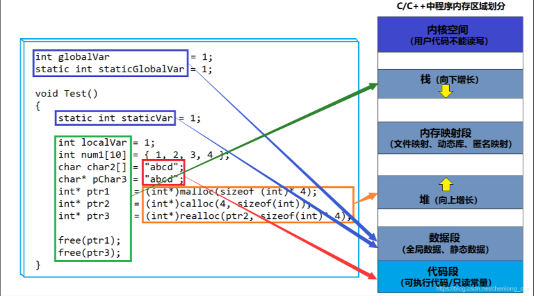

# 内存分布

**在一般情况下，在栈区开辟空间，先开辟的空间地址较高，而在堆区开辟空间，先开辟的空间地址较低。**

所以说一个向上增长 一个向下增长

# C语言管理内存

malloc

calloc

realloc

free

# C++管理内存

## 动态申请单个

~~~c++
//动态申请单个int类型的空间
int* p1 = new int; //申请

delete p1; //销毁
~~~

等价于

~~~c++
//动态申请单个int类型的空间
int* p2 = (int*)malloc(sizeof(int)); //申请

free(p2); //销毁
~~~

## 动态申请多个

~~~c++
//动态申请10个int类型的空间
int* p3 = new int[10]; //申请

delete[] p3; //销毁
~~~

~~~c++
//动态申请10个int类型的空间
int* p4 = (int*)malloc(sizeof(int)* 10); //申请

free(p4); //销毁
~~~

## 动态申请单个并初始化

~~~c++
//动态申请单个int类型的空间并初始化为10
int* p5 = new int(10); //申请 + 赋值

delete p5; //销毁
~~~

~~~c++
//动态申请一个int类型的空间并初始化为10
int* p6 = (int*)malloc(sizeof(int)); //申请
*p6 = 10; //赋值

free(p6); //销毁
~~~

## 动态申请多个并初始化

~~~c++
//动态申请10个int类型的空间并初始化为0到9
int* p7 = new int[10]{0, 1, 2, 3, 4, 5, 6, 7, 8, 9}; //申请 + 赋值

delete[] p7; //销毁
~~~

~~~c++
//动态申请10个int类型的空间并初始化为0到9
int* p8 = (int*)malloc(sizeof(int)* 10); //申请
for (int i = 0; i < 10; i++) //赋值
{
    p8[i] = i;
}

free(p8); //销毁
~~~

申请和释放单个元素的空间，使用new和delete操作符；申请和释放连续的空间，使用new[ ]和delete[ ]。

## 对于自定义数据

~~~c++
class Test{
public:
	Test():_a(0){
		cout << "构造函数" << endl;
	}
	~Test(){
		cout << "析构函数" << endl;
	}
private:
	int _a;
};
~~~

~~~c++
Test* p1 = new Test; //申请
delete p1; //销毁
~~~

~~~c++
Test* p2 = (Test*)malloc(sizeof(Test)); //申请
free(p2); //销毁
~~~

~~~c++
Test* p3 = new Test[10]; //申请
delete[] p3; //销毁
~~~

~~~c++
Test* p4 = (Test*)malloc(sizeof(Test)* 10); //申请
free(p4); //销毁
~~~

在申请自定义类型的空间时，new会调用构造函数，delete会调用析构函数，而malloc和free不会。

1. C++中如果是申请内置类型的对象或是数组，用new/delete和malloc/free没有什么区别。
2. 如果是自定义类型，区别很大，new和delete分别是开空间+构造函数、析构函数+释放空间，而malloc和free仅仅是开空间和释放空间。

# malloc和new区别

1、malloc和free是函数，new和delete是操作符。

2、malloc申请的空间不会初始化，new申请的空间会初始化。

3、malloc申请空间时，需要手动计算空间大小并传递，new只需在其后跟上空间的类型即可。

4、malloc的返回值是void*，在使用时必须强转，new不需要，因为new后跟的是空间的类型。

5、malloc申请失败时，返回的是NULL，因此使用时必须判空，new不需要，但是new需要捕获异常。

 6、申请自定义类型对象时，malloc/free只会开辟空间，不会调用构造函数和析构函数，而new在申请空间后会调用构造函数完成对象的初始化，delete在释放空间前会调用析构函数完成空间中资源的清理。

