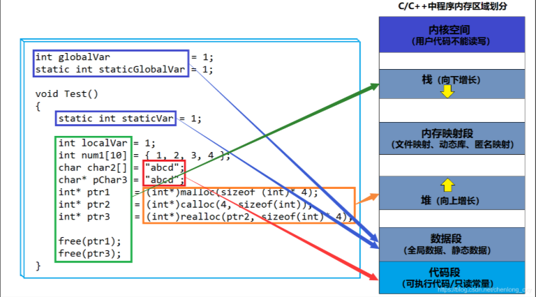
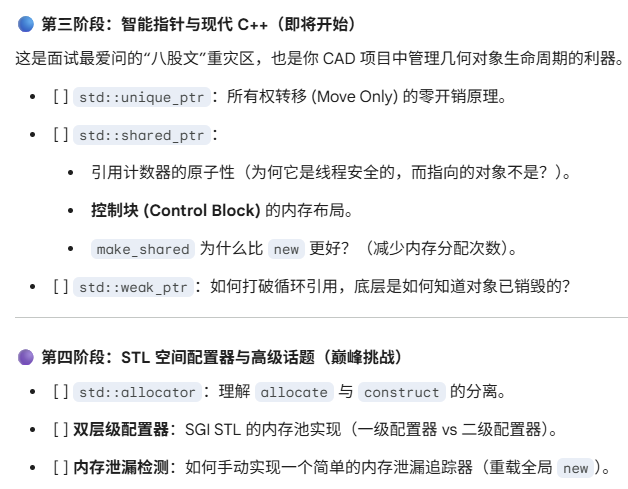

> [!NOTE]
>
> C++内存管理






# 内存布局

**栈区**：由编译器自动分配释放，存放函数的参数值、局部变量等。其操作方式类似于数据结构中的栈（后进先出），地址向低地址增长。

**堆区**：由程序员手动分配（`malloc`/`new`）和释放（`free`/`delete`）。若程序员不释放，程序结束时由 OS 回收。地址向高地址增长。

**全局/静态区**：存放全局变量和静态变量。

- **Data段**：已初始化的全局/静态变量
- **BSS段**：未初始化的全局/静态变量

**常量区**：存放常量字符串和代码指令。

# 内存碎片

**内部碎片**：已经分配出去，但不能被利用的空间。比如内存对齐。

**外部碎片**：未被分配出去，但由于太小或不连续，无法满足新的申请需求。只要心申请的尺寸小于这个碎片，就能用。

| **类型**      | **定义**                                                     | **发生场景**                           | **能否被再次分配？**                                 |
| ------------- | ------------------------------------------------------------ | -------------------------------------- | ---------------------------------------------------- |
| **内部碎片 ** | 已经被**分配出去**，但却不能被利用的空间。                   | 内存对齐（如申请 13B 给 16B）。        | **不能**。直到该对象被释放前，这部分空间没人能用。   |
| **外部碎片 ** | **未被分配出去**，但由于太小或不连续，无法满足新申请请求的空闲空间。 | 频繁申请释放后，空闲块夹在已用块中间。 | **能**。只要新申请的尺寸小于或等于这个碎片，就能用。 |

举个例子：

```c++
struct Node {
    char a;    // 1 byte
    int b;     // 4 bytes
};
```

在 32 位系统下，`sizeof(Node)` 通常是 8 字节。

1. 这多出来的 3 字节属于**内部碎片**。
2. 如果 `malloc` 了 10000 个 `Node` 然后释放了其中下标为奇数的所有节点，此时产生的空隙属于什么还是**外部碎片**。

# malloc与free

## malloc

`void* malloc(size_t size);`

在内存的**堆区**申请一块连续的、指定字节数的空间。

特点：

**不初始化**：申请到的内存里全是随机的“垃圾值”。

**类型无关**：返回 `void*`，必须强制转换为目标类型。

**可能失败**：如果内存不足，返回 `NULL`。

## malloc的阈值

在Linux中：

`malloc` 通常以 **128 KB** 为界限：

**小于 128 KB**：调用 `brk()`

- 通过推高堆顶指针来分配内存。
- **优点**：分配速度快，内存可以复用。
- **缺点**：容易产生内存碎片（**外部碎片**），且由于它是推顶式分配，高地址内存不释放，低地址也无法还给 OS。

**大于 128 KB**：调用 `mmap()`

- 在“文件映射区”找一块空闲的虚拟内存进行映射。
- **优点**：释放时直接解除映射，实时归还给操作系统。
- **缺点**：每次都要进行系统调用（内核态切换），性能开销较大。

### brk()的外部碎片

假设申请了 A, B, C 三块内存：A在低地址、B在中地址、C在高地址。

如果`free(B)`，虽然B在malloc的空闲链表里被标记为可用，但由于顶部还有 C 压着，堆顶指针 `program break` 无法下移。此时，B 这块空间在操作系统看来依然属于该进程，无法返还给物理内存，这就形成了**外部碎片**。

主要产生的是**外部碎片**：即堆中存在大量零散的、被释放但无法归还 OS 的空闲空隙。

### mmap()的状态切换

`mmap` 申请内存时，内核会在进程的**虚拟地址空间**中（通常在堆和栈之间的空闲区）找一块足够大的区域，并建立一条 **VMA (Virtual Memory Area)** 记录。

注意：此时通常并没有立刻分配物理内存，而是等到你真正读写这块内存触发**缺页中断**时，内核才会修改**页表**，将虚拟地址映射到物理页框上。

为什么会切换到内核态?

`malloc` 本身是用户态函数。

但 `mmap` 是一个**系统调用**。

当执行系统调用时，CPU 必须通过软中断（如 `int 0x80` 或 `syscall` 指令）从 **用户态 ** 切换到 **内核态**。

内核态涉及上下文切换（寄存器保存、内核栈切换等），这个过程比单纯在用户态操作链表要重得多。

## free

### 内存块头部

`free(ptr)` 只需要传一个指针，**它是怎么知道要释放多少字节的？**

当你执行 `p = malloc(16)` 时，`malloc` 实际上申请了比 16 字节更多的空间（比如 24 或 32 字节）。

申请的内存块分为两部分：

- **Header (Cookie)**：存储了这块内存的大小、状态（是否占用）等信息。

- **Payload**：返还给你的实际可用地址。

所以频繁分配小内存会很**亏**，因为头部信息占用的比例太高了。且很容易导致内存碎片（**内部碎片**）。

### free过程

1. 根据 `ptr` 往前偏移，读取 **Header** 里的信息，确认大小。

2. 将这块内存标记为“空闲”。

3. **合并**：检查相邻的内存块是否也空闲，如果是，就把它们合并成一个大块，防止碎片化。

### 风险

**悬空指针**：`free(p)` 之后，`p` 本身的值（地址）还在，但那块地已经不属于你了。如果不手动 `p = nullptr`，下次访问就会崩溃。

**Double Free**：对同一个地址释放两次，会导致内存管理器里的链表结构被破坏。

## 其它问题

**malloc(0) 会发生什么？** 规范定义它是“实现相关”的。在大多数平台上，它会返回一个唯一的、非空的有效指针，但你不能对它进行解引用。它依然需要被 `free`。 

**既然有 malloc，为什么 C++ 还要 new？** 最根本的原因是 **构造函数**。对于自定义类，`malloc` 只管分地皮，不管盖房子（初始化成员变量、虚函数表等），这在面向对象编程里是不可接受的。

> [!NOTE]
>
> 那么接下来进入new的学习

# new与delete

C++中常说的new与delete其实是`new/delete`表达式.

在C++中调用`Foo *p  = new Foo();`：

保证了**分配空间+调用构造函数**一气呵成。

## new表达式的过程

**第一步：分配内存 调用 `operator new` 函数。

```c++
void* mem = operator new(sizeof(Complex)); // 底层通常调用 malloc
```

**第二步：类型转换与构造** 在分配好的内存上调用构造函数。由于构造函数不能被显式调用，编译器在底层使用 **Placement new**。

```c++
pc = static_cast<Complex*>(mem);
pc->Complex::Complex(1, 2); // 只有编译器能这么写，用户手动调用需用 placement new
```

**第三步：返回指针** 返回指向新对象的指针。

## delete表达式的过程

同理，`delete pc;` 会被拆解为：

**第一步：调用析构函数**

```c++
pc->~Complex(); // 清理对象内部持有的资源
```

**第二步：释放内存** 调用 `operator delete` 函数。

```c++
operator delete(pc); // 底层通常调用 free
```

## 手动模拟new/delete表达式

**第一步**：分配原始内存

调用`operator new`分配`sizeof(Complex)`大小字节

```c++
// 1. 申请内存：这不会调用构造函数
void* rawMemory = ::operator new(sizeof(Complex));
```

**第二步**：在指定位置构造对象

使用`Placement new`在指定的地址上**就地**调用构造函数。

语法：`new (address) Type(arguments)`

```c++
// 2. 放置 new：在 rawMemory 上构造对象
// 这等同于编译器内部执行的 pc->Complex::Complex(1, 2)
Complex* pc = new (rawMemory) Complex(1, 2);
```

**第三步**：手动清理与释放

```c++
// 3a. 手动执行析构函数（销毁对象内部资源，如成员指针指向的内存）
pc->~Complex(); 

// 3b. 手动释放原始内存（归还地皮）
::operator delete(rawMemory);
```

这也引出了在面试的问题：

如果直接 `new Complex[100]`，会立刻得到 100 个**已经构造好**的对象。但在实际开发中（比如 `std::vector`）：

我们可能先申请了能容纳 100 个对象的**容量**。

但此时里面还没有任何元素，我们不希望调用 100 次构造函数。

只有当用户执行 `push_back` 时，我们才在预留好的 `rawMemory` 的特定偏移位置上，用 **Placement new** 构造出真正的对象。

## 为什么要显式的写::

主要的作用是：

1. **指定全局作用域**
2. **防止递归/名称遮蔽**

`operator new` 本质上是一个函数。C++ 允许在两个层面定义这个函数：

- **全局层**：标准库提供的缺省分配器（通常底层调 `malloc`）。
- **类层**：在某个类内部重载了 `operator new`。

当你写 `::operator new` 时，你是在显式地告诉编译器：**请使用全局命名空间里的那个分配函数，不要管我当前类里是否重载了它**。

举个例子：

```c++
struct Complex {
    int re, im;

    // 重载类特定的 operator new
    static void* operator new(size_t size) {
        std::cout << "Using Complex-specific alloc\n";
        
        // 错误尝试：如果你直接写 operator new(size)
        // 编译器会认为你在调用“自己”，导致无限递归，最终栈溢出
        // return operator new(size); 

        // 正确做法：调用全局版本的 operator new 来获取原始内存
        return ::operator new(size); 
    }
};
```

`::`打破了递归，让类的分配器向系统申请真正的物理内存。

## new的异常安全性

```c++
void* mem = ::operator new(sizeof(Complex));
try {
    pc = new (mem) Complex(1, 2); // 如果 Complex 构造函数抛出异常
} catch (...) {
    ::operator delete(mem); // 你必须手动捕获并释放，否则内存就漏了
    throw;
} 
```

标准的new表达式具有原子性：如果在构造函数执行时抛出了异常，编译器会自动调用对应的`operator delete`来释放刚申请的内容。

# operator new与operator delete

## operator new

**operator new有错误处理机制**

既然都是申请内存并返回`void*`，那么为什么不直接用mallo？

`malloc` ：内存不够就返回 `NULL`，然后拍屁股走人。你必须在每一处代码都写 `if (p == NULL)`。

`operator new` ：它不是一失败就放弃。它会启动一个**抢救流程**：

1. 它会不断调用用户通过 `std::set_new_handler()` 设置的紧急函数。
2. 这个函数可以尝试释放你的缓存、关闭不必要的文件、或者清理内存池。
3. 只有当抢救函数也没招了，它才会抛出 `std::bad_alloc`。

**意义**：这让程序在极端情况下具有更强的生存能力，而不是直接崩溃或返回空指针导致后续逻辑段错误。

**operator new有异常安全性**

`malloc` 不抛出异常。

`operator new` 抛出 `std::bad_alloc`。

这看似麻烦，实则救命。如果在一个构造函数的初始化列表中连续分配多个对象，如果中间有一个失败了，异常机制会自动回溯并清理已经分配成功的资源。如果用 `malloc` 的返回码，代码会充斥着大量的嵌套判断，极易漏掉内存释放。

**operator new可定制查找链**

`operator new` 允许按**类**进行重载。

- `malloc` 是全局的：你很难让 `malloc` 针对某个特定的结构体走特殊的分配逻辑。
- `operator new` 是分层的：
  - 你可以让 `CAD_Element` 类走高性能内存池。
  - 让 `Logging_System` 类走记录型分配器。
  - 其他普通类走系统缺省分配器。

## operator delete

```c++
void operator delete(void* ptr) noexcept {
    if (ptr) {
        free(ptr); // 最终还是归还给了内存管理器
    }
}
```

**对空指针安全**

**`free`**：虽然 C 标准规定 `free(NULL)` 是安全的，但在早期的 C 代码或非标准实现中，释放空指针偶尔会导致问题。

**`operator delete`**：C++ 语言标准明确保证 `delete nullptr` 必须安全且不执行任何操作。这使得程序员在调用 `delete` 前不需要写 `if (p != nullptr)`。

**可以定制**

如果你在 `operator new` 里使用**内存池**分配了对象，你必须在 `operator delete` 里将内存归还给那个特定的池子，而不是还给全局堆。通过重载，当你写 `delete p` 时，编译器会自动找到对应类的 `operator delete`，确保内存“从哪来，回哪去”。

**可以大小感知释放**

```c++
void operator delete(void* ptr, std::size_t size) noexcept;
```

`free` 的痛点：`free` 必须去查内存块头部的 Cookie 才知道要释放多大空间，这涉及一次查数据。

`operator delete` 的优势：编译器在**编译期**通常知道对象的大小。通过这个版本，内存池可以直接根据 `size` 将内存放回对应的空闲链表，**完全跳过查询 Cookie 的步骤**，极大提升了高频释放时的性能。

### 关于节省访存的细节

`free(p)` 的动作：

1. CPU 拿到指针 `p`。
2. 计算 `p - sizeof(header)`。
3. **访存**：读取该位置的内存数据（Cookie），获取块大小。
4. 根据大小将块归还给空闲链表。

由于内存是按“页”管理的，如果这块内存很久没被访问了（被交换到了 Swap，或者不在 CPU Cache 里），为了释放它，CPU 必须强制把 Header 所在的内存页加载进 Cache，并读取那一块数据。**这次读取是强制性的，不可逾越。**

所以说节省访存其实是减少Cache Miss和缺页中断。

总结：

`free` 是**“问内存要大小/必须访存**

`operator delete` 是**已经知道大小/无需访存**

---

这就是为什么 C++14 引入这个特性时，很多高性能分配器（如 Google 的 `tcmalloc`）都立刻跟进支持了，因为**“已知大小”是内存管理中最宝贵的捷径**。

# new[]与delete[]

## new[]的原理

当写下 `Complex* ptr = new Complex[n];` 时，编译器并不是简单地调用 `n` 次 `new`。它会执行以下步骤：

1. **分配阶段**：调用 `operator new[]`。

   - **计算大小**：申请的空间通常是 `n * sizeof(Complex) + overhead`。

   - **Overhead 的真相**：这个多出来的空间（通常是 4 或 8 字节）位于返回地址的前方，专门用来存储**数组长度 `n`**。

2. **构造阶段**：编译器会生成一段循环代码，在申请到的连续空间上，依次为每个元素调用**构造函数**。

   - **顺序**：从地址低位向高位依次构造（`ptr[0]` -> `ptr[n-1]`）。

   - **异常处理**：如果在构造第 5 个对象时抛出了异常，编译器非常智能——它会**逆序**销毁前 4 个已构造的对象，然后释放整块内存，防止内存泄漏。

```c++
[ 数组长度 n ] [ 对象 0 ] [ 对象 1 ] ... [ 对象 n-1 ]
^              ^
|              |
真正起始地址     返回给你的指针 ptr
```

当执行 `delete[] ptr;` 时，编译器只拿到了 `ptr`。它必须知道要调用多少次析构函数。于是它会向左偏移，读取那个隐藏的 `n`。

## delete[]原理

```c++
Complex* ptr = new Complex[10];
// ... 使用 ptr ...
delete[] ptr; // 必须带上 []
```

`delete[] ptr`时：

1. **寻找偏移量**：由于 `ptr` 指向的是数组第一个元素的起始位置，而数组的长度 $n$ 存储在 `ptr` 之前的 **4 或 8 个字节**处。
   - 编译器会将指针**向左偏移**，读取出存储在那里的整数 $n$。
2. **逆序析构**：知道了 $n$ 之后，编译器会生成一个循环：
   - 从 `ptr[n-1]` 开始，一直到 `ptr[0]`，依次调用每个对象的**析构函数**。
   - **为什么要逆序？** 这符合 C++ 资源管理的“对称性原则”：**后构造的对象往往依赖先构造的对象，因此必须先销毁。** 这与栈的逻辑一致。
3. 最后，编译器调用 `operator delete[]` 函数。
   - **注意**：传给 `operator delete[]` 的地址是**原始起始地址**（即包含长度信息的那块地的开头），而不是你手中的 `ptr`。

## 无析构函数优化

如果类有**析构函数**，`new[]` 必须在内存开头多申请 8 个字节存长度 $N$。

如果无析构函数，纯数据类型，比如

```c++
int x;//x纯数据
struct Point{
    int x;
    int y;
    int z;
};
//Point也是纯数据
```

因为`delete[]`时不需要调用析构函数，所以没必要知道数组有几个元素。

此时`new[]` 申请的字节数严格等于 $N \times \text{sizeof(Point)}$。

## new[]的信息与malloc的信息

在一个 `new Complex[10]` 的内存块里，实际上可能存在**两份**关于大小的信息：

**内存管理层**

在malloc返回地址的左侧，记载物理字节数。目的是为了`free()`

记录的内容是**整块物理内存的字节数**

**语言对象层**

在 `operator new[]` 申请到的内存起始位置，也就是 `malloc` 返回地址的**内部**。

为了让 `delete[]` 知道要调用多少次**析构函数**。

记录内容是**数组元素的个数**

### 内存布局

**最外层 (malloc 层)**：

`malloc` 实际分配了 $88$ 字节（$10 \times 8 + 8$ 字节的数组 Cookie）。

在地址 `-16`（假设）的地方，`malloc` 记下了：**“这块地总共 88 字节”**。

**内层 (C++ 数组层)**：

在 `malloc` 返回地址（地址 `0`）处，编译器写下了：**“这里有 10 个对象”**。

**返回给你的指针**：

编译器把地址 `+8`（跨过了数组 Cookie）返回给你。

1. `new Complex[10]`
2. 编译器计算10×8+8，于是`malloc(88)`

3. malloc申请了88+16，但是malloc不会告诉编译器，编译器视角自己就是申请了88。
4. malloc返回88字节首地址
5. new返回偏移8字节后的地址

**[0x09F0 - 0x09FF] (16 字节)**：这是 `malloc` 的私有领域。里面存着“88”这个数字。

**[0x1000 - 0x1007] (8 字节)**：这是 `malloc` 返回给编译器的首地址。**编译器**立刻在这里写下“10”。

**[0x1008 - 0x1057] (80 字节)**：这是**编译器**返回给你的 `p`。这里存 10 个对象。

所以真实的内存中，存了104字节。

此时双重Cookie已明了。

### 存信息的动作

存信息这个动作本身是`new[]`来实现的，而不是`operator new[]`，operator只为了分配内存，存信息是为了析构。

## 使用delete释放new[]

### 对于基础类型（如 `int`）

对于 `int` 或 `double` 这种没有析构函数的类型，编译器通常**不会**在开头存数组长度 `n`。此时 `delete` 和 `delete[]` 效果往往一样。但**绝对不要**养成这种坏习惯。

### 对于自定义类（有析构函数）

这是灾难现场：

1. **析构缺失**：`delete ptr` 只会调用 `ptr[0]` 的析构函数，剩下的 `n-1` 个对象内部持有的资源（如 `std::vector` 或文件句柄）将全部泄漏。
2. **内存崩溃**：最严重的点在于，`delete` 会把 `ptr` 直接传给 `free`。但 `free` 预期的起始地址应该是**包含数组长度的那个地址**。由于传入的地址偏移了 4/8 字节，内存管理器会发现这个地址它不认识，直接触发 **Heap Corruption (堆损坏)**，程序崩溃。

## 使用delete[]释放new

`delete[]` 会强行去 `ptr` 的左边读一个数当成长度。那个位置的数据是随机的垃圾值（比如 `1048576`）。编译器会尝试在错误的地址上执行 100 多万次析构函数，结果必然是**段错误 **。

# operator new[]与operator delete[]

| **动作**         | **表达式**   | **底层调用的函数 (分配器)**     |
| ---------------- | ------------ | ------------------------------- |
| **分配单个对象** | `new T`      | `void* operator new(size_t)`    |
| **分配对象数组** | `new T[N]`   | `void* operator new[](size_t)`  |
| **释放单个对象** | `delete p`   | `void operator delete(void*)`   |
| **释放对象数组** | `delete[] p` | `void operator delete[](void*)` |

`operator new`与`operator new[]`**不重载的话**都是调用`::operator new`

但重载后可以根据分配模式优化：

`operator new` ：适合走 **固定大小空闲链表**。因为你知道它只分配一个对象的大小，分配和释放极其迅速。

`operator new[]` (数组)：适合走 **备用分配器**。因为数组的大小是不确定的（取决于变量 $N$），它更像传统的 `malloc`。

所以这俩operator讨论的少。

# placement new

**Placement new** 的本质是：**在一段已经分配好的内存基址上，手动触发构造函数。**

语法：

```c++
// 假设 buffer 是已经申请好的内存（堆、栈、静态区皆可）
void* buffer = operator new(sizeof(Complex)); 

// Placement new 语法
Complex* pc = new (buffer) Complex(1, 2);
```

`new`：关键字。

`(buffer)`：**放置位置**，即你想在哪里构造对象。

`Complex(1, 2)`：想调用的**构造函数**。

## 可以调用移动构造

在vector进行扩容时，此时

```c++
new (new_buffer + i) T(std::move(old_buffer[i]));
```

就是把构造函数替换为了移动构造函数。

## 执行过程

**寻找分配函数**

```c++
// 它的实现简直“简陋”到极致
void* operator new(size_t, void* __p) noexcept {
    return __p; 
}
```

这个函数接收一个 `size`（虽然没用上）和一个指针 `p`，然后**原封不动地把 `p` 返回**。它不执行任何内存申请逻辑。

**调用构造函数**

编译器拿到刚才返回的指针（其实就是 `buffer` 的地址），直接生成机器码，在这个地址上调用 `Complex` 的构造函数，并传入参数 `(1, 2)`。

**返回地址**

最后将该地址转换为 `Complex*` 类型并返回。

> [!WARNING]
>
> 一定不要delete定位new的对象，只需要析构。

## 定位new也会多存个数信息

如果使用定位new构造一个数组

```c++
Complex* p = new (buffer) Complex[10];
```

那么编译器还会再buffer开头塞入8字节长度吗？

 `delete[]` 原理：

- `delete[] p` 的唯一任务是**逆序调用析构函数**。
- 为了知道调用多少次，它必须在 `p` 的左边找到那个数字 $N$。

**可能会带来的越界问题**

当使用 `new (buffer) T[N]` 时，编译器为了保证这块内存后续能被正确地处理（虽然你不能直接 `delete[]`，但你可能需要某种方式知道构造了多少个对象），它依然会严格执行 `new[]` 的布局标准：

1. **偏移地址**：编译器会在你提供的 `buffer` 起始位置写入 $N$。

2. **返回指针**：返回给你的指针 `p` 实际上是 `buffer + 8`（在 64 位系统下）。

3. **构造**：在 `p` 开始的位置构造 $N$ 个对象。

所以构造内存池时，如果不算这额外的8字节Cookie，那么

```c++
char* buffer = new char[10 * sizeof(Complex)]; // 刚够存 10 个对象
Complex* p = new (buffer) Complex[10];        // 灾难！
```

此时编译器会尝试往 `buffer` 前 8 字节写长度，然后从第 9 字节开始盖房子。**最后 8 字节的数据会写到 `buffer` 外面，造成内存越界。**

**可能会带来的析构问题**

由于你不能对 Placement new 的结果执行 `delete[] p`，你必须手动析构。但此时你手里的 `p` 已经不是 `buffer` 的首地址了。

```c++
// 正确的手动析构方式
for (int i = 9; i >= 0; --i) {
    p[i].~Complex();
}
```

所以实际开发中不用`placement new[]`

在vector中，使用循环+单个placement new

```c++
// std::vector 底层的近似逻辑
for (size_t i = 0; i < N; ++i) {
    new (buffer + i * sizeof(T)) T(args); // 这里的 buffer 是精确控制的，没有 Cookie
}
```

# 智能指针

涉及到智能指针相关的内存问题，这里主要是

## make_shared的优点

`std::shared_ptr<T> p(new T())`。

- **内存分布**：分配两次内存。一次给 `T`，一次给存放引用计数的控制块。这两块内存在堆上通常不连续。

`std::make_shared<T>()`：

- **内存分布**：分配一次内存。`T` 对象和控制块被打包在**一块连续的内存**中。
- **优点**：更快的分配速度，更好的缓存局部性。
- **潜在风险（重点）**：如果有一个 `weak_ptr` 还指向这块内存，即使 `shared_ptr` 全都析构了，**整个大块内存（包括 T 的占位符）都不会被释放**。因为控制块和对象连在一起，只要引用计数（包括弱引用）不归零，地皮就不能还给 OS。

## 返回值问题

```c++
std::unique_ptr<Foo> get() {
    auto p = std::make_unique<Foo>();
    return std::move(p); // ❌ 错误做法：这会阻碍 NRVO 优化
}
```

让编译器自动处理，不要手动move。

## 其它

以及再提一嘴：

 `shared_ptr` **不是完全线程安全的**，这在面试中是致命伤。

- **引用计数**：是**原子操作**，线程安全。
- **智能指针对象本身**：**不是线程安全的**。多个线程同时读写同一个 `shared_ptr` 实例（比如赋值、重置）需要加锁。
- **指向的对象**：**不是线程安全的**。通过 `shared_ptr` 访问对象成员，必须自己加锁。

`td::enable_shared_from_this` 的陷阱

如果想在类成员函数内部返回一个指向自己的 `shared_ptr`，绝对不能写 `return shared_ptr<T>(this)`。

- **原因**：这会创建一个全新的控制块，导致“双重所有权”，最终在析构时触发 Double Free。
- **正确姿势**：类继承 `std::enable_shared_from_this<T>` 并调用 `shared_from_this()`。它会复用现有的控制块。

# 异常处理机制


# 内存对齐

C++11 引入了原生关键字来控制对齐：

- `alignof(Type)`：查询该类型的对齐要求。
- `alignas(N)`：强制要求某个变量或结构体按 $N$ 字节对齐。

```c++
struct alignas(32) AVXPoint {
    float coords[8]; // 刚好 32 字节，强制 32 字节对齐
};
```

优化小对象的内存占用：

将对齐要求高的成员排在前面，小的排在后面。

优化前：`char, double, int` (24字节)

优化后：`double, int, char` (16字节)

在 C++17 之前，`operator new` 只保证返回符合**最大基本类型**（通常是 16 字节）对齐要求的地址。

如果你定义了一个 `alignas(64)` 的超对齐类型，普通的 `new` 可能会失效。因此 C++17 引入了：

```c++
// 专门处理超对齐分配的底层函数
void* operator new(std::size_t size, std::align_val_t al);
```

# 问题

内存泄漏

野指针

悬空指针

双重释放

内存碎片：内部/外部

# malloc和new区别

1、malloc和free是函数，new和delete是操作符。

2、malloc申请的空间不会初始化，new申请的空间会初始化。

3、malloc申请空间时，需要手动计算空间大小并传递，new只需在其后跟上空间的类型即可。

4、malloc的返回值是void*，在使用时必须强转，new不需要，因为new后跟的是空间的类型。

5、malloc申请失败时，返回的是NULL，因此使用时必须判空，new不需要，但是new需要捕获异常。

 6、申请自定义类型对象时，malloc/free只会开辟空间，不会调用构造函数和析构函数，而new在申请空间后会调用构造函数完成对象的初始化，delete在释放空间前会调用析构函数完成空间中资源的清理。


# 关于allocator

## 分权

`std::allocator` 并不使用 `new` 表达式，它把整个过程拆分成了四件独立的事：

1. `allocate(n)`：只负责拨地皮（调用 `operator new` 或 `malloc`），得到的是 `void*` 转换后的原始指针。
2. `construct(p, args...)`：只负责盖房子（调用 **Placement new**），在指定位置构造对象。
3. `destroy(p)`：只负责拆房子（手动调用析构函数 `~T()`）。
4. `deallocate(p, n)`：只负责还地皮（调用 `operator delete` 或 `free`）。

## 避开Cookie浪费

这是 `std::allocator` 支撑 `std::vector` 实现高性能的关键。

**不再需要 Cookie**： `new[]` 之所以要存 Cookie，是因为 `delete[]` 只有指针，不知道要调多少次析构。 但在 STL 中，容器（如 `vector`）自己内部就维护了 `size` 成员变量。当容器析构时，它会根据自己记录的 `size` 循环调用 `destroy()`。

**内存布局变纯净**： 既然容器自己知道“住户数量”，配置器在 `allocate(n)` 时就完全不需要多申请那 8 字节来存个数。

**结果**： 如果你申请 10 个 `Point`，`std::allocator` 申请的空间就是严格的 `10 * sizeof(Point)`。**完美消灭了语言层面的额外 Cookie 占比。**

## 避免强制初始化

`new[]` 的痛苦：你写 `new Complex[100]`，它必须立刻调用 100 次默认构造函数。如果你只想先占个座（预留容量），或者对象没有默认构造函数，`new[]` 就直接罢工。

`allocator` 的优雅： `vector.reserve(100)` 底层调用的是 `allocate(100)`。此时，**只有地皮，没有对象**。 当你真正 `push_back` 时，才调用 `construct` 在相应位置造一个对象。这种“按需构造”极大地提升了效率，也增加了灵活性。

## 二级分配

 `std::allocator` 已经趋向于直接封装 `operator new`，但经典的 SGI STL 二级配置器设计是面试和工程思维的巅峰：

1. **一级配置器**：处理大于 128 字节的请求，直接用 `malloc`。
2. **二级配置器（重点）**：处理小于 128 字节的小额申请。
   - **自由链表**：预先维护 16 组链表，分别管理 8, 16, 24...128 字节的区块。
   - **内存池**：如果链表空了，就从内存池“批发”一大块出来切分。
   - **优势**：彻底解决了频繁申请小内存带来的外碎片问题，且因为是针对固定尺寸的分配，**完全没有额外 Cookie**。

# const与内存

# static与内存

# 关于内存问题的面试反问

> 现在的CAD内核中存在着大量的点线面等小内存的new 它们不但会造成Cookie的内存占比堆积 也会在多线程的情况下造成性能问题 所以换用Google的TCmalloc是后续的一个优化方向 这不但解决了性能和Cookie问题 也解决了未来扩展时Profiler的问题

**Cookie与内存**

在目前的 CAD 内核模块中，我们需要处理数以百万计的几何微小对象（如 B-Spline 控制点、拓扑边信息等）。如果使用标准库默认的分配器，每个对象都会带上 8-16 字节的 `malloc` Cookie，对于这种 24 字节左右的小结构体来说，**内存浪费率接近 40%-50%**，这不仅限制了超大规模图纸的加载能力，还增加了 Cache Miss 的概率。

在目前的 CAD 内核模块中，我们需要处理数以百万计的几何微小对象（如 B-Spline 控制点、拓扑边信息等）。如果使用标准库默认的分配器，每个对象都会带上 8-16 字节的 `malloc` Cookie，对于这种 24 字节左右的小结构体来说，**内存浪费率接近 40%-50%**，这不仅限制了超大规模图纸的加载能力，还增加了 Cache Miss 的概率。

**锁竞争与本地缓存**

考虑到未来多线程并行计算的需求（如曲面交线并行求解），默认分配器的全局锁或 Arena 锁在高并发下会成为瓶颈。引入 **TCmalloc** 的核心价值在于它的 **Thread-local Cache** 机制。它让绝大多数小对象的分配在线程本地无锁完成，极大地提升了多核环境下的吞吐量。

**可观测性和拓展**

TCmalloc 自带的 **heap profiler** 和内存泄漏检测工具，能够让我们在不重启程序的情况下监控内核各模块的内存水位。这对于 CAD 这种长生命周期的复杂软件来说，是保证后期系统稳定性和进行针对性优化的基础设施。

**为什么不用自定义内存池**

自定义内存池在性能上确实可以做到极致，但它的**开发维护成本高**且**通用性差**。CAD 内核中对象尺寸分布虽然集中但仍有变化，TCmalloc 已经针对不同 **Size Classes** 做了极佳的优化。在当前阶段，引入成熟的工业级分配器可以在‘研发效率’与‘性能收益’之间取得最佳平衡。等后续某个特定类型对象成为绝对瓶颈时，我们再考虑针对性地实现更细颗粒度的内存池。
