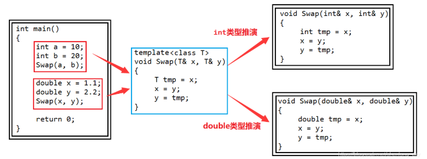

> [!NOTE]
>
> 模板

模板的核心思想：让类型称为参数

# 函数模板

~~~c++
template<typename T>
void Swap(T& x, T& y)
{
	T tmp = x;
	x = y;
	y = tmp;
}
~~~

typename是用来定义模板参数的关键字，也可以用class代替，但是不能用struct代替。

在编译器编译阶段，对于函数模板的使用，编译器需要根据传入的实参类型来推演生成对应类型的函数以供调用。

## 函数模板的原理



编译器需要根据传入的实参类型来推演生成对应类型的函数以供调用。

使用不同类型的参数来使用模板时，称为模板的实例化。

## 隐式实例化

~~~c++
template<typename T>
T Add(const T& x, const T& y)
{
	return x + y;
}
int main()
{
	int a = 10, b = 20;
	int c = Add(a, b); //编译器根据实参a和b推演出模板参数为int类型
	return 0;
}
//这种情况下会将double强转为int
int a = 10;
double b = 1.1;
int c = Add(a, b);
~~~

但模板不会进行类型转换

```c++
int a = 10;
double b = 1.1;
int c = Add(a, b);
```

根据实参a推T为int，b推T为double，所以无法确定到底是什么。

为此要么将b强转int，要么用显示实例化。

## 显示实例化

~~~c++
template<typename T>
T Add(const T& x, const T& y)
{
	return x + y;
}
int main()
{
	int a = 10;
	double b = 1.1;
	int c = Add<int>(a, b); //指定模板参数的实际类型为int
	return 0;
}
~~~

使用显示实例化时，如果传入的参数类型与模板参数类型不匹配，编译器会尝试进行隐式类型转换，如果无法转换成功，则编译器将会报错。

## 匹配原则

**一个非模板函数可以和一个同名的函数模板同时存在，而且该函数模板还可以被实例化为这个非模板函数**

~~~c++
//专门用于int类型加法的非模板函数
int Add(const int& x, const int& y)
{
	return x + y;
}
//通用类型加法的函数模板
template<typename T>
T Add(const T& x, const T& y)
{
	return x + y;
}
int main()
{
	int a = 10, b = 20;
	int c = Add(a, b); //调用非模板函数，编译器不需要实例化
	int d = Add<int>(a, b); //调用编译器实例化的Add函数
	return 0;
}
~~~

**对于非模板函数和同名的函数模板，如果其他条件都相同，在调用时会优先调用非模板函数，而不会从该模板产生出一个实例。如果模板可以产生一个具有更好匹配的函数，那么选择模板**

~~~c++
//专门用于int类型加法的非模板函数
int Add(const int& x, const int& y)
{
	return x + y;
}
//通用类型加法的函数模板
template<typename T1, typename T2>
T1 Add(const T1& x, const T2& y)
{
	return x + y;
}
int main()
{
	int a = Add(10, 20); //与非模板函数完全匹配，不需要函数模板实例化
	int b = Add(2.2, 2); //函数模板可以生成更加匹配的版本，编译器会根据实参生成更加匹配的Add函数
	return 0;
}
~~~

**模板函数不允许自动类型转换，但普通函数可以进行自动类型转换**

~~~c++
template<typename T>
T Add(const T& x, const T& y)
{
	return x + y;
}
int main()
{
	int a = Add(2, 2.2); //模板函数不允许自动类型转换，不能通过编译
	return 0;
}
~~~

# 类模板

~~~c++
template<class T1,class T2,…,class Tn>
class 类模板名
{
  //类内成员声明
};
~~~

类模板中的成员函数若是放在类外定义时，需要加模板参数列表。

```c++
template<class T>
class Score
{
public:
	void Print();
private:
	T _Math;
	T _Chinese;
	T _English;
};
//类模板中的成员函数在类外定义，需要加模板参数列表
template<class T>
void Score<T>::Print()
{
	cout << "数学:" << _Math << endl;
	cout << "语文:" << _Chinese << endl;
	cout << "英语:" << _English << endl;
}
```

## 实例化

类模板实例化与函数模板实例化不同，类模板实例化需要在类模板名字后面根<>，然后将实例化的类型放在<>中即可。

~~~c++
//Score不是真正的类，Score<int>和Score<double>才是真正的类
Score<int> s1;
Score<double> s2;
~~~

类模板名字不是真正的类，而实例化的结果才是真正的类。

# 非类型 模板参数

**类型形参：** 出现在模板参数列表中，跟在`class`或`typename`关键字之后的参数类型名称。

**非类型形参：** 用一个常量作为类（函数）模板的一个参数，在类（函数）模板中可将该参数当成常量来使用。

~~~c++
template<class T, size_t N> //N：非类型模板参数
class StaticArray
{
public:
	size_t arraysize()
	{
		return N;
	}
private:
	T _array[N]; //利用非类型模板参数指定静态数组的大小
};
~~~

~~~c++
int main()
{
	StaticArray<int, 10> a1; //定义一个大小为10的静态数组
	cout << a1.arraysize() << endl; //10
	StaticArray<int, 100> a2; //定义一个大小为100的静态数组
	cout << a2.arraysize() << endl; //100
	return 0;
}
~~~

1. 非类型模板参数只允许使用整型家族，浮点数、类对象以及字符串是不允许作为非类型模板参数的。
2. 非类型的模板参数在编译期就需要确认结果，因为编译器在编译阶段就需要根据传入的非类型模板参数生成对应的类或函数。

# 函数模板特化

函数模板特化步骤：

1. 首先必须要有一个基础的函数模板。
2. 关键字template后面接一对空的尖括号<>。
3. 函数名后跟一对尖括号，尖括号中指定需要特化的类型。
4. 函数形参表必须要和模板函数的基础参数类型完全相同，否则不同的编译器可能会报一些奇怪的错误。

~~~c++
//基础的函数模板
template<class T>
bool IsEqual(T x, T y)
{
	return x == y;
}
//对于char*类型的特化
template<>
bool IsEqual<char*>(char* x, char* y)
{
	return strcmp(x, y) == 0;
}
~~~

如果不特化，那么只会对比两个字符串的地址是否相同，而不是内容。

 一般情况下，如果函数模板遇到不能处理或者处理有误的类型，为了实现简单通常都是将该函数直接给出。

**函数模板不能半特化**

# 类模板特化

## 全特化

全特化即是将模板参数列表中所有的参数都确定化。

~~~c++
template<class T1, class T2>
class Dragon
{
public:
	//构造函数
	Dragon()
	{
		cout << "Dragon<T1, T2>" << endl;
	}
private:
	T1 _D1;
	T2 _D2;
};

//对于T1是double，T2是int时进行特化
template<>
class Dragon<double, int>
{
public:
	//构造函数
	Dragon()
	{
		cout << "Dragon<double, int>" << endl;
	}
private:
	double _D1;
	int _D2;
};
~~~

## 偏特化

偏特化是指任何针对模板参数进一步进行条件限制设计的特化版本。

**部分特化**

~~~c++
template<class T1, class T2>
class Dragon
{
public:
	//构造函数
	Dragon()
	{
		cout << "Dragon<T1, T2>" << endl;
	}
private:
	T1 _D1;
	T2 _D2;
};

//对T1为int的类进行特化
template<class T2>
class Dragon<int, T2>
{
public:
	//构造函数
	Dragon()
	{
		cout << "Dragon<int, T2>" << endl;
	}
private:
	int _D1;
	T2 _D2;
};
~~~

**对参数进一步限制**

~~~c++
//两个参数偏特化为指针类型
template<class T1, class T2>
class Dragon<T1*, T2*>
{
public:
	//构造函数
	Dragon()
	{
		cout << "Dragon<T1*, T2*>" << endl;
	}
private:
	T1 _D1;
	T2 _D2;
};
//两个参数偏特化为引用类型
template<class T1, class T2>
class Dragon<T1&, T2&>
{
public:
	//构造函数
	Dragon()
	{
		cout << "Dragon<T1&, T2&>" << endl;
	}
private:
	T1 _D1;
	T2 _D2;
};
~~~

# 模板的分离编译

**C++ 模板默认是“不能像普通函数那样分离编译的”**，
**因为模板只有在“看到具体类型”时才能生成代码，而这个过程发生在“使用点”，不是“定义点”。**

```c++
// add.h
template<typename T>
T add(T a, T b);
```

```c++
// add.cpp
template<typename T>
T add(T a, T b) {
    return a + b;
}
```

```c++
// main.cpp
#include "add.h"

int main() {
    add<int>(1, 2);
}
```

编译器在add.h

> **T 是什么？int？double？Matrix？我不知道。**
>
> 那我**什么代码也不能生成**。”

编译器在main.cpp

> ~~~c++
> template<typename T>
> T add(T a, T b);   // 只有声明
> 
> add<int>(1, 2);
> ~~~
>
> 你要我用 `add<int>`
>
> 那我需要 **模板定义** 才能实例化
>
> 但我现在这个世界里，只有声明，没有定义

模板不能天然分离编译，是因为模板实例化发生在使用点，而分离编译把“定义”和“使用”拆开了。

**解决办法只有两个：**

1. 模板定义放在头文件

```c++
// add.h
template<typename T>
T add(T a, T b) {
    return a + b;
}
```

```c++
// main.cpp
#include "add.h"
```

> `main.cpp` **既看到了模板定义**
>
> 又看到了 `add<int>` 的使用
>
> ✔️ 编译器可以当场实例化

2. 使用显式实例化

```c++
// add.h
template<typename T>
T add(T a, T b);
```

```c++
// add.cpp
template<typename T>
T add(T a, T b) {
    return a + b;
}

// 显式告诉编译器：我要这个版本
template int add<int>(int, int);
```

```c++
// main.cpp
#include "add.h"

int main() {
    add<int>(1, 2);
}
```

> 此时：
>
> `add.cpp` **主动生成了 `add<int>` 的代码**
>
> `main.cpp` 只需声明即可

要么让h里有定义 要么让cpp里有实例化

总结：

模板优点：

1. 模板复用了代码，节省资源，更快的迭代开发，C++的标准模板库（STL）因此而产生。
2. 增强了代码的灵活性。

模板缺点：

1. 模板会导致代码膨胀问题，也会导致编译时间变长。
2. 出现模板编译错误时，错误信息非常凌乱，不易定位错误。

# 模板不是运行时多态

| 机制     | 时间   |
| -------- | ------ |
| virtual  | 运行期 |
| template | 编译期 |

```c++
Base* p = new Derived;
p->foo();
//运行时决定
```

```c++
foo<int>();
foo<double>();
//编译时决定
```

所以这个叫编译时多态。

# 函数模板可以自动推导，类模板不可

```c++
template<typename T>
void foo(T x)
{
}
foo(10);
//编译通过
```

没有写int但是编译器自动得到T=int

```c++
template<typename T>
class Box
{
public:
    Box(T v) {}
};
Box b(10);   //❌
//missing template arguments
Box<int> b(10);//✔️
```

为什么？**创建对象时，类还不存在！**

此时编译器的视角：

```c++
Box<??> b(10);
```

# 函数模板不能偏特化

✅ **类模板允许偏特化**

```c++
template<typename T>
class A {};          // 主模板

template<typename T>
class A<T*> {};      // ✅ 偏特化
```

但：

❌ **函数模板不允许偏特化**

```c++
template<typename T>
void foo(T);

template<typename T>
void foo(T*);   // ❌ 这不是偏特化！
```

编译器认为这是函数重载而不是偏特化。

为什么？粗略理解

类名不能重载，想让不同类行为不同只能靠特化。

```c++
class A {};
class A {};   // ❌
```

而函数本来就支持重载，所以

```c++
template<typename T>
void foo(T);

template<typename T>
void foo(T*);
```

编译器理解为两个函数模板的重载而不是主模板+偏特化。

假设函数模板可以偏特化：

```c++
template<typename T>
void foo(T);        // #1

template<typename T>
void foo(T*);       // #2

template<>
void foo<int*>(int*); // #3 假设允许
```

 ①模板参数推导

② 重载决议

③ 特化选择

这三套系统会打架。先选重载还是先选特化？

先选最匹配函数模板#2再找特化#3？

先实例化#1再匹配特化#3？

结果可能不同导致语言变得不可判定，所以C++标准规定：函数模板只有重载没有特化。

> [!NOTE]
>
> 关于可变参数模板看C++11部分

