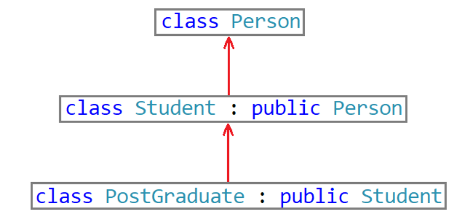
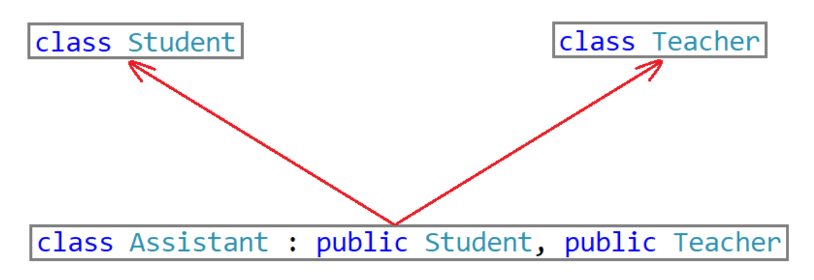
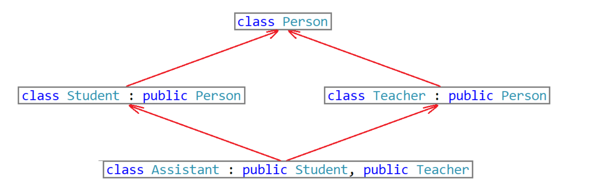
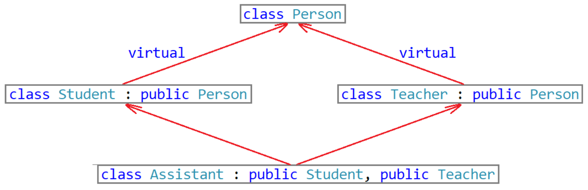
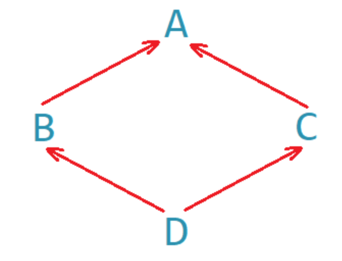
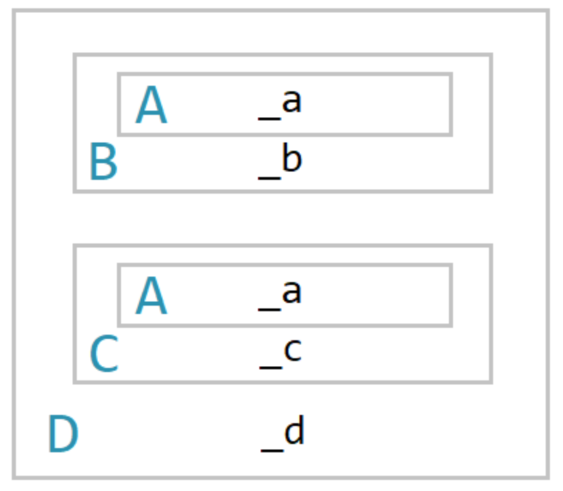
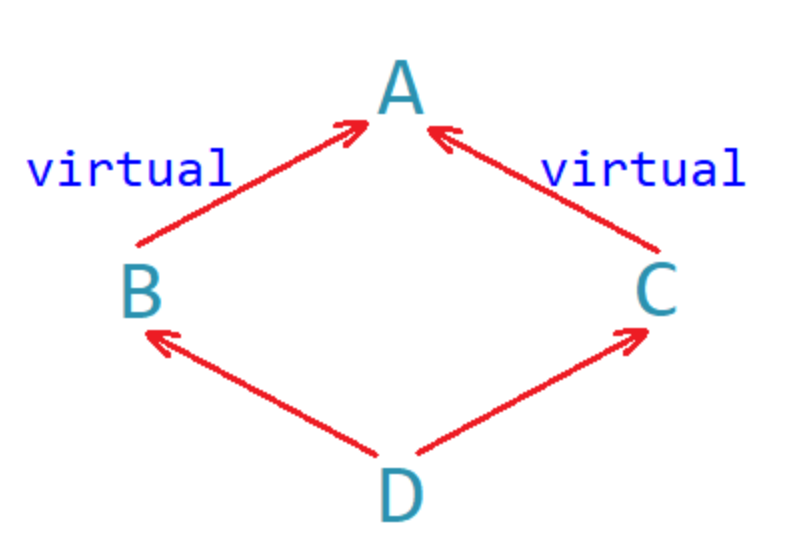
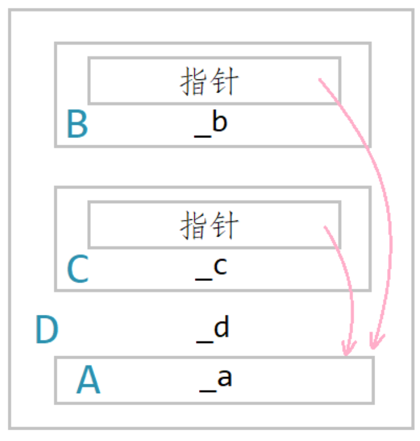

> [!NOTE]
>
> 继承

# 定义

## 格式

```c++
class 派生类:继承方式:基类{
    
}
```

在继承中，父类就是基类，子类由基类派生而来，所以也叫派生类。

## 继承方式和访问限定符

三种访问限定符：

1. public访问
2. protected访问
3. private访问

三种继承方式：

1. public继承
2. protected继承
3. private继承

## 继承基类成员访问方式的变化

| 基类成员类型        | public继承          | protected继承       | private继承       |
| ------------------- | ------------------- | ------------------- | ----------------- |
| 基类的public成员    | 派生类public成员    | 派生类protected成员 | 派生类private成员 |
| 基类的protected成员 | 派生类protected成员 | 派生类protected成员 | 派生类private成员 |
| 基类的private成员   | 派生类中不可见      | 派生类中不可见      | 派生类中不可见    |

三种访问限定符的权限大小为：`private>protected>private`

1. 在基类中的public或protected成员，在派生类中的访问方式为`Min(成员在基类的访问方式,继承方式)`
2. 基类中访问方式为private的成员在派生类中都是不可见的

如何理解在派生类中都是不可见的？

```c++
class Person{
private: 
    string _name;
};

class Student: public Person{
public:
	void Print(){
        cout << _name << endl;
    }    
protected:
    int _stuid;
};
```

基类的private成员无论以什么方式继承，在派生类中都是不可见的。

**不可见是指：**基类的私有成员虽然被继承到了派生类的对象中，但是语法上限制派生类对象不管在类里还是类外都无法访问。

如果基类的成员不想在类外被直接访问，到需要在派生类中访问，那么就定义为protected。（protected是因为继承才出现的）

但在实际运用中一般都是public继承

## 默认继承方式

若在继承中没有指定继承方式，那么使用class时默认继承方式为private，使用struct默认继承方式为public。

# 基类和派生类对象赋值转换

派生类对象可以赋值给基类的对象、指针和引用。在此过程中会发生基类和派生类对象之间的赋值转换。

基类对象不能赋值给派生类对象，基类的指针可以通过强制类型转换赋值给派生类的指针，但此时基类的指针必须指向派生类的对象才是安全的。

# 继承中的作用域

在继承中基类和派生类都有独立的作用域。若子类和父类由同名成员，子类成员将屏蔽父类对同名成员的直接访问。这就是屏蔽（重定义）。

~~~c++
class Person{
protected:
    int num = 111;
};

class Student: public Person{
public:
    void fun(){
        cout << num << endl;
    }
protected:
    int num = 999;
}

Student st;
st.fun();//999
~~~

1. 编译器在fun()的作用域中找，没找到
2. 在Student的作用域中找，找到了Student::num
3. 不会再去Person的作用域中找

想访问基类的num，需要

```c++
void fun(){
    cout << Person::fun() << endl;
}
```

对于同名如何识别的问题，用到了和函数重载类似的名称修饰。

**只要函数名相同（不管参数列表）就构成成员函数的隐藏**

```c++
class Person{
public:
    void fun(int x){
        cout << x << endl;
    }
};

class Student:public Person{
public:
    void fun(double x){
        cout << x << endl;
    }
};

Student st;
s.fun(3.14);
s.Person::fun(20);

```

此时父类中的fun和子类中的fun不构成函数重载，因为重载要求两个变量在同一个作用域，而这两个fun函数不在同一个作用域。

# 派生类的默认成员函数

初始化和清理：

1. 构造函数
2. 析构函数

拷贝复制：

3. 拷贝构造
4. 复制重载

取地址重载：

5. 对普通对象取地址
6. 对const对象取地址

举个例子

```c++
//基类
class Person
{
public:
	//构造函数
	Person(const string& name = "peter")
		:_name(name)
	{
		cout << "Person()" << endl;
	}
	//拷贝构造函数
	Person(const Person& p)
		:_name(p._name)
	{
		cout << "Person(const Person& p)" << endl;
	}
	//赋值运算符重载函数
	Person& operator=(const Person& p)
	{
		cout << "Person& operator=(const Person& p)" << endl;
		if (this != &p)
		{
			_name = p._name;
		}
		return *this;
	}
	//析构函数
	~Person()
	{
		cout << "~Person()" << endl;
	}
private:
	string _name; //姓名
};
```

```c++
//派生类
class Student : public Person
{
public:
	//构造函数
	Student(const string& name, int id)
		:Person(name) //调用基类的构造函数初始化基类的那一部分成员
		, _id(id) //初始化派生类的成员
	{
		cout << "Student()" << endl;
	}
	//拷贝构造函数
	Student(const Student& s)
		:Person(s) //调用基类的拷贝构造函数完成基类成员的拷贝构造
		, _id(s._id) //拷贝构造派生类的成员
	{
		cout << "Student(const Student& s)" << endl;
	}
	//赋值运算符重载函数
	Student& operator=(const Student& s)
	{
		cout << "Student& operator=(const Student& s)" << endl;
		if (this != &s)
		{
			Person::operator=(s); //调用基类的operator=完成基类成员的赋值
			_id = s._id; //完成派生类成员的赋值
		}
		return *this;
	}
	//析构函数
	~Student()
	{
		cout << "~Student()" << endl;
		//派生类的析构函数会在被调用完成后自动调用基类的析构函数
	}
private:
	int _id; //学号
};
```

注意：

1. 派生类的构造函数被调用时，会自动调用基类的构造函数初始化基类的那一部分，如果基类没有默认构造函数，必须在派生类构造函数的初始化列表中显式调用基类的构造函数。
2. 派生类的拷贝构造函数必须调用基类的拷贝构造函数完成基类成员的拷贝构造。
3. 派生类的赋值运算符重载函数必须调用基类的赋值运算重载函数完成基类成员的赋值。
4. 派生类的析构函数必须在调用完成后自动调用基类的析构函数清理基类成员。
5. 派生类对象初始化时会自动调用基类的构造函数再调用派生类的构造函数。
6. 派生类对象再析构时，会先调用派生类的析构函数再调用基类的析构函数。

编写派生类的默认成员函数时需要注意：

1. 派生类和基类的赋值运算符重载函数因为函数名相同构成隐藏，因此派生类中调用基类的赋值运算符重载函数时，需要使用作用域限定符`::`进行调用。

   ```c++
   class Base {
   public:
       int base_data = 0;
       Base& operator=(const Base& other) {
           std::cout << "Base assignment called" << std::endl;
           if (this != &other) {
               base_data = other.base_data;
           }
           return *this;
       }
   };
   
   class Derived : public Base {
   public:
       int derived_data = 0;
       // 显式定义派生类的赋值运算符
       Derived& operator=(const Derived& other) {
           std::cout << "Derived assignment called" << std::endl;
           if (this != &other) {
               // 重点：必须显式调用基类版本，否则 Base::base_data 不会被拷贝！
               Base::operator=(other); 
               
               this->derived_data = other.derived_data;
           }
           return *this;
       }
   };
   ```

2. 由于多态的某些原因，任何类的析构函数名都会被统一处理为`destructor();`。因此，派生类和基类的析构函数也会因为函数名相同构成隐藏，若是我们需要在某处调用基类的析构函数，那么就要使用作用域限定符进行指定调用。

   ```c++
   derived_obj.Base::~Base();
   ```

3. 在派生类的拷贝构造函数和`operator=`当中调用基类的拷贝构造函数和`operator=`的传参方式是一个切片行为，都是将派生类对象直接赋值给基类的引用。

   ```c++
   class Base {
   public:
       int base_val;
       Base(const Base& other) : base_val(other.base_val) {} // 拷贝构造
       Base& operator=(const Base& other) {                  // 赋值运算符
           if (this != &other) base_val = other.base_val;
           return *this;
       }
   };
   
   class Derived : public Base {
   public:
       int der_val;
       
       // 1. 拷贝构造中的“切片”传参
       // 此处的 other 是 Derived，但 Base 构造函数接受 Base&，产生绑定
       Derived(const Derived& other) : Base(other), der_val(other.der_val) {}
   
       // 2. operator= 中的“切片”传参
       Derived& operator=(const Derived& other) {
           if (this != &other) {
               // 显式调用基类赋值，将派生类对象 other “切片”给基类引用
               Base::operator=(other); 
               der_val = other.der_val;
           }
           return *this;
       }
   };
   ```

基类的构造函数、拷贝构造函数、赋值运算符重载函数我们都可以在派生类当中自行进行调用，而基类的析构函数是当派生类的析构函数被调用后由**编译器自动调用**的，我们若是自行调用基类的构造函数就会导致基类被析构多次的问题。

创建派生类对象时是先创建的基类成员再创建的派生类成员，编译器为了保证析构时先析构派生类成员再析构基类成员的顺序析构，所以编译器会在派生类的析构函数被调用后自动调用基类的析构函数。

# 继承与友元

友元不能继承：基类的友元可以访问基类的私有和保护成员，但是不能访问派生类的私有和保护成员。

```c++
class Person{
public:
    friend void Display(const Person& p, const Student& s);
protected:
    string _name;
};

class Student: public Person{
protected:
    int _id;
};

void Display(const Person&p, const Student& s){
    cout << p._name << endl;//可以访问
    cout << s._id << endl;//无法访问
}
```

若想让Display函数也能访问派生类Student的私有和保护成员，需要在Student当中进行友元声明。

~~~c++
class Student : public Person
{
public:
	//声明Display是Student的友元
	friend void Display(const Person& p, const Student& s);
protected:
	int _id; //学号
};
~~~

同样的，派生类都无法访问基类的private成员，所以派生类里声明的友元更不用说了。

# 继承与静态成员

当基类中定义了一个static成员变量，则整个继承体系中只有一个该静态成员实例。

例如Person类定义了static count尽管Person又有了派生类Student和Graduate，但整个继承体系中只有一个该静态成员。若是在基类Person的构造函数和拷贝构造中设置count进行自增，就可以随时通过_count来获取此刻已实例化的Person、Student、和Graduate对象的个数。

基类声明中的所有static会被所有派生类继承，本质上是派生类作用域可以直接访问基类的static符号。

**但是这并不是维护了一个指针指向static，而是在编译时通过名称修饰符直接绑定地址。（这也是static比全局变量高级的原因）**

若派生类**未重定义**同名static，那么基类和派生类的static地址相同，基类/派生类的对象/类名访问的static都是基类的那一个。

若派生类**重定义**了同名static，会触发static成员的隐藏，此时基类访问基类的，派生类访问派生类的。

# 继承的方式

## 单继承



一个子类只有一个直接父类

## 多继承



一个子类有两个或两个以上直接父类

## 菱形继承



菱形继承存在数据冗余和二义性问题

使用

```c++
//显示指定访问哪个父类的成员
a.Student::_name = "张同学";
a.Teacher::_name = "张老师";
```

可以解决二义性问题，但是无法解决数据冗余问题。

## 虚拟继承



```c++
class Person
{
public:
	string _name; //姓名
};
class Student : virtual public Person //虚拟继承
{
protected:
	int _num; //学号
};
class Teacher : virtual public Person //虚拟继承
{
protected:
	int _id; //职工编号
};
class Assistant : public Student, public Teacher
{
protected:
	string _majorCourse; //主修课程
};
int main()
{
	Assistant a;
	a._name = "peter"; //无二义性
	return 0;
}
```

## 菱形虚拟继承原理









# 总结

继承是一种is-a关系

组合是一种has-a关系