> [!NOTE]
>
> 多态

# 多态概念

**多态：函数调用的多种形态**，使用多态使不同对象完成同一件事时，产生不同的动作和结果。

# 多态的定义与实现

## 构成条件

不同继承关系的类对象，调用同一函数，产生了不同的行为。

构成多态的两个条件：

1. 必须通过基类的指针或引用调用虚函数
2. 被调用的函数必须是虚函数，且派生类必须对虚函数进行重写。

## 虚函数

```c++
class Person{
    virtual void BuyTicket(){
        
    }
};
```

注意：

1. 只有类的非静态成员函数前可以加Virtual 普通函数不能加Virtual
2. 和虚拟继承使用的是同一关键字但是没有任何关系，虚函数的virtual为了实现多态而虚拟继承为了解决菱形继承的二义性和数据冗余

## 虚函数的重写

虚函数的重写/虚函数的覆盖，若派生类中有一个和基类完全相同的虚函数（返回值类型，函数名，参数列表），此时该派生类虚函数重写了基类的虚函数。

```c++
//父类
class Person
{
public:
	//父类的虚函数
	virtual void BuyTicket()
	{
		cout << "买票-全价" << endl;
	}
};
//子类
class Student : public Person
{
public:
	//子类的虚函数重写了父类的虚函数
	virtual void BuyTicket()
	{
		cout << "买票-半价" << endl;
	}
};
//子类
class Soldier : public Person
{
public:
	//子类的虚函数重写了父类的虚函数
	virtual void BuyTicket()
	{
		cout << "优先-买票" << endl;
	}
};
```

在这个例子中，使用父类Person的指针或引用调用虚函数BuyTicket，不同类型的对象调用的就是不同的函数，产生的也是不同的结果，实现了函数调用的多态。

**在重写基类虚函数时，派生类的虚函数不加virtual关键字也可以构成重写，因为继承后基类的虚函数属性被继承下来了，在派生类中依旧保持虚函数的属性。**但是这种写法不规范。

## 虚函数重写的两个例外？

### 协变

**子类重写父类虚函数时，返回值类型可 “协变” 为父类返回值的**派生类指针/引用（普通重写要求返回值一致）

通常**派生类重写基类函数时返回类型必须一致，但协变返回类型是唯一例外。**

协变的3个条件：

**函数必须是虚函数**：基类函数必须被声明为 `virtual`。

**返回类型必须是类类型的指针或引用**：不能是基本数据类型（如 `int`、`double`）或值传递的对象。

**继承关系**：派生类函数返回的类型必须是基类函数返回类型的派生类。

~~~c++
#include <iostream>

// 基类层次
class Animal {
public:
    virtual void speak() { std::cout << "Animal sound" << std::endl; }
    virtual ~Animal() {}
};

class Dog : public Animal {
public:
    void speak() override { std::cout << "Woof!" << std::endl; }
};

// 工厂类层次（体现协变）
class AnimalFactory {
public:
    // 基类返回 Animal 指针
    virtual Animal* createAnimal() {
        return new Animal();
    }
    virtual ~AnimalFactory() {}
};

class DogFactory : public AnimalFactory {
public:
    // 协变：派生类重写时返回 Dog 指针（Dog 是 Animal 的子类）
    Dog* createAnimal() override {
        return new Dog();
    }
};
~~~

协变的注意事项：

| **限制项**           | **说明**                                                     |
| -------------------- | ------------------------------------------------------------ |
| **必须是指针或引用** | 返回值类型不能是 `Animal` 和 `Dog` 的对象值（值传递会发生对象切割）。 |
| **访问权限**         | 协变不要求访问权限一致。基类可以是 `public`，派生类重写可以是 `private`（虽然不建议这么做）。 |
| **智能指针**         | **注意：** `std::unique_ptr<T>` 或 `std::shared_ptr<T>` **不支持**原生协变。因为它们是模板类，`std::unique_ptr<Dog>` 并不是 `std::unique_ptr<Animal>` 的派生类。 |

### 析构函数的重写

>  为什么需要虚析构函数？

当你通过**基类指针**指向并删除一个**派生类对象**时，如果基类的析构函数没有声明为虚函数，程序将发生**未定义行为**（通常是只调用基类的析构函数，而跳过派生类的析构函数）。

```c++
class Base {
public:
    ~Base() { std::cout << "Base Destructor\n"; } // 非虚析构
};

class Derived : public Base {
    int* data;
public:
    Derived() { data = new int[100]; }
    ~Derived() { 
        delete[] data; 
        std::cout << "Derived Destructor\n"; 
    }
};

int main() {
    Base* ptr = new Derived();
    delete ptr; // 报错或内存泄漏：仅调用 Base 的析构函数
}
```

调用了`~Base()`，data数组并不会被释放。

> 虚析构函数工作机制

当将基类虚函数声明为`virtual`时:

1. 动态绑定:编译器会根据虚函数表查找对象的实际类型
2. 析构序列会从最底层的派生类开始逐级向上调用,直到基类

```c++
class Base {
public:
    virtual ~Base() { std::cout << "Base Destructor\n"; } // 声明为虚
};
```

此时执行 `delete ptr;`输出顺序为：

1. `Derived Destructor`（先清理派生类资源）
2. `Base Destructor`（再清理基类资源）

> 析构重写的特殊规则

如果基类的析构函数是`virtual`，那么所有派生类析构函数自动称为**虚析构函数**,即使没有显示的写`virtual`或`override`。

#### 析构函数其它知识

编译器会保证虚析构函数从下往上链式调用

> 编译器在派生类析构函数做了什么

~~~c++
~Derived(){
    
}
~~~

编译器会在编译阶段转换为类似伪代码：

```c++
void Derived_Destructor(Derived* const this) {
    this->vptr = vtable_for_Derived; // 1. 确保在当前析构函数内虚函数指向正确
    
    // 执行用户写的逻辑
    // [User Code: delete my_data;]
    
    // 2. 编译器自动插入的操作：调用基类析构函数
    Base_Destructor((Base*)this); 
}
```

## 显式的得到虚表指针

```c++
#include <iostream>
#include <stdint.h>

class Base {
public:
    virtual void f() { std::cout << "Base::f" << std::endl; }
    virtual void g() { std::cout << "Base::g" << std::endl; }
};

class Derived : public Base {
public:
    void f() override { std::cout << "Derived::f" << std::endl; }
};

int main() {
    Base* b = new Derived();

    // 1. 得到对象的起始地址，强转为指向指针的指针 (uintptr_t*)
    // 在 64 位下，指针占 8 字节，uintptr_t 刚好也是 8 字节
    uintptr_t* vptr = (uintptr_t*)b;

    // 2. 解引用 vptr，得到虚表 (vtable) 的首地址
    uintptr_t vtable_addr = *vptr;
    std::cout << "虚表指针 (vptr) 指向的地址: 0x" << std::hex << vtable_addr << std::endl;

    // 3. 访问虚表中的第一个函数 (Derived::f)
    // 虚表本质是一个函数指针数组
    typedef void (*Func)(); 
    uintptr_t* vtable = (uintptr_t*)vtable_addr;
    Func f1 = (Func)vtable[0]; // 虚表第 1 项
    Func f2 = (Func)vtable[1]; // 虚表 第 2 项

    std::cout << "通过虚表调用第一个虚函数: ";
    f1(); // 输出 Derived::f
    
    std::cout << "通过虚表调用第二个虚函数: ";
    f2(); // 输出 Base::g（Derived 没重写，所以用基类的）

    delete b;
    return 0;
}
```

虚表指针实现细节中属于ABI（应用二进制接口）（约定俗成的规定）

将对象指针转为 `void**` 或 `uintptr_t*`，就能读取出它存储的那个“地址值”（即虚表的起始地址）。

### 虚函数与this指针

不论是普通成员函数还是虚函数在编译器编译后第一个参数一定是对象的地址`*this`

若函数指针为

```c++
typedef void (*Func)();
```

然后直接 `f1();` 调用，实际上是在**没有传递任何参数**的情况下运行了一个**预期接收一个参数**的函数。

为什么可以跑通呢？

在现代 64 位系统中，函数的第一个参数通常通过 `RDI` 寄存器传递。

当执行 `b->f()` 时，编译器会自动把 `b` 的地址放进 `RDI`。

```c++
Base* b = new Derived(); // b 指向对象
// ... 获取 f1 ...
f1(); // 并没有传递 b
```

在调用 `f1()` 之前的代码中，一直在操作指针 `b`。在很多情况下，寄存器 `RDI` 里**恰好还残留着** `b` 的地址。当 `f1()` 执行时，它去 `RDI` 里找 `this`，刚好找到了那个残余的值。

但是这是一种**极其危险的未定义行为**。如果在调用 `f1()` 之前做一些复杂的计算，清空了寄存器，程序就会立刻崩溃（通常是段错误，因为 `this` 变成了乱码）。

> 那么如何正确的调用

要让虚函数指针意识到`this`指针：

1. 在参数列表里加上`this`

   ```c++
   // 显式声明第一个参数是 void* (即 this)
   typedef void (*Func)(void*); 
   
   // 调用时手动把对象地址传进去
   f1(b);
   ```

2. 使用C++的成员函数指针

   `void (Base::*fptr)()` 这种语法，它会自动处理 `this`，但这会绕过我们手动查表的过程。

   ```c++
   struct Base {
       void foo() {
           std::cout << "Base::foo\n";
       }
   
       void bar() {
           std::cout << "Base::bar\n";
       }
   };
   void (Base::*fptr)();
   fptr = &Base::foo;
   //通过对象调用
   Base b;
   (b.*fptr)();
   //通过对象指针调用
   Base* pb = &b;
   (pb->*fptr)();
   ```

成员函数指针不一定是地址

///这个就涉及到了成员函数指针和函数指针的用法 之后详细补充///

> 为什么void*能充当this

在 C++ 的底层机器码中，并没有所谓的“类”或者“成员函数”。所有的函数最终都变成了内存中一段连续的指令，而**成员函数与普通函数的唯一区别在于“调用约定”**。

编译器在翻译成员函数时，会自动做如下转换：

```c++
//我写的代码
void MyClass::func(int x) { this->data = x; }
```

```c++
//编译器的底层代码
// 实际上变成了一个带额外参数的全局函数
void MyClass_func(MyClass* const this, int x) { 
    this->data = x; 
}
```

这里的 `this` 本质上就是一个**内存地址**。

当你定义 `typedef void (*Func)(void*)` 时：

1. `void*` 代表“一个通用地址”。
2. 当你调用 `f1(b)`，你实际上是手动把对象的地址（`b`）放进了编译器预留给第一个参数的“槽位”（通常是寄存器 `RDI`）。
3. 虚函数内部的代码会把这个“槽位”里的值当成 `this` 来使用。

> `void*`指向虚无吗？

`void*` 指向一块内存，但**我不关心这块内存里存的是什么**。

**`void*` 的两个核心特性：**

1. **万能接收器**：任何类型的指针（`Base*`, `Derived*`, `int*`）都可以隐式地转换为 `void*`。这是因为在底层，所有指针的大小都是一样的（64 位系统下都是 8 字节）。
2. **放弃解析权**：`void*` 告诉编译器：“我知道这里有一个地址，但由于我不知道它是什么类型，所以你不允许我通过这个指针去访问成员（如 `ptr->data` 报错）”。

> `void*`在查表调用中的作用

由于我们要从虚函数表里提取出的函数可能来自不同的类，我们无法在 `typedef` 时写死具体的类名（比如 `Base*` 或 `Derived*`）。

使用 `void*` 作为第一个参数，实际上是建立了一个**通用的调用模板**：

> “编译器，我知道你要调用的这个函数第一个参数需要一个地址。我这正好有一个地址（对象地址），你把它塞进第一个参数位置就行了，至于函数内部怎么把它转回原来的类型去用，那是函数自己的事。”

### 其它参数和返回值情况

`typedef void (*Func)(void*)`; 解决了传入this的问题 那么实际中的参数列表和返回值 怎么办

在编译器层面，`typedef void (*Func)(void*)` 其实并没有真正“捕获”或“适配”实际的参数和返回值。它只是提供了一个“入口地址”，而真正保证不出错的原因在于底层的调用约定。

> 内存中的函数只是逻辑起点

在 CPU 看来，函数并没有“类型”或“签名”，只有**指令的起始地址**。 当你执行 `f1(b)` 时，机器码层面只发生了两件事：

1. **传参**：把地址 `b` 放到特定的寄存器（如 `RDI`）。
2. **跳转**：把执行流转向虚表里存的那个地址。

**至于这个函数原本需要多少参数、返回什么，跳转这一刻是不管的。**

> 参数列表不会崩？

假设实际的虚函数是 `virtual int add(int x, int y)`，编译器翻译后的底层签名是 `int add(Derived* this, int x, int y)`。

如果你用 `void (*Func)(void*)` 去调：

- 你只传了第一个参数 `this`。
- 函数内部会去尝试读取寄存器 `RSI`（第二个参数 `x`）和 `RDX`（第三个参数 `y`）。
- **结果**：函数不会崩溃，但它会读取到这两个寄存器里此时此刻的**随机垃圾值**。你得到的返回值也将是基于垃圾值计算出来的结果。

**结论**：这种写法并没有“解决”参数问题，它只是因为 C++ 允许你强转指针，让你能够“踢开大门”强行进入函数。**只有当你调用的虚函数原本就只有 0 个参数时，这种写法才是逻辑安全的。**

> 为什么返回值不会崩？

这涉及到返回值是如何传递给调用者的。在 64 位系统下：

- **整数/指针返回值**：通常存放在 `RAX` 寄存器中。
- **浮点数返回值**：通常存放在 `XMM0` 寄存器中。

当你用一个声明为返回 `void` 的函数指针去调用一个实际返回 `int` 的函数时：

1. 被调用的函数会如实地把结果算好，放进 `RAX`。
2. 调用方（你的 `main` 函数）因为认为返回值是 `void`，所以它**直接忽略了 `RAX` 寄存器**。

**数据还在那里，只是你选择视而不见。** 内存并不会因此溢出，程序也不会因此挂掉，这仅仅是“信息的丢失”。

> 如果非要捕获虚函数呢？

必须精确匹配签名

如果你知道虚表的第 3 个函数是 `float calculate(int a, double b)`，你必须定义完全对应的指针类型：

```c++
// 必须完全匹配：返回值是 float，参数是 this, int, double
typedef float (*ActualFunc)(void* _this, int a, double b);

ActualFunc f = (ActualFunc)vtable[2];
float result = f(b, 10, 3.14); // 这样才是真正的“捕获”
```

所以：这样做可以某些情况下获取到虚表地址和虚表中的虚函数 并在各种巧合的情况下调用虚函数 但是终究不是标准 只是一种语法没有禁止的尝试 正常来讲我们不会这么干 所以也无需在意更细节的东西

## 虚函数表的性能开销

空间开销：每个类有一个虚表，每个对象多一个指针大小(64位系统寻址2^64大小8字节)的`vptr`

时间开销：

1. **间接寻址：**多了一次内存访问（查表）
2. **流水线预测失败：**由于是动态跳转，CPU 分支预测器更难准确预判下一步执行的代码，可能导致指令流水线刷新。
3. **内联失败**：编译器很难内联一个虚函数，因为在编译时它根本不知道该内联哪段代码。

## override和final

有些情况下由于疏忽可能会导致函数名的字母次序写反而无法构成重写，而这种错误在编译期间是不会报错的，直到在程序运行时没有得到预期结果再来进行调试会得不偿失

`final`修饰虚函数，表明虚函数不能再被重写。

```c++
class Person{
public:
    virtual void BuyTicket() final{
        
    }
};

class Student: public Person{
public:
    virtual void BuyTicket(){
        //重写 编译报错
    }
}
```

`override`检查派生类虚函数是否重写了基类的虚函数，如果没有重写则编译报错。

```c++
//父类
class Person
{
public:
	virtual void BuyTicket()
	{
		cout << "买票-全价" << endl;
	}
};
//子类
class Student : public Person
{
public:
	//子类完成了父类虚函数的重写，编译通过
	virtual void BuyTicket() override
	{
		cout << "买票-半价" << endl;
	}
};
//子类
class Soldier : public Person
{
public:
	//子类没有完成了父类虚函数的重写，编译报错
	virtual void BuyTicket(int i) override
	{
		cout << "优先-买票" << endl;
	}
};
```

## 重载、重写与重定义（隐藏）

**重载：**

- 两函数在同一作用域，函数名相同参数不同。

**重写（覆盖）：**

- 两个函数分别在基类和派生类的作用域
- 函数名、参数、返回类型完全相同（除了协变）
- 两个函数必须是虚函数

**重定义（隐藏）：**

- 两个函数分别在基类和派生类的作用域
- 函数名相同
- 两个基类和派生类的同名函数不构成重写就是重定义

# 抽象类

在虚函数后面加上`=0`则这个函数为纯虚函数，包纯虚函数的类叫抽象类，抽象类不能实例化为对象。

```c++
class Car{
public:
	virtual void Drive() = 0;
};

Car c;//报错
```

- 可以更好的表示现实生活中的抽象类型。
- 很好的体现了虚函数的继承是一种接口继承。这样强制子类重写虚函数，因为子类若不重写父类继承下来的虚函数，那么子类也是抽象类不能实例化出对象。

## 接口继承和实现继承

实现继承：普通函数的继承是一种实现继承，派生类继承了基类函数的实现。

接口继承：虚函数的继承是一种接口继承，派生类继承的是基类虚函数的接口，目的就是为了重写，达到多态。

# 多态的原理

## 虚函数表

```c++
class Base
{
public:
	virtual void Func1()
	{
		cout << "Func1()" << endl;
	}
private:
	int _b = 1;
};

Base b;
sizeof(b)//8
```

Base类实例化后的对象大小其实为16个字节：

64位系统虚表指针占了8字节，int4字节，内存对齐4字节（后8字节的前一半）。

b对象除了_b外还有一个`_vfptr`在对象的前面

虚函数表指针（虚表指针）指向一个虚函数表，每一个含有虚函数的类至少有一个虚表指针。

```c++
#include <iostream>
using namespace std;
//父类
class Base
{
public:
	//虚函数
	virtual void Func1()
	{
		cout << "Base::Func1()" << endl;
	}
	//虚函数
	virtual void Func2()
	{
		cout << "Base::Func2()" << endl;
	}
	//普通成员函数
	void Func3()
	{
		cout << "Base::Func3()" << endl;
	}
private:
	int _b = 1;
};
//子类
class Derive : public Base
{
public:
	//重写虚函数Func1
	virtual void Func1()
	{
		cout << "Derive::Func1()" << endl;
	}
private:
	int _d = 2;
};
int main()
{
	Base b;
	Derive d;
	return 0;
}
```

父类对象b和基类对象d当中除了自己的成员变量之外，父类和子类对象都有一个虚表指针，分别指向属于自己的虚表。

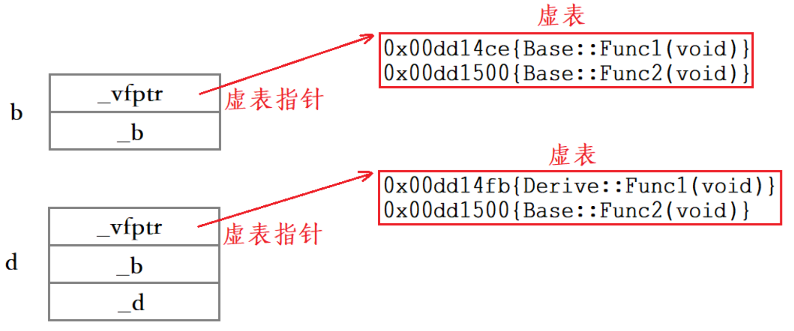

实际上虚表当中存储的就是虚函数的地址，因为父类当中的Func1和Func2都是虚函数，所以父类对象b的虚表当中存储的就是虚函数Func1和Func2的地址。

而子类虽然继承了父类的虚函数Func1和Func2，但是子类对父类的虚函数Func1进行了重写，因此，子类对象d的虚表当中存储的是**父类的虚函数Func2的地址**和**重写的Func1的地址**。这就是为什么虚函数的重写也叫做覆盖，覆盖就是指虚表中虚函数地址的覆盖，重写是语法的叫法，覆盖是原理层的叫法。

其次需要注意的是：Func2是虚函数，所以继承下来后放进了子类的虚表，而Func3是普通成员函数，继承下来后不会放进子类的虚表。此外，虚函数表本质是一个存虚函数指针的指针数组，一般情况下会在这个数组最后放一个nullptr。

> [!IMPORTANT]
>
> 派生类的虚表生成步骤如下

1. 将基类中的虚表内容拷贝一份到派生类的虚表
2. 如果派生类重写了基函数中的某个虚函数，则用派生列自己的虚函数地址覆盖虚表中基类的虚函数地址
3. 派生类自己新增的虚函数按其在派生类中的声明次序依次添加到虚表最后

虚表实际上是在**构造函数初始化列表阶段**进行初始化的，注意虚表当中存的是虚函数的地址不是虚函数，虚函数和普通函数一样，都是存在代码段的，只是他的地址又存到了虚表当中。

对象中存的不是虚表而是指向虚表的指针。

至于虚表是存在哪里的？

```c++
int j = 0;
int main()
{
	Base b;
	Base* p = &b;
	printf("vfptr:%p\n", *((int*)p)); //000FDCAC
	int i = 0;
	printf("栈上地址:%p\n", &i);       //005CFE24
	printf("数据段地址:%p\n", &j);     //0010038C

	int* k = new int;
	printf("堆上地址:%p\n", k);       //00A6CA00
	char* cp = "hello world";
	printf("代码段地址:%p\n", cp);    //000FDCB4
	return 0;
}
```

可以看出虚表是存在代码段中的

> **构造函数可以是虚函数吗？** 为什么？
>
> 另外，**如果在构造函数里调用虚函数，会发生多态行为吗？**

vptr 的赋值发生在**构造函数的函数体执行之前**，但在**基类构造之后**。

**对象诞生的精确步骤**（以 `Derived` 继承 `Base` 为例）：

1. **分配空间**：在栈或堆上划出足够大的内存。
2. **基类构造**：调用 `Base` 的构造函数。此时，对象的 vptr 指向的是 **`Base` 的虚表**。
3. **vptr “重写”**：基类构造完成后，编译器会插入代码，将 vptr 修改为指向 **`Derived` 的虚表**。
4. **子类初始化列表**：初始化 `Derived` 自己的成员。
5. **子类构造体**：执行 `Derived()` 大括号里的代码。

**构造函数为什么不能是虚的？** 你的结论是对的：虚函数调用依赖于 vptr，而 vptr 是由构造函数来初始化的。如果构造函数本身是虚的，这就陷入了“先有鸡还是先有蛋”的悖论。

**在构造函数里调虚函数会怎样？** **没有多态行为**。 当你在 `Base` 的构造函数里调用虚函数时，此时 vptr 依然指向 `Base` 的虚表（因为 `Derived` 的部分还没开始构造）。所以它只会调用 `Base` 版本的函数。这在 C++ 中是为了安全性——防止你在父类构造时去访问子类尚未初始化的成员。

## 多态的底层原理

```c++
//父类
class Person
{
public:
	virtual void BuyTicket()
	{
		cout << "买票-全价" << endl;
	}
	int _p = 1;
};
//子类
class Student : public Person
{
public:
	virtual void BuyTicket()
	{
		cout << "买票-半价" << endl;
	}
	int _s = 2;
};
int main()
{
	Person Mike;
	Student Johnson;
	Johnson._p = 3; //以便观察是否完成切片
	Person* p1 = &Mike;
	Person* p2 = &Johnson;
	p1->BuyTicket(); //买票-全价
	p2->BuyTicket(); //买票-半价
	return 0;
}
```

对象Mike包含一个成员变量_p和一个虚表指针，对象Johnson包含两个成员变量\_p\_s和一个虚表指针，这两个对象当中虚表指针分别指向自己的虚表。

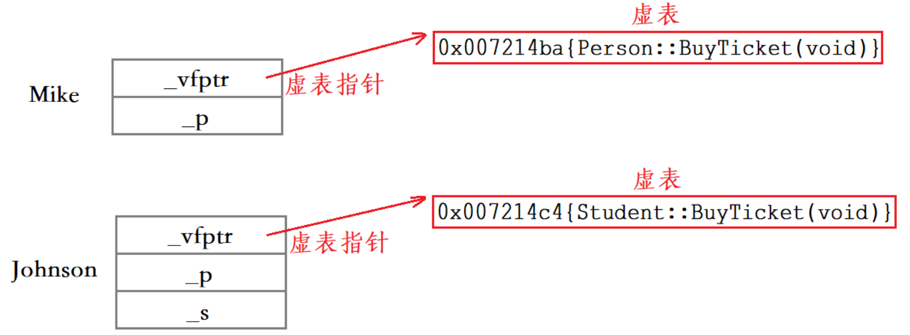

1. 父类指针p1指向Mike对象，p1->BuyTicket在Mike的虚表中找到的虚函数就是Person::BuyTicket。
2. 父类指针p2指向Johnson对象，p2>BuyTicket在Johnson的虚表中找到的虚函数就是Student::BuyTicket。

回顾多态的两个必要条件：

1. 完成虚函数的重写：需要子类虚函数表中虚函数地址的覆盖
2. 必须使用父类指针或引用去调用虚函数

对于2 为什么 不能是父类对象呢

### 切片

使用父类指针或者引用时本质是一种切片行为，切片只会让指针或引用得到父类对象或子类对象中切除来的那部分

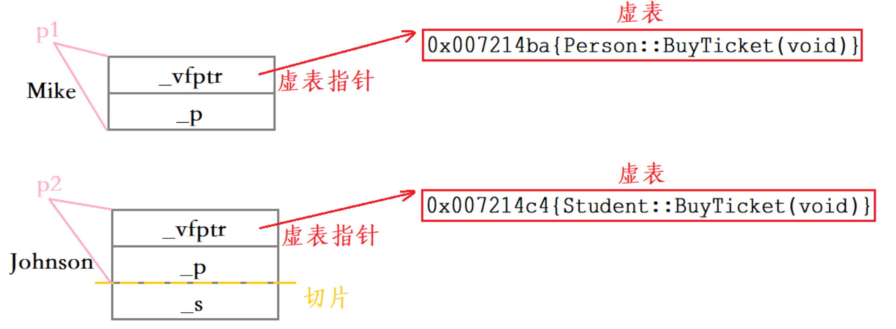

此时用p1和p2调用虚表时，p1和p2通过虚表指针找到的虚表是不一样的，最终调用的函数也是不一样的。

```c++
Person* p1 = &Mike;
Person* p2 = &Johnson;
```

但是

使用父类对象时，切片得到部分成员变量后，会调用父类的拷贝构造函数对“那部分”成员变量进行**拷贝构造**，拷贝构造出来的父类对象p1和p2当中的虚表指针指向父类对象的虚表。同类型的对象共享一张虚表，所以p1和p2的虚表是一样的。

```c++
Person p1 = Mike;
Person p2 = Johnson;
```

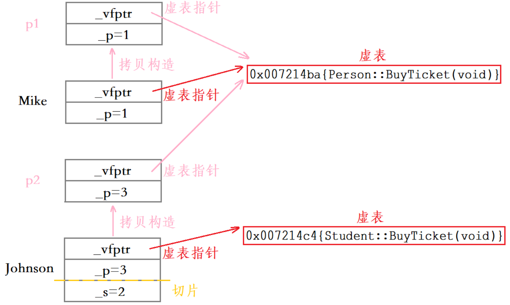


## 动态绑定和静态绑定

**静态绑定：**前期绑定（早绑定），在程序编译期间确定了程序的行为，也叫静态多态。如函数重载。

**动态绑定：**后期绑定（晚绑定），在程序运行期间，根据具体拿到的类型确定程序的具体行为，调用具体的函数。也叫动态多态。

对于以下代码

```c++
//父类
class Person
{
public:
	virtual void BuyTicket()
	{
		cout << "买票-全价" << endl;
	}
};
//子类
class Student : public Person
{
public:
	virtual void BuyTicket()
	{
		cout << "买票-半价" << endl;
	}
};

int main()
{
	Student Johnson;
	Person p = Johnson; //不构成多态
	p.BuyTicket();
	return 0;
}
```

> 对象切割过程

`Person p = Johnson;` 时，编译器执行的操作是：

1. **内存分配**：在栈上开辟一块足以容纳 `Person` 对象的空间（注意，这个空间比 `Student` 小）。
2. **拷贝构造**：调用 `Person` 的拷贝构造函数。它只会拷贝 `Johnson` 中属于 `Person` 基类的那部分成员数据。
3. **虚表指针 (vptr) 的设定**：这是关键！由于 `p` 的类型是 `Person`，编译器在构造 `p` 时，会将它的 **`vptr` 强制指向 `Person` 的虚函数表**。

`Johnson` 里的 `Student` 特有数据和指向 `Student` 虚表的指针，在赋值给 `p` 的一瞬间都被“切割”掉了。

> 为什么不查表

处理 `p.BuyTicket()` 时：

- **类型已知**：`p` 是一个栈上的局部对象，它的类型在编译期是 100% 确定的 `Person`。
- **无动态性**：无论 `p` 是怎么来的（即使是用 `Student` 初始化来的），它现在就是一个纯粹的 `Person`。

因此，编译器不需要生成“查表”的指令。它直接把代码链接到 `Person::BuyTicket()` 的函数地址。这就变成了**静态绑定**。

| **代码写法**            | **行为本质**                             | **虚表指针 (vptr) 指向** | **是否构成多态**  |
| ----------------------- | ---------------------------------------- | ------------------------ | ----------------- |
| `Person p = Johnson;`   | **创建新对象**。发生切割，调用拷贝构造。 | **Person 的虚表**        | **否** (静态绑定) |
| `Person* p = &Johnson;` | **地址绑定**。只存地址，不创建新对象。   | **Student 的虚表**       | **是** (动态绑定) |
| `Person& p = Johnson;`  | **起别名**。直接操作原对象。             | **Student 的虚表**       | **是** (动态绑定) |

# 不同继承中的虚函数表

## 单继承

```c++
//基类
class Base
{
public:
	virtual void func1() { cout << "Base::func1()" << endl; }
	virtual void func2() { cout << "Base::func2()" << endl; }
private:
	int _a;
};
//派生类
class Derive : public Base
{
public:
	virtual void func1() { cout << "Derive::func1()" << endl; }
	virtual void func3() { cout << "Derive::func3()" << endl; }
	virtual void func4() { cout << "Derive::func4()" << endl; }
private:
	int _b;
};
```

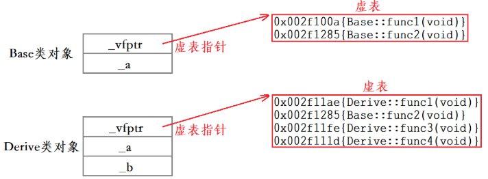

单继承中派生类的虚函数表生成过程如下：

1. 继承基类的虚表内容到派生类的虚表。
2. 对派生类重写的虚函数地址进行覆盖，如func1。
3. 虚表中新增派生类中新的虚函数地址，如func2和func3。

## 多继承

```c++
//基类1
class Base1
{
public:
	virtual void func1() { cout << "Base1::func1()" << endl; }
	virtual void func2() { cout << "Base1::func2()" << endl; }
private:
	int _b1;
};
//基类2
class Base2
{
public:
	virtual void func1() { cout << "Base2::func1()" << endl; }
	virtual void func2() { cout << "Base2::func2()" << endl; }
private:
	int _b2;
};
//多继承派生类
class Derive : public Base1, public Base2
{
public:
	virtual void func1() { cout << "Derive::func1()" << endl; }
	virtual void func3() { cout << "Derive::func3()" << endl; }
private:
	int _d1;
};
```

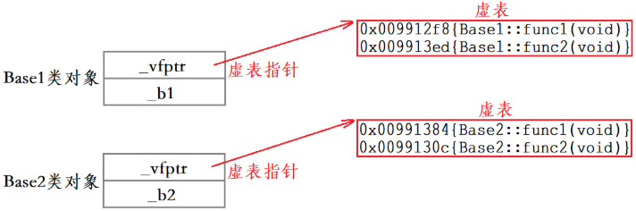

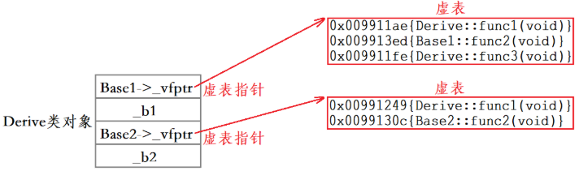

多继承中派生类的虚表生成过程如下：

1. 分别继承各个基类的虚表内容到派生类的各个虚表中。
2. 对派生类重写了的虚函数地址进行覆盖（派生类中的各个虚表中存有这个被重写虚函数地址的都要进行覆盖，如func1）。
3. 在派生类第一个继承基类部分的虚表中新增派生类当中新的虚函数地址，如func3。

## 菱形继承

```c++
class A
{
public:
	virtual void funcA()
	{
		cout << "A::funcA()" << endl;
	}
private:
	int _a;
};
class B : virtual public A
{
public:
	virtual void funcA()
	{
		cout << "B::funcA()" << endl;
	}
	virtual void funcB()
	{
		cout << "B::funcB()" << endl;
	}
private:
	int _b;
};
class C : virtual public A
{
public:
	virtual void funcA()
	{
		cout << "C::funcA()" << endl;
	}
	virtual void funcC()
	{
		cout << "C::funcC()" << endl;
	}
private:
	int _c;
};
class D : public B, public C
{
public:
	virtual void funcA()
	{
		cout << "D::funcA()" << endl;
	}
	virtual void funcD()
	{
		cout << "D::funcD()" << endl;
	}
private:
	int _d;
};
```

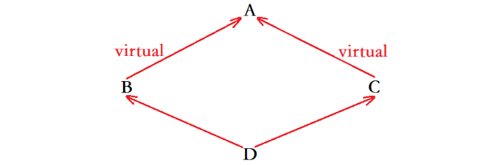

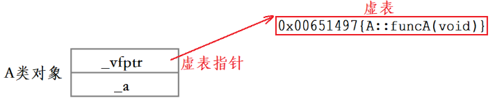

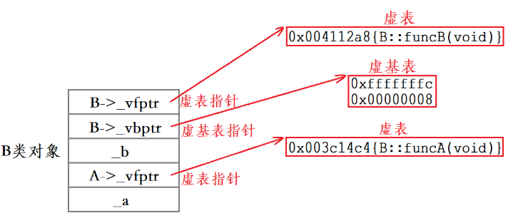

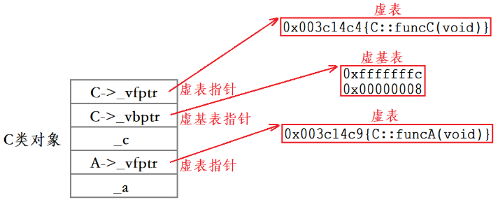

B的虚基表当中存储的是两个偏移量，第一个是虚基表指针距离B虚表指针的偏移量，第二个是虚基表指针距离虚基类A的偏移量。

**第一项（针对当前类）**：`vbptr` 距离**当前子对象地址**的偏移量。

**后续项（针对虚基类）**：`vbptr` 距离**虚基类对象**首地址的偏移量。

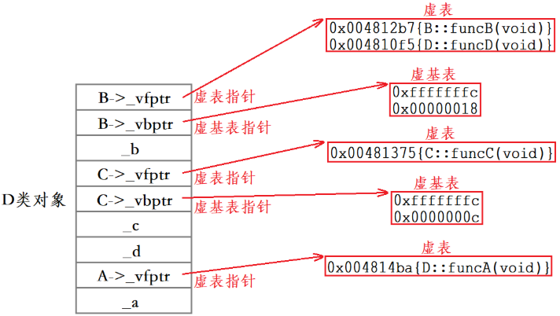

为什么必须用指针+表呢？

因为虚继承破坏了一个重要性质：**基类位置不再是编译器常量**

因为基类A不再属于B或C，而是属于D。

只有D才知道完整的布局，推导A的最终位置。

普通继承

```c++
B -> A 偏移 = 固定值（编译期确定）
```

虚继承

```c++
B -> A 偏移 = 不确定（取决于最终派生类 D）
```

```c++
B* pb = new D();
pb->A::func();
```

1️⃣ 通过 pb 找到 B 子对象

2️⃣ 读取 vbptr

3️⃣ 通过 vbptr 找到 vbtable

4️⃣ 查表找到：

```
A 在整个对象中的偏移
```

5️⃣ 做指针偏移：

```
A地址 = 当前this + offset
```

# 题外话：什么函数可以是虚函数

## 不能是虚函数

**构造函数**

- **原因**：虚函数的调用依赖于对象内部的**虚函数表指针（vptr）**。当实例化一个对象并调用构造函数时，该对象的 vptr 正在被初始化，对象本身还未完全“成型”。在构造函数中调用虚函数，不会发生多态行为，只会调用当前类版本的函数。因此，C++ 语法直接禁止将构造函数声明为 `virtual`。

**静态成员函数**

- **原因**：静态成员函数属于“类”本身，所有对象共享同一个静态函数。它们没有隐藏的 `this` 指针，而虚函数的动态绑定是强依赖于对象实例的 `this` 指针来查找虚函数表的。

**友元函数**

- **原因**：友元函数仅仅是类的“朋友”，它们可以访问类的私有成员，但它们**不是**类的成员函数。虚函数必须是类的成员函数。

**全局函数 / 普通非成员函数**

- **原因**：同上，它们不属于任何类，没有继承关系，自然无法多态。

**（补充说明）内联函数**

- **原因**：这其实是一个面试常考的“陷阱”。语法上，你可以把虚函数写成 `inline`，编译器不会报错。但是，`inline` 是在**编译期**将代码直接展开，而 `virtual` 是在**运行期**进行动态绑定。当一个虚函数被多态调用（通过基类指针/引用）时，编译器无法在编译期确定调用哪个版本，因此**会直接忽略 `inline` 请求**。只有在通过对象本身（非指针/引用）明确调用时，才可能被内联。

## 必须是虚函数

**作为多态基类的析构函数**

- **场景**：如果你的类是设计用来被继承的，并且你会通过**基类指针去释放（delete）派生类对象**，那么基类的析构函数**必须**声明为虚函数。
- **原因**：如果基类的析构函数不是虚函数，执行 `delete base_ptr;` 时，编译器将执行静态绑定，**只会调用基类的析构函数**。派生类自己的析构函数（以及派生类中特有的成员变量的清理工作）将被完全忽略，这会导致严重的**内存泄漏**和资源未释放。

