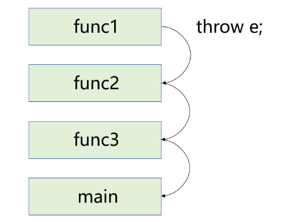
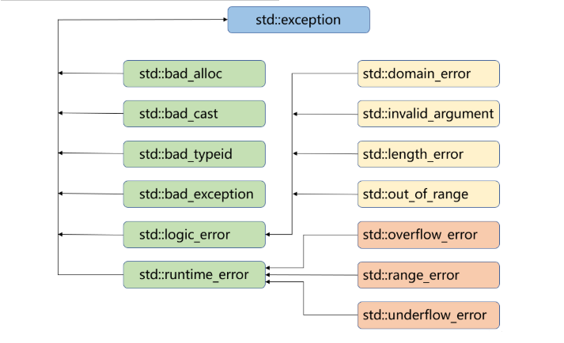

> [!NOTE]
>
> 异常

异常是面向对象语言常用的一种处理错误的方式，当一个函数发现自己无法处理的错误时就可以抛出异常，让函数直接或间接的调用者处理这个错误。

- throw：当程序出现问题时，可以通过throw关键字抛出一个异常。
- try：try块中放置的是可能抛出异常的代码，该代码块在执行时将进行异常错误检测，try块后面通常跟着一个或多个catch块。
- catch：如果try块中发生错误，则可以在catch块中定义对应要执行的代码块。

try/catch语法如下：

```c++
try
{
	//被保护的代码
}
catch (ExceptionName e1)
{
	//catch块
}
catch (ExceptionName e2)
{
	//catch块
}
catch (ExceptionName eN)
{
	//catch块
}
```

一旦某个 `catch` 成功匹配并执行完毕，后面的 `catch` 不会再执行

举个例子：

```c++
class Base {};
class Derived : public Base {};

try {
    throw Derived();
}
catch (Base&) {
    cout << "base\n";
}
catch (Derived&) {
    cout << "derived\n";
}
//输出 base
```

所以正确的写法是：

```c++
catch (Derived&)
catch (Base&)
```

如果是

```c++
catch (int e) {
    cout << "int\n";
    throw;  // 重新抛出
}
```

那么当前catch结束后异常继续向外层传播，外层try才有机会接住，同一个try里的后续catch仍然不会执行。

# 异常的用法

## 异常的抛出和捕获

异常的抛出和捕获的匹配原则：

1. 异常是通过抛出对象而引发的，该对象的类型决定了应该激活哪个catch的处理代码，如果抛出的异常对象没有捕获，或是没有匹配类型的捕获，那么程序会终止报错。

2. 被选中的处理代码（catch块）是调用链中与该对象类型匹配且离抛出异常位置最近的那一个。

3. 抛出异常对象后，会生成一个异常对象的拷贝，因为抛出的异常对象可能是一个临时对象，所以会生成一个拷贝对象，这个拷贝的临时对象会在被catch以后销毁。（类似于函数的传值返回）

4. `catch(...)`可以捕获任意类型的异常，但捕获后无法知道异常错误是什么。

5. 实际异常的抛出和捕获的匹配原则有个例外，捕获和抛出的异常类型并不一定要完全匹配，可以抛出派生类对象，使用基类进行捕获，这个在实际中非常有用

在函数调用链中异常栈展开的匹配原则：

1. 异常被抛出后，首先检查throw本身是否在try块内部，如果在则查找匹配的catch语句，如果有匹配的，则跳到catch的地方进行处理。
2. 如果当前函数栈没有匹配的catch则退出当前函数栈，继续在上一个调用函数栈中进行查找匹配的catch。找到匹配的catch子句并处理以后，会沿着catch子句后面继续执行，而不会跳回到原来抛异常的地方。
3. 如果到达main函数的栈，依旧没有找到匹配的catch，则终止程序。

举个例子：

```c++
void func1()
{
	throw string("这是一个异常");
}
void func2()
{
	func1();
}
void func3()
{
	func2();
}
int main()
{
	try
	{
		func3();
	}
	catch (const string& s)
	{
		cout << "错误描述：" << s << endl;
	}
	catch (...)
	{
		cout << "未知异常" << endl;
	}
	return 0;
}
```

当func1中的异常被抛出后：

- 首先会检查throw本身是否在try块内部，这里由于throw不在try块内部，因此会退出func1所在的函数栈，继续在上一个调用函数栈中进行查找，即func2所在的函数栈。

- 由于func2中也没有匹配的catch，因此会继续在上一个调用函数栈中进行查找，即func3所在的函数栈。

- func3中也没有匹配的catch，于是就会在main所在的函数栈中进行查找，最终在main函数栈中找到了匹配的catch。

- 这时就会跳到main函数中对应的catch块中执行对应的代码块，执行完后继续执行该代码块后续的代码。



上述沿着这个调用链查找匹配catch子句的过程称为**栈展开/栈解退**（叫法不一样，其实都是Stack Unwinding）。

在实际中我们最后都要加一个`catch(...)`捕获任意类型的异常，否则当有异常没捕获时，程序就会直接终止。

## 异常的重新抛出

有时候单个的catch可能不能完全处理一个异常，在进行一些校正处理以后，希望再交给更外层的调用链函数来处理，比如最外层可能需要拿到异常进行日志信息的记录，这时就需要通过重新抛出将异常传递给更上层的函数进行处理。

但如果直接让最外层捕获异常进行处理可能会引发一些问题。比如：

```c++
void func1()
{
	throw string("这是一个异常");
}
void func2()
{
	int* array = new int[10];
	func1();

	//do something...

	delete[] array;
}
int main()
{
	try
	{
		func2();
	}
	catch (const string& s)
	{
		cout << s << endl;
	}
	catch (...)
	{
		cout << "未知异常" << endl;
	}
	return 0;
}
```

由于func2调用func1的途中抛出了一个异常，这时会跳转到main函数中的catch块执行对应的异常处理程序，在处理完后沿着catch之后执行。

这就导致了func2申请的内存没有释放，造成内存泄漏

这时可以在func2中先对func1抛出的异常进行捕获，捕获后先将申请到的内存释放再将异常重新抛出，这时就避免了内存泄露。

```c++
void func2()
{
	int* array = new int[10];
	try
	{
		func1();
		//do something...
	}
	catch (...)
	{
		delete[] array;
		throw; //将捕获到的异常再次重新抛出
	}
	delete[] array;
}
```

- func2中的new和delete之间可能还会抛出其他类型的异常，因此在fun2中最好以catch(...)的方式进行捕获，将申请到的内存delete后再通过throw重新抛出。

- 重新抛出异常对象时，throw后面可以不用指明要抛出的异常对象（正好也不知道以catch(...)的方式捕获到的具体是什么异常对象）。

## 异常安全

对于异常安全有以下建议：

1. 构造函数完成对象的构造和初始化，最好不要在构造函数中抛出异常，否则可能导致对象不完整或没有完全初始化。

2. 析构函数主要完成对象资源的清理，最好不要在析构函数中抛出异常，否则可能导致资源泄露（内存泄露、句柄未关闭等）。

3. C++中异常经常会导致资源泄露的问题，比如在new和delete中抛出异常，导致内存泄露，在lock和unlock之间抛出异常导致死锁，C++经常使用RAII的方式来解决以上问题。

## 异常规范

`void f() throw();`已经是旧标准

在函数的后面接`throw()`或`noexcept`（C++11），表示该函数不抛异常。

noexcept是一个**编译期承诺+运行时强约束**

栈展开过程中如果再抛异常 → terminate

noexcept 相当于：明确告诉编译器：这里不能参与异常传播。

noexcept的语法：

```c++
void f() noexcept;        // 等价于 noexcept(true)
void g() noexcept(false); // 明确说明可能抛异常
```

```c++
//这两种写法等价
void f() noexcept(true);
void f() noexcept;
```

如果`noexcept`真的抛异常了，那么程序会立即调用`std::terminate()`

不会进入catch，不会继续传播，直接终止程序。

```c++
//这两种写法等价
void g();
void g() noexcept(false);
```

`noexcept(false)`很少单独写

**noexcept是函数类型的一部分**

```c++
void f() noexcept;
void g();
void(*)() noexcept     // 指向不抛异常函数
void(*)()              // 指向可能抛异常函数
```

**条件noexcept**

```c++
template<typename T>
void func() noexcept(std::is_nothrow_move_constructible<T>::value);
```

> 如果 T 的移动构造不抛异常，那 func 也不抛异常。

```c++
noexcept(表达式)
```

如果表达式为 true → noexcept(true)
如果表达式为 false → noexcept(false)

**与异常规范同名但不同的编译器运算符**

```c++
noexcept(expr)
//示例
void f() noexcept;
void g();

cout << noexcept(f()); // true
cout << noexcept(g()); // false
```

# 自定义异常体系

- 公司中的项目一般会进行模块划分，让不同的程序员或小组完成不同的模块，如果不对抛异常这件事进行规范，那么负责最外层捕获异常的程序员就非常难受了，因为他需要捕获大家抛出的各种类型的异常对象。

- 因此实际中都会定义一套继承的规范体系，先定义一个最基础的异常类，所有人抛出的异常对象都必须是继承于该异常类的派生类对象，因为异常语法规定可以用基类捕获抛出的派生类对象，因此最外层就只需捕获基类就行了。

最基础的异常类至少需要包含错误编号和错误描述两个成员变量，甚至还可以包含当前函数栈帧的调用链等信息。该异常类中一般还会提供两个成员函数，分别用来获取错误编号和错误描述。

举个例子：

```c++
class Exception
{
public:
	Exception(int errid, const char* errmsg)
		:_errid(errid)
		, _errmsg(errmsg)
	{}
	int GetErrid() const
	{
		return _errid;
	}
	virtual string what() const
	{
		return _errmsg;
	}
protected:
	int _errid;     //错误编号
	string _errmsg; //错误描述
	//...
};
```

```c++
class CacheException : public Exception
{
public:
	CacheException(int errid, const char* errmsg)
		:Exception(errid, errmsg)
	{}
	virtual string what() const
	{
		string msg = "CacheException: ";
		msg += _errmsg;
		return msg;
	}
protected:
	//...
};
class SqlException : public Exception
{
public:
	SqlException(int errid, const char* errmsg, const char* sql)
		:Exception(errid, errmsg)
		, _sql(sql)
	{}
	virtual string what() const
	{
		string msg = "CacheException: ";
		msg += _errmsg;
		msg += "sql语句: ";
		msg += _sql;
		return msg;
	}
protected:
	string _sql; //导致异常的SQL语句
	//...
};
```

# 标准库异常体系

C++标准库当中的异常也是一个基础体系，其中exception就是各个异常类的基类，我们可以在程序中使用这些标准的异常，它们之间的继承关系如下：



| 异常                  | 描述                                                         |
| --------------------- | ------------------------------------------------------------ |
| std::exception        | 该异常是所有标准C++异常的父类。                              |
| std::bad_alloc        | 该异常可以通过new抛出。                                      |
| std::bad_cast         | 该异常可以通过dynamic_cast抛出。                             |
| std::bad_exception    | 这在处理C++程序中无法预期的异常时非常有用。                  |
| std::bad_typeid       | 该异常可以通过typeid抛出。                                   |
| std::logic_error      | 理论上可以通过读取代码来检测到的异常。                       |
| std::domain_error     | 当使用了一个无效的数学域时，会抛出该异常。                   |
| std::invalid_argument | 当使用了无效的参数时，会抛出该异常。                         |
| std::length_error     | 当创建了太长的std::string时，会抛出该异常。                  |
| std::out_of_range     | 该异常可以通过方法抛出，例如std::vector和std::bitset<>::operator。 |
| std::runtime_error    | 理论上不可以通过读取代码来检测到的异常。                     |
| std::overflow_error   | 当发生数学上溢时，会抛出该异常。                             |
| std::range_error      | 当尝试存储超出范围的值时，会抛出该异常。                     |
| std::underflow_error  | 当发生数学下溢时，会抛出该异常。                             |

- exception类的what成员函数和析构函数都定义成了虚函数，方便子类对其进行重写，从而达到多态的效果。
- 实际中我们也可以去继承exception类来实现自己的异常类，但实际中很多公司都会自己定义一套异常继承体系。

# 异常的优缺点

缺点：

异常会导致程序的执行流乱跳，并且非常的混乱，这会导致我们跟踪调试以及分析程序时比较困难。

C++没有垃圾回收机制，资源需要自己管理。