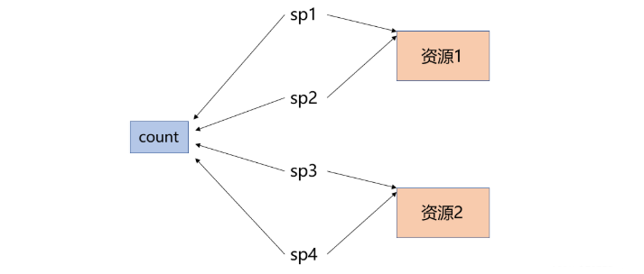
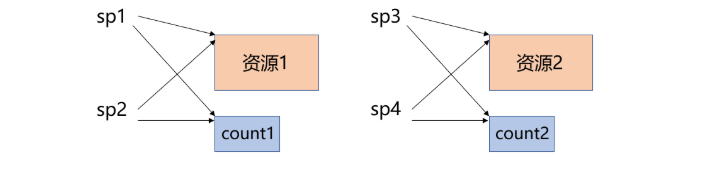
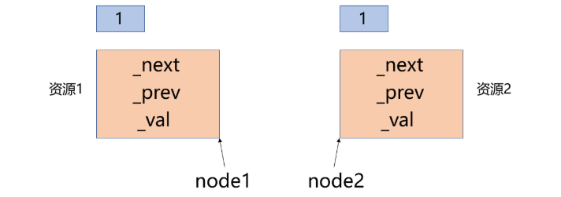
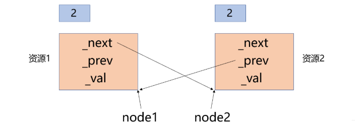
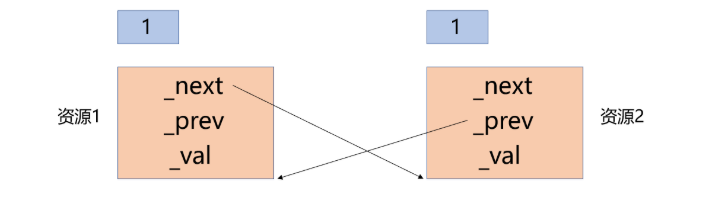

> [!NOTE]
>
> 智能指针

# std::unique_ptr

`unique_ptr` 在底层就是一个极其简单的包装，它通过 **删除拷贝构造函数和赋值运算符** 来禁止拷贝。

- **性能**：与原始指针几乎没有区别（Zero-cost abstraction）。
- **内存布局**：通常只占用一个指针的大小。

```c++
int main()
{
	std::unique_ptr<int> up1(new int(0));
	//std::unique_ptr<int> up2(up1); //error
	return 0;
}
```

## 模拟实现

1. 在构造函数中获取资源，在析构函数中释放资源，利用对象的声明周期来控制资源
2. 对`*`和`->`进行重载，使unique_ptr对象有像指针一样的行为。
3. 讲拷贝构造和赋值函数`=delete`

```c++
template<typename T>
class unique_ptr{
public:
    //
    unique_ptr(T* ptr = nullptr):_ptr(ptr){}
    ~unique_ptr(){
        if(ptr!=nullptr){
        	delete _ptr;
            _ptr=nullptr
        }        
    }
    
    T& operator*{
        return *_ptr;
    }
    
    T* operator->{
        return _ptr;
    }
    
    unique_ptr(unique_ptr<T>& up) = delete;
    unique_ptr& operator=(unique_ptr<T>& up) = delete;
            
private:
    T* _ptr;
}
```

# std::shared_ptr

## 控制块

当你创建一个 `shared_ptr` 时，它内部实际上包含两个指针：

1. 指向**托管对象**的指针。
2. 指向**控制块**的指针。控制块是存储在堆上的一个结构，包含：
   - **Strong Ref Count**（强引用计数）：控制对象的生命周期。
   - **Weak Ref Count**（弱引用计数）：控制控制块本身的生命周期。
   - 自定义删除器等。

**性能陷阱**：引用计数的增减是**原子操作**，虽然线程安全，但在高频循环中会有一定的同步开销。

## 手写注意事项

shared_ptr通过引用计数的方式解决智能指针的拷贝问题

1. 每一个被管理的资源都有一个对应的引用计数，通过这个引用计数记录着当前有多少个对象在管理着这块资源。

2. 当新增一个对象管理这块资源时则将该资源对应的引用计数进行++，当一个对象不再管理这块资源或该对象被析构时则将该资源对应的引用计数进行--。

3. 当一个资源的引用计数减为0时说明已经没有对象在管理这块资源了，这时就可以将该资源进行释放了。

### 引用计数存在堆区

不能在栈上：shared_ptr中的引用计数count不能单纯的定义成一个int类型的成员变量，因为这就意味着每个shared_ptr对象都有一个自己的count成员变量，而当多个对象要管理同一个资源时，这几个对象应该用到的是同一个引用计数。


不能是static：shared_ptr中的引用计数count也不能定义成一个静态的成员变量，因为静态成员变量是所有类型对象共享的，这会导致管理相同资源的对象和管理不同资源的对象用到的都是同一个引用计数。



而如果将shared_ptr中的引用计数count定义成一个指针，当一个资源第一次被管理时就在堆区开辟一块空间用于存储其对应的引用计数，如果有其他对象也想要管理这个资源，那么除了将这个资源给它之外，还需要把这个引用计数也给它。



### 线程安全

如果对引用计数器的自增和自减不是原子操作，那么线程不安全。

所以要加锁解决线程安全问题：

1. 在shared_ptr类中新增互斥锁成员变量，为了让管理同一个资源的多个线程访问到的是同一个互斥锁，管理不同资源的线程访问到的是不同的互斥锁，因此互斥锁也需要在堆区创建。
2. 在调用拷贝构造函数和拷贝赋值函数时，除了需要将对应的资源和引用计数交给当前对象管理之外，还需要将对应的互斥锁也交给当前对象。
3. 当一个资源对应的引用计数减为0时，除了需要将对应的资源和引用计数进行释放，由于互斥锁也是在堆区创建的，因此还需要将对应的互斥锁进行释放。
4. 为了简化代码逻辑，可以将拷贝构造函数和拷贝赋值函数中引用计数的自增操作提取出来，封装成AddRef函数，将拷贝赋值函数和析构函数中引用计数的自减操作提取出来，封装成ReleaseRef函数，这样就只需要对AddRef和ReleaseRef函数进行加锁保护即可。

```c++
namespace cl
{
	template<class T>
	class shared_ptr
	{
	private:
		//++引用计数
		void AddRef()
		{
			_pmutex->lock();
			(*_pcount)++;
			_pmutex->unlock();
		}
		//--引用计数
		void ReleaseRef()
		{
			_pmutex->lock();
			bool flag = false;
			if (--(*_pcount) == 0) //将管理的资源对应的引用计数--
			{
				if (_ptr != nullptr)
				{
					cout << "delete: " << _ptr << endl;
					delete _ptr;
					_ptr = nullptr;
				}
				delete _pcount;
				_pcount = nullptr;
				flag = true;
			}
			_pmutex->unlock();
			if (flag == true)
			{
				delete _pmutex;
			}
		}
	public:
		//RAII
		shared_ptr(T* ptr = nullptr)
			:_ptr(ptr)
			, _pcount(new int(1))
			, _pmutex(new mutex)
		{}
		~shared_ptr()
		{
			ReleaseRef();
		}
		shared_ptr(shared_ptr<T>& sp)
			:_ptr(sp._ptr)
			, _pcount(sp._pcount)
			, _pmutex(sp._pmutex)
		{
			AddRef();
		}
		shared_ptr& operator=(shared_ptr<T>& sp)
		{
			if (_ptr != sp._ptr) //管理同一块空间的对象之间无需进行赋值操作
			{
				ReleaseRef();         //将管理的资源对应的引用计数--
				_ptr = sp._ptr;       //与sp对象一同管理它的资源
				_pcount = sp._pcount; //获取sp对象管理的资源对应的引用计数
				_pmutex = sp._pmutex; //获取sp对象管理的资源对应的互斥锁
				AddRef();             //新增一个对象来管理该资源，引用计数++
			}
			return *this;
		}
		//获取引用计数
		int use_count()
		{
			return *_pcount;
		}
		//可以像指针一样使用
		T& operator*()
		{
			return *_ptr;
		}
		T* operator->()
		{
			return _ptr;
		}
	private:
		T* _ptr;        //管理的资源
		int* _pcount;   //管理的资源对应的引用计数
		mutex* _pmutex; //管理的资源对应的互斥锁
	};
}
```

- 在ReleaseRef函数中，当引用计数被减为0时需要释放互斥锁资源，但不能在临界区中释放互斥锁，因为后面还需要进行解锁操作，因此代码中借助了一个flag变量，通过flag变量来判断解锁后释放需要释放互斥锁资源。
- shared_ptr只需要保证引用计数的线程安全问题，而不需要保证管理的资源的线程安全问题，就像原生指针管理一块内存空间一样，原生指针只需要指向这块空间，而这块空间的线程安全问题应该由这块空间的操作者来保证。

## 定制删除器

 当智能指针对象的声明周期结束时，所有智能指针都默认使用`delete`方式将资源释放，但是智能指针并不是只管理`new`申请的内存，也可能是`new[]`方式申请的空间。

```c++
struct ListNode
{
	ListNode* _next;
	ListNode* _prev;
	int _val;
	~ListNode()
	{
		cout << "~ListNode()" << endl;
	}
};
int main()
{
	std::shared_ptr<ListNode> sp1(new ListNode[10]);   //error
	std::shared_ptr<FILE> sp2(fopen("test.cpp", "r")); //error

	return 0;
}
```

对于ListNode[10]，delete只会调用第一个对象的析构函数，剩下9个对象的析构函数不会执行。

对于fopen，对于的释放是fclose，而不是delete。

此时需要定制删除器来控制资源释放

```c++
template <class U, class D>
shared_ptr(U* p, D* del);
```

- p：需要让智能指针删除的资源
- del：删除器

```c++
template<class T>
struct DelArr
{
	void operator()(const T* ptr)
	{
		cout << "delete[]: " << ptr << endl;
		delete[] ptr;
	}
};
int main()
{
	std::shared_ptr<ListNode> sp1(new ListNode[10], DelArr<ListNode>());
    //传入lambda表达式
	std::shared_ptr<FILE> sp2(fopen("test.cpp", "r"), [](FILE* ptr){
		cout << "fclose: " << ptr << endl;
		fclose(ptr);
	});

	return 0;
}
```

## 循环引用问题

```c++
struct ListNode
{
	std::shared_ptr<ListNode> _next;
	std::shared_ptr<ListNode> _prev;
	int _val;
	~ListNode()
	{
		cout << "~ListNode()" << endl;
	}
};
int main()
{
	std::shared_ptr<ListNode> node1(new ListNode);
	std::shared_ptr<ListNode> node2(new ListNode);

	node1->_next = node2;
	node2->_prev = node1;
	//...

	return 0;
}
```

这时程序运行结束后两个结点都没有被释放，但如果去掉连接结点时的两句代码中的任意一句，那么这两个结点就都能够正确释放，根本原因就是因为这两句连接结点的代码导致了循环引用。

当node1和node2被new了之后



去掉`node1->_next = node2`或`node2->_prev=node1`任意一句，资源都能够被正确释放。

但两个节点被连起来后，就变成了



当main运行结束时，node1和node2的声明周期结束，引用-1。



当资源对于的引用计数为0时对应的资源才会被释放，资源1的释放取决于资源2的prev，资源2的释放取决于资源1的next。

而资源1当中的next成员的释放又取决于资源1，资源2当中的prev成员的释放又取决于资源2，于是这就变成了一个死循环，最终导致资源无法释放。

如果连接结点时只进行一个连接操作，那么当node1和node2的生命周期结束时，就会有一个资源对应的引用计数被减为0，此时这个资源就会被释放，这个释放后另一个资源的引用计数也会被减为0，最终两个资源就都被释放了

再举一个例子

```c++
#include <iostream>
#include <memory>
#include <string>

class Pet; // 前置声明

class Player {
public:
    std::string name;
    std::shared_ptr<Pet> myPet; // 持有宠物的强引用
    Player(std::string n) : name(n) {}
    ~Player() { std::cout << "Player " << name << " destroyed\n"; }
};

class Pet {
public:
    std::shared_ptr<Player> master; // 持有主人的强引用 -> 隐患点！
    ~Pet() { std::cout << "Pet destroyed\n"; }
};

void TestLeak() {
    auto player = std::make_shared<Player>("Arasaka");
    auto pet = std::make_shared<Pet>();

    player->myPet = pet;   // pet 的计数变为 2
    pet->master = player;  // player 的计数变为 2
    
    // 函数结束，局部变量 player 和 pet 销毁
    // player 的计数从 2 降为 1（因为被 pet 内部持有）
    // pet 的计数从 2 降为 1（因为被 player 内部持有）
} // 没有任何析构函数被调用！内存泄漏发生。
```

在 `shared_ptr` 的控制块中，只有当 **强引用** 变为 0 时，托管的对象才会被销毁。

1. 初始状态：`player` 指向 `Player` 对象（Count=1），`pet` 指向 `Pet` 对象（Count=1）。
2. 互相持有：
   - `player->myPet = pet`：`Pet` 对象的控制块中，Strong Ref Count = 2。
   - `pet->master = player`：`Player` 对象的控制块中，Strong Ref Count = 2。
3. 作用域结束：局部变量销毁，触发一次递减。
   - `Player` 对象计数变为 1。
   - `Pet` 对象计数变为 1。
4. 结果：因为计数不为 0，两者都不会调用析构函数。而由于这两个对象只能通过彼此找到，它们在内存中变成了一个孤岛。

# std::make_shared

> 为什么推荐用 `std::make_shared` 而不是 `std::shared_ptr<T>(new T())`？

**内存分配**：`new` 方式会触发两次堆分配（对象一次，控制块一次）；`make_shared` 只需一次连续的内存分配，提高了缓存友好性。

**异常安全**：避免在构造函数参数求值过程中发生内存泄漏。

> `std::make_shared` 会将对象内存和控制块内存分配在一起。那么，如果我有一个很大的对象，并且有很多 `weak_ptr` 指向它。即使所有的 `shared_ptr` 都被销毁了，这个大对象所占用的**内存**会立即归还给操作系统吗？为什么？

一旦 Strong Ref Count（强引用计数）归零，**对象的析构函数会被立即调用**，对象逻辑上已经死亡，绝对不可能“复活”。`weak_ptr.lock()` 会返回空

但是make_shared有副作用

`make_shared` 申请的是**一块**连续的大内存（包含 `Control Block` + `Object`）。

强引用归零 -> 对象析构（调用 `~T()`），但内存不能释放，因为这块大内存里还有 `Control Block` 活着。

`Control Block` 必须活着，因为 `weak_ptr` 需要访问其中的 `Weak Ref Count` 来确认对象是否还在。

只有当 **Weak Ref Count 也归零**，整个控制块才会被销毁。

如果你的对象非常大（例如 100MB 的纹理），且还有 `weak_ptr` 活着，那么这 **100MB 的内存空间**会一直被占用，无法归还给 OS，即使对象已经析构了。

如果对象很大且 `weak_ptr` 生命周期很长，**不要用** `make_shared`！请用 `std::shared_ptr<T>(new T)`，这样对象内存（Heap 1）和控制块内存（Heap 2）是分开的。对象析构时，Heap 1 会立即释放，只留下极小的 Heap 2 给 `weak_ptr` 检查。

# std:weak_ptr

`weak_ptr` 是 `shared_ptr` 的“观察者”。它的关键点在于：**它指向对象，但不会增加控制块中的 Strong Ref Count**，它只会增加 **Weak Ref Count**。

在游戏开发中，通常遵循**“上层持有下层强引用，下层持有上层弱引用”**的原则。

```c++
class Pet {
public:
    // 将 shared_ptr 改为 weak_ptr
    std::weak_ptr<Player> master; 
    
    void PlayWithMaster() {
        // 使用前需要提权（lock）
        if (auto p = master.lock()) { 
            std::cout << "Playing with " << p->name << "\n";
        } else {
            std::cout << "Master is gone...\n";
        }
    }
    ~Pet() { std::cout << "Pet destroyed\n"; }
};
```

weak_ptr支持用shared_ptr对象来构造weak_ptr对象，构造出来的weak_ptr对象与shared_ptr对象管理同一个资源，但不会增加这块资源对应的引用计数。

```c++
struct ListNode
{
	std::weak_ptr<ListNode> _next;
	std::weak_ptr<ListNode> _prev;
	int _val;
	~ListNode()
	{
		cout << "~ListNode()" << endl;
	}
};
int main()
{
	std::shared_ptr<ListNode> node1(new ListNode);
	std::shared_ptr<ListNode> node2(new ListNode);

	cout << node1.use_count() << endl;
	cout << node2.use_count() << endl;
	node1->_next = node2;
	node2->_prev = node1;
	//...
	cout << node1.use_count() << endl;
	cout << node2.use_count() << endl;
	return 0;
}
```

# 自定义删除器问题

`unique_ptr` 和 `shared_ptr` 对删除器的处理完全不同

**`std::unique_ptr<T, D>`**：删除器 `D` 是**模板参数的一部分**。

- 如果你给两个 `unique_ptr` 传了不同的删除器（比如一个是 `default_delete`，一个是 lambda），它们的**类型就不同了**。
- 没有运行时开销，直接内联。

**`std::shared_ptr<T>`**：删除器通过**构造函数传递**，不是类型的一部分。

- 类型擦除。无论你传什么删除器，`shared_ptr<int>` 永远是 `shared_ptr<int>`。
- 删除器存储在堆上的**控制块**中，增加了运行时虚函数调用的微小开销，但灵活性极高。

```c++
void DeleterDemo() {
    // 两个 shared_ptr，类型完全一样！
    std::shared_ptr<int> sp1(new int(10)); // 默认删除器
    std::shared_ptr<int> sp2(new int(20), [](int* p){ 
        std::cout << "Custom delete\n"; delete p; 
    }); 

    // 可以放入同一个容器
    std::vector<std::shared_ptr<int>> vec;
    vec.push_back(sp1);
    vec.push_back(sp2); // 合法！
}
```

# std::enable_shared_from_this

如果你在类的方法内部，想把 `this` 指针交给另一个需要 `shared_ptr` 的函数，你会怎么做？

```c++
// 错误示范！
Class Player {
    std::shared_ptr<Bad> getPtr() {
        return std::shared_ptr<Player>(this); 
    }
};
```

这会创建一个全新的控制块。现在有两个独立的引用计数管理同一个 `this`，对象会被 `delete` 两次。

1. 假设外部创建了一个`sp1`指向`Player`对象，`sp1`创建了Control Block A

2. 在 `Bad` 内部，你调用 `std::shared_ptr<Player>(this)`
3. 会以为这是个裸指针
4. 此时不知道`sp1`存在，于是创建了Control Block B

最终：

1. `sp1` 销毁-> `Control Block A` 归零 -> `delete Player`
2. 内部创建的指针销毁 -> `Control Block B` 归零 -> 再次 `delete Player`

**底层机制**：继承 `enable_shared_from_this` 后，类内部会持有一个 `weak_ptr`。当你调用 `shared_from_this()` 时，它实际上是基于这个 `weak_ptr` 进行 `lock()` 提权，从而保证所有 `shared_ptr` 共享同一个控制块。

```c++
#include <memory>
#include <iostream>

// 1. 继承 enable_shared_from_this
class Player : public std::enable_shared_from_this<Player> {
public:
    std::shared_ptr<Player> GetSelf() {
        // 2. 不要用 this，用 shared_from_this()
        // 它会查找内部存储的 weak_ptr，并从中 lock() 出一个新的 shared_ptr
        // 从而共享同一个 Control Block
        return shared_from_this(); 
    }
    ~Player() { std::cout << "Player destroyed\n"; }
};

void TestSafe() {
    // 注意：对象必须已经被 shared_ptr 管理，shared_from_this 才能工作！
    // 如果是 Player p; p.GetSelf(); 会抛出异常（bad_weak_ptr）
    auto p1 = std::make_shared<Player>(); 
    
    auto p2 = p1->GetSelf(); // 安全！
    
    std::cout << "Use count: " << p1.use_count() << "\n"; // 输出 2
}
```

# 指针指向内容线程不安全

对于shared_ptr

> 安全（多线程读）

多个线程同时读取同一个 `shared_ptr` 对象，或者复制它（增加引用计数），是安全的。

```c++
// 线程安全
void ReadFunc(std::shared_ptr<int> sp) {
    int val = *sp; // 读数据
    auto sp2 = sp; // 拷贝，引用计数 +1 (原子操作)
}
```

> 不安全（多线程写同一个智能指针变量）

```c++
std::shared_ptr<int> sp_global = std::make_shared<int>(1);

void ThreadA() {
    // 赋值操作包含两步：1. sp_global 指向新对象; 2. 旧对象计数减一
    // 这不是原子的！
    sp_global = std::make_shared<int>(2); 
}

void ThreadB() {
    // 同样的写操作
    sp_global = std::make_shared<int>(3);
}
```

Thread A 和 Thread B 同时修改 `sp_global` 的内部指针和控制块指针，可能导致旧对象的引用计数逻辑错乱，造成内存泄漏或崩溃。 **解法**：使用 `std::atomic_store(&sp_global, ...)` 或者 C++20 的 `std::atomic<std::shared_ptr<T>>`。

# 一个问题

> 在游戏服务器中，我有数百万个微小的 `Bullet`（子弹）对象，如果频繁用 `make_shared` 创建和销毁，虽然比 `shared_ptr new` 快，但依然有大量的内存碎片和分配开销。你能结合**智能指针**和**内存池（Object Pool）**，给出一个无锁（或低锁）的高性能解决方案吗？提示：思考一下 `shared_ptr` 的自定义删除器能做什么。”

```c++
#include <iostream>
#include <memory>
#include <vector>
#include <stack>

class Bullet {
public:
    int id;
    Bullet() { std::cout << "Bullet Created (Expensive OS Alloc)\n"; }
    ~Bullet() { std::cout << "Bullet Destroyed (Expensive OS Free)\n"; }
    void Fire() { std::cout << "Bang!\n"; }
};

// 简单的对象池单例
class BulletPool {
    std::stack<Bullet*> pool;
public:
    static BulletPool& Instance() {
        static BulletPool instance;
        return instance;
    }

    // 初始化池子
    void Init(int count) {
        for (int i = 0; i < count; ++i) {
            pool.push(new Bullet()); // 预先分配，只痛一次
        }
    }

    // 核心魔法在这里！
    std::shared_ptr<Bullet> GetBullet() {
        if (pool.empty()) return nullptr; // 或扩展池子

        Bullet* ptr = pool.top();
        pool.pop();

        // 创建 shared_ptr，但指定一个“假”的删除器
        // 当计数归零时，不调用 delete，而是把指针压回栈里！
        return std::shared_ptr<Bullet>(ptr, [](Bullet* b) {
            std::cout << "Returning to pool...\n";
            // 重置对象状态（很重要，防止脏数据）
            b->id = 0; 
            // 归还给池子，而不是 delete b
            BulletPool::Instance().pool.push(b); 
        });
    }
};

void GameLoop() {
    BulletPool::Instance().Init(2); // 初始化2个子弹

    std::cout << "--- Game Start ---\n";
    {
        // 从池中获取，此时引用计数 = 1
        auto b1 = BulletPool::Instance().GetBullet();
        if(b1) b1->Fire();
        
        // b1 离开作用域，计数归零
        // 触发 lambda 删除器：打印 "Returning to pool..."
        // 内存没有释放！Bullet 析构函数没有调用！
    } 
    std::cout << "--- Game End ---\n";
    // 此时池子里依然有两个可用的 Bullet 对象
}
```

在这个例子中，如果

```c++
BulletPool::Instance().Init(3);
auto b1 = BulletPool::Instance().GetBullet();
auto b2= BulletPool::Instance().GetBullet();
auto b3 = BulletPool::Instance().GetBullet();
```

那么b1和b2和b3会指向三个控制块 并且他们的引用计数都为1

这个例子中 用shared_ptr并不是因为它的引用计数改变的原子性 而是利用它可以自定义删除器来维持对象池 利用了它的RAII属性
