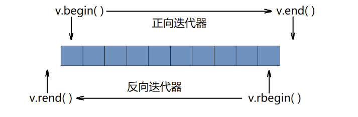

> [!NOTE]
>
> 关于Vector的底层原理和扩容请看C++基础的STL章

# vector构造

```c++
vector<int> v1; //构造int类型的空容器
```

```c++
vector<int> v2(10,2);//10个2
```

```c++
vector<int> v3(v2);
```

```c++
vector<int> v4(v2.begin(), v2.end());
```

```c++
string s("Hello World");
vector<char> v5(s.begin(), s.end());
```

# vector空间增长

```c++
cout << v.size() << endl; //获取当前容器中的有效元素个数
cout << v.capacity() << endl; //获取当前容器的最大容量
```

>  reserve和resize

通过reserse函数改变容器的最大容量，resize函数改变容器中的有效元素个数。

>  reserve规则：

 1、当所给值大于容器当前的capacity时，将capacity扩大到该值。
 2、当所给值小于容器当前的capacity时，什么也不做。

>  resize规则：

 1、当所给值大于容器当前的size时，将size扩大到该值，扩大的元素为第二个所给值，若未给出，则默认为0。

 2、当所给值小于容器当前的size时，将size缩小到该值。

> empty

```c++
vector<int> v;
cout << v.empty() << endl;//判断是否为空
```

# vector迭代器

> begin和end

通过begin函数可以得到容器中第一个元素的正向迭代器，通过end函数可以得到容器中最后一个元素的后一个位置的正向迭代器。

```c++
#include <iostream>
#include <vector>
using namespace std;

int main()
{
	vector<int> v(10, 2);
	//正向迭代器遍历容器
	vector<int>::iterator it = v.begin();
	while (it != v.end())
	{
		cout << *it << " ";
		it++;
	}
	cout << endl;
	return 0;
}
```

> rbegin和rend

通过rbegin函数可以得到容器中最后一个元素的反向迭代器，通过rend函数可以得到容器中第一个元素的前一个位置的反向迭代器

```c++
#include <iostream>
#include <vector>
using namespace std;

int main()
{
	vector<int> v(10, 2);
	//反向迭代器遍历容器
	vector<int>::reverse_iterator rit = v.rbegin();
	while (rit != v.rend())
	{
		cout << *rit << " ";
		rit++;
	}
	cout << endl;
	return 0;
}
```



# vector增删改查

> push_back和pop_back

push_back对容器尾插，pop_back对容器尾删

> insert和erase

```c++
#include <iostream>
#include <vector>
using namespace std;

int main()
{
	vector<int> v;
	v.push_back(1);
	v.push_back(2);
	v.push_back(3);
	v.push_back(4);
	v.insert(v.begin(), 0); //在容器开头插入0
	
	v.insert(v.begin(), 5, -1); //在容器开头插入5个-1

	v.erase(v.begin()); //删除容器中的第一个元素

	v.erase(v.begin(), v.begin() + 5); //删除在该迭代器区间内的元素（左闭右开）
	
	return 0;
}
```

> find函数

按值进行插入或删除元素

- find函数共三个参数，前两个参数确定一个迭代器区间（左闭右开），第三个参数确定所要寻找的值。

- find函数在所给迭代器区间寻找第一个匹配的元素，并返回它的迭代器，若未找到，则返回所给的第二个参数。

```c++
int main()
{
	vector<int> v;
	v.push_back(1);
	v.push_back(2);
	v.push_back(3);
	v.push_back(4);
	vector<int>::iterator pos = find(v.begin(), v.end(), 2); //获取值为2的元素的迭代器
	
	v.insert(pos, 10); //在2的位置插入10

	pos = find(v.begin(), v.end(), 3); //获取值为3的元素的迭代器
	
	v.erase(pos); //删除3

	return 0;
}
```

find函数是在算法模块（algorithm）当中实现的，不是vector的成员函数。

> swap

```c++
vector<int> v1(10, 1);
vector<int> v2(10, 2);

v1.swap(v2); //交换v1,v2的数据空间
```

> 元素访问

```c++
#include <iostream>
#include <vector>
using namespace std;

int main()
{
	vector<int> v(10, 1);
	//使用“下标+[]”的方式遍历容器
	for (size_t i = 0; i < v.size(); i++)
	{
		cout << v[i] << " ";
	}
	cout << endl;
	return 0;
}
```

```c++
#include <iostream>
#include <vector>
using namespace std;

int main()
{
	vector<int> v(10, 1);
	//范围for
	for (auto e : v)
	{
		cout << e << " ";
	}
	cout << endl;
	return 0;
}
```

# 迭代器失效问题

情况1：

```c++
#include <iostream>
#include <algorithm>
#include <vector>
using namespace std;

int main()
{
	vector<int> v;
	v.push_back(1);
	v.push_back(2);
	v.push_back(3);
	v.push_back(4);
	v.push_back(5);
	//v: 1 2 3 4 5
	vector<int>::iterator pos = find(v.begin(), v.end(), 2); //获取值为2的元素的迭代器
	v.insert(pos, 10); //在值为2的元素的位置插入10
	//v: 1 10 2 3 4 5
	v.erase(pos); //删除元素2 ？？？error（迭代器失效）
	//v: 1 2 3 4 5
	return 0;
}
```

情况2：

```c++
#include <iostream>
#include <vector>
using namespace std;

int main()
{
	vector<int> v;
	for (size_t i = 1; i <= 6; i++)
	{
		v.push_back(i);
	}
	vector<int>::iterator it = v.begin();
	while (it != v.end())
	{
		if (*it % 2 == 0) //删除容器当中的全部偶数
		{
			v.erase(it);
		}
		it++;
	}
	return 0;
}
```

这个情况当删除1 2 3 4 5 6时 删了6还会++ 导致迭代器最后是end()+1