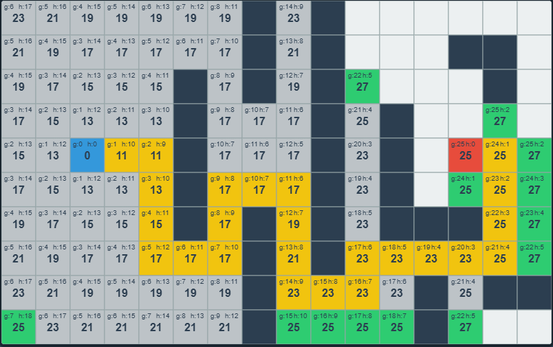

> [!NOTE]
>
> 寻路算法

# BFS

BFS 的核心是 **“先进先出” (FIFO)**。它逐层扫描，先访问距离起点为 1 的所有节点，再访问距离为 2 的，以此类推。

```c++
#include <iostream>
#include <vector>
#include <queue>

using namespace std;

// 邻接表定义：adj[u] 存储了所有从 u 指向的节点 v
void bfs(int startNode, const vector<vector<int>>& adj, int n) {
    vector<bool> visited(n + 1, false); // 标记是否访问过
    queue<int> q;

    // 1. 初始化起点
    visited[startNode] = true;
    q.push(startNode);

    while (!q.empty()) {
        // 2. 取出队首节点
        int u = q.front();
        q.pop();
        cout << u << " "; // 处理当前节点

        // 3. 遍历邻居
        for (int v : adj[u]) {
            if (!visited[v]) {
                visited[v] = true; // 发现邻居，立即标记并入队
                q.push(v);
            }
        }
    }
}
```

# DFS

DFS 的核心是 **“后进先出” (LIFO)**。它利用递归（系统栈）或显式栈，尽可能深地探索每一条路径。

```c++
#include <iostream>
#include <vector>

using namespace std;

// 访问记录需要放在全局或作为引用传递
void dfs(int u, const vector<vector<int>>& adj, vector<bool>& visited) {
    // 1. 标记当前节点已访问
    visited[u] = true;
    cout << u << " "; // 处理当前节点

    // 2. 递归访问每一个未被访问的邻居
    for (int v : adj[u]) {
        if (!visited[v]) {
            dfs(v, adj, visited);
        }
    }
}

// 调用示例
// vector<bool> visited(n + 1, false);
// dfs(startNode, adj, visited);
```

| **特性**       | **BFS (广度优先)**         | **DFS (深度优先)**           |
| -------------- | -------------------------- | ---------------------------- |
| **数据结构**   | **队列 (Queue)**           | **栈 (Stack) / 递归**        |
| **空间复杂度** | 较大（存储一层的所有节点） | 较小（存储当前路径上的节点） |
| **最短路径**   | **保证**找到无权图最短路   | 不保证，只保证连通性         |
| **行为模式**   | 向四周均匀扩散（像水波）   | 向纵深一条路走到黑（像钻头） |

迭代版DFS

```c++
#include <iostream>
#include <vector>
#include <stack>

using namespace std;

void dfs_iterative(int startNode, const vector<vector<int>>& adj, int n) {
    vector<bool> visited(n + 1, false);
    stack<int> s;

    // 1. 起点入栈
    s.push(startNode);

    while (!s.empty()) {
        // 2. 弹出最近加入的节点（后进先出）
        int u = s.top();
        s.pop();

        // 特别注意：在处理带有环的图时，出栈时再检查并标记访问
        if (visited[u]) continue;
        
        visited[u] = true;
        cout << u << " "; // 处理节点

        // 3. 将所有未访问的邻居压入栈中
        // 如果想保持和递归版完全一样的访问顺序，可以逆序压栈
        for (auto it = adj[u].rbegin(); it != adj[u].rend(); ++it) {
            int v = *it;
            if (!visited[v]) {
                s.push(v);
            }
        }
    }
}
```


> [!NOTE]
>
> 接下来来看寻路

| **算法**     | **方向感 (有无指南针)** | **考虑地形代价？** | **探索效率** | **适用场景**               |
| ------------ | ----------------------- | ------------------ | ------------ | -------------------------- |
| **BFS**      | 无 (盲目向四周扩散)     | 否                 | 低           | 简单的无权重网格、迷宫     |
| **Dijkstra** | 无 (贪图眼前最省力)     | 是                 | 中等         | 道路网络规划、图论最短路径 |
| **A\***      | 有 (直奔目标而去)       | 是                 | 极高         | 游戏AI寻路、自动驾驶导航   |

# Dijkstra算法

## 思想

迪杰斯特拉算法的核心思想是**贪心策略**：它每次都从当前已知的、离起点**最近**的那个路口出发，去探索它周围的邻居。一旦一个路口被选作“最近路口”并探索完毕，它到起点的最短距离就被**永久锁定**了（因为不可能有更短的路能绕过来）。

算法维护两个核心信息：

1. **距离表** ：记录从起点到每个节点目前的**已知最短距离**。初始时，除了起点为 $0$，其他所有节点都是 $\infty$（无穷大）。
2. **访问状态** ：记录哪些节点的最短距离已经被“永久锁定”。

算法不断重复一个叫做**松弛**的操作：

如果发现通过当前节点 $u$ 走到邻居节点 $v$ 的距离，比之前记录的 $v$ 的距离更短，就更新 $v$ 的距离表。数学表达为：

$$dist[v] = \min(dist[v], dist[u] + weight(u, v))$$

## 模拟

为了直观，我们构造一个包含 5 个路口（A, B, C, D, E）的微型网络。括号内的数字代表路段的代价。

- A 到 B (代价 2)
- A 到 C (代价 5)
- B 到 C (代价 1)
- B 到 D (代价 6)
- C 到 D (代价 2)
- C 到 E (代价 4)
- D 到 E (代价 1)

**起点：A，目标：求 A 到所有点的最短路径。**

**初始状态：**

距离表：`A:0, B:∞, C:∞, D:∞, E:∞`

锁定状态：`无`

- **第 1 步：**
  - 从未锁定的节点中挑出距离最小的：选 **A (0)**。锁定 A。
  - 探索 A 的邻居 (B 和 C)。
  - 通过 A 到 B：$0 + 2 = 2$。小于 $\infty$，更新 B。
  - 通过 A 到 C：$0 + 5 = 5$。小于 $\infty$，更新 C。
  - **当前距离表：`A:0, B:2, C:5, D:∞, E:∞`**
- **第 2 步：**
  - 从未锁定的节点中挑出距离最小的：选 **B (2)**。锁定 B。
  - 探索 B 的邻居 (C 和 D)。(A 已锁定，忽略)
  - 通过 B 到 C：$2 + 1 = 3$。发现 $3 < 5$（之前 A 直接到 C 是 5），**发生松弛**，更新 C 为 3。
  - 通过 B 到 D：$2 + 6 = 8$。小于 $\infty$，更新 D。
  - **当前距离表：`A:0, B:2, C:3, D:8, E:∞`**
- **第 3 步：**
  - 从未锁定的节点中挑出距离最小的：选 **C (3)**。锁定 C。
  - 探索 C 的邻居 (D 和 E)。
  - 通过 C 到 D：$3 + 2 = 5$。发现 $5 < 8$，**发生松弛**，更新 D 为 5。
  - 通过 C 到 E：$3 + 4 = 7$。小于 $\infty$，更新 E。
  - **当前距离表：`A:0, B:2, C:3, D:5, E:7`**
- **第 4 步：**
  - 从未锁定的节点中挑出距离最小的：选 **D (5)**。锁定 D。
  - 探索 D 的邻居 (E)。
  - 通过 D 到 E：$5 + 1 = 6$。发现 $6 < 7$，**发生松弛**，更新 E 为 6。
  - **当前距离表：`A:0, B:2, C:3, D:5, E:6`**
- **第 5 步：**
  - 只剩 E，选 **E (6)**，锁定 E。没有未锁定的邻居。结束。

**最终结果：** A 到 E 的最短距离是 6（路径是 A -> B -> C -> D -> E）。

## 代码实现

```c++
#include <iostream>
#include <vector>
#include <queue>
#include <climits> // 使用 INT_MAX

using namespace std;

// 1. 定义边结构
struct Edge {
    int to;     // 目标节点
    int weight; // 边权（代价）
};

// 2. 定义优先队列中的元素
struct Node {
    int id;   // 节点编号
    int dist; // 从起点到该节点的当前已知最短距离

    // 优先队列默认为大顶堆，我们需要重载比较运算符，使其变成小顶堆
    bool operator>(const Node& other) const {
        return dist > other.dist;
    }
};

/**
 * Dijkstra 算法实现
 * @param start 起点
 * @param n 节点总数
 * @param adj 邻接表
 * @return 存储所有节点最短路径的 vector
 */
vector<int> dijkstra(int start, int n, const vector<vector<Edge>>& adj) {
    // 初始化距离为无穷大
    vector<int> dist(n + 1, INT_MAX); 
    dist[start] = 0;

    // 优先队列：小顶堆
    priority_queue<Node, vector<Node>, greater<Node>> pq;
    pq.push({start, 0});

    // 记录节点是否已访问（确定了最短路径）
    vector<bool> visited(n + 1, false);

    while (!pq.empty()) {
        // 取出当前距离起点最近且未锁定的节点
        int u = pq.top().id;
        pq.pop();

        // 关键：如果已经处理过这个节点，直接跳过
        if (visited[u]) continue;
        visited[u] = true;

        // 遍历当前节点的所有邻居
        for (const auto& edge : adj[u]) {
            int v = edge.to;
            int w = edge.weight;

            // 松弛操作 (Relaxation)
            if (dist[u] != INT_MAX && dist[u] + w < dist[v]) {
                dist[v] = dist[u] + w;
                pq.push({v, dist[v]});
            }
        }
    }
    return dist;
}
```

如果不仅想知道距离，还想知道具体走法，还需要一个`pre`数组

```c++
vector<int> pre(n + 1, -1); // 记录每个节点的前驱

// 在松弛操作中更新
if (dist[u] + w < dist[v]) {
    dist[v] = dist[u] + w;
    pre[v] = u; // 记录 v 是从 u 走过来的
    pq.push({v, dist[v]});
}

// 结束后通过 pre 数组回溯即可得到完整路径
```

为什么用 `priority_queue`？

如果不使用优先队列，你每次都需要遍历整个 `dist` 数组去寻找那个距离最短的节点，复杂度会退化到 $O(V^2)$。优先队列利用了**二叉堆**的数据结构，让你能以 $O(\log V)$ 的代价快速取出当前的“最优选择”。

`if (visited[u]) continue;` 为什么重要？

在 Dijkstra 的执行过程中，一个节点可能会被多次放入优先队列（因为发现了一条更短的路）。

- 堆顶永远是当前最短的。
- 当你处理完堆顶的节点 `u` 后，队列里可能还残留着旧的、距离更长的 `u`。
- 这一行判断能确保每个节点只被“扩展”一次邻居，是保证 $O(E \log V)$ 复杂度的关键。

这里的 `n + 1`

在处理算法题时，节点编号通常是从 `1` 到 `N`。所以初始化数组大小时使用 `n + 1` 可以避免下标越界的麻烦，让你直接用 `adj[1]` 表示 1 号节点。

# A*算法

## 思想

 **A* 的核心理念：带有目标感的 Dijkstra**

在 Dijkstra 算法中，我们总是选择**离起点最近**的节点进行扩展。这就像一个在黑暗中寻找出口的人，只能靠摸索，四面八方去试探，直到偶然碰到出口。这种方式在游戏地图中极其浪费性能，因为它在朝着反方向的死胡同里也花费了同样的计算力。

A* 算法的理念是：**既然我们知道终点在哪里，为什么不优先向着终点的方向探索呢？**

为了实现这种“目标感”，A* 引入了一个极其优雅的启发式评估公式：

$$f(n) = g(n) + h(n)$$

- **$n$**：当前正在评估的节点。
- **$g(n)$**：**实际代价**。从起点走到节点 $n$ 已经花费的确定代价。（这部分和 Dijkstra 算法里记录的 `dist` 完全一样）。
- **$h(n)$**：**启发代价**。算法的“眼睛”。它是预估从节点 $n$ 走到终点还需要多少代价。
- **$f(n)$**：**综合评估代价**。A* 算法每次都会从已知的节点中，挑选 $f(n)$ 值**最小**的节点来优先探索。

## 启发函数

 $h(n)$ 就像是一个指南针。它的设计决定了 A* 算法的性格：是偏向于极速但可能绕点远路，还是稳扎稳打保证绝对最短？

在网格地图中，我们最常用两种 $h(n)$ 计算方式：

### 1. 曼哈顿距离 (Manhattan Distance)

如果你在一个只能上下左右移动的方块世界里（不能斜着走），两点之间的预估距离就是它们在 X 轴和 Y 轴上的绝对差值之和。

$$h(n) = |x_n - x_{goal}| + |y_n - y_{goal}|$$

**特点：** 计算极快，且在没有斜向移动的网格中，它能保证找到绝对最短的路径。

### 2. 欧几里得距离 (Euclidean Distance)

也就是两点之间的直线距离。如果你的角色可以不受网格限制向任意角度移动，或者可以斜向移动，通常使用这个。

$$h(n) = \sqrt{(x_n - x_{goal})^2 + (y_n - y_{goal})^2}$$

**特点：** 物理意义上的真实距离，但在带有障碍物的网格中，计算包含开平方，相对耗时。

> **A\* 的黄金法则：** 你的 $h(n)$ 预估值，**绝对不能大于**实际走到终点的真实代价。一旦预估偏高，A* 就可能会错过最优解。只要 $h(n) \le$ 真实代价，A* 就一定能找到最短路径。

## 运行原理

**Open List（开放列表）：** 记录了所有被考虑探索，但还没有作为当前节点展开的格子。通常用优先队列（小顶堆）实现，按 $f(n)$ 值从小到大排序。

**Closed List（关闭列表）：** 记录了所有已经探索过其周围邻居的格子。被放入这里的格子，不需要再次被探索。（相当于 Dijkstra 里的 `visited` 数组）。

**算法主循环：**

1. 把起点加入 Open List。
2. 只要 Open List 不为空，重复以下步骤：
   - **取出最优：** 从 Open List 中弹出 $f(n)$ 最小的节点，设为当前节点 `current`。
   - **到达终点：** 如果 `current` 是终点，寻路成功！通过每个节点记录的父节点指针回溯，即可得到路径。
   - **加入关闭：** 将 `current` 放入 Closed List。
   - **扩展邻居：** 遍历 `current` 周围的相邻节点（比如上下左右 4 个格子）：
     - 如果邻居是障碍物，或者已经在 Closed List 中，**忽略它**。
     - 计算从起点经过 `current` 走到该邻居的新的 $g$ 值：`new_g = current.g + 移动代价`。
     - 如果邻居**不在** Open List 中：计算它的 $h$ 和 $f$，记录其父节点为 `current`，并加入 Open List。
     - 如果邻居**已经**在 Open List 中：比较 `new_g` 和它原来的 $g$ 值。如果 `new_g` 更小，说明我们找到了一条到达该邻居更近的路！更新它的 $g$、$f$ 值，并把它的父节点重新指向 `current`。（这其实就是 Dijkstra 里的松弛操作）。

如果你把 $h(n)$ 强制设为 $0$（即完全没有目标感），A* 的公式就变成了 $f(n) = g(n)$，此时它就**完全退化成了 Dijkstra 算法**。

因此，A* 算法本质上是在 Dijkstra 的“确保最短路径”和贪婪最佳优先搜索的“极速直奔目标”之间，通过 $h(n)$ 找到了一个完美的平衡点。



## 代码

```c++
struct Node {
    int x, y;
    int g, h, f;
    Node* parent;
    
    // 优先队列的小顶堆比较逻辑
    bool operator>(const Node& other) const {
        return f > other.f; 
    }
};

// A* 核心函数简述
void AStar(Point start, Point end) {
    priority_queue<Node, vector<Node>, greater<Node>> openList;
    
    // 初始节点
    Node* startNode = new Node(start.x, start.y, 0, calculateH(start, end));
    openList.push(*startNode);
    
    while(!openList.empty()) {
        Node current = openList.top();
        openList.pop();
        
        if (isEnd(current)) {
            // 找到终点，回溯路径...
            return;
        }
        
        // 标记为已处理 (Closed List)
        closed[current.x][current.y] = true;
        
        for (auto neighbor : getNeighbors(current)) {
            if (isWall(neighbor) || closed[neighbor.x][neighbor.y]) continue;
            
            int newG = current.g + 1;
            
            // 如果邻居不在 OpenList 或者找到了更短的 g
            if (newG < neighbor.g || !inOpenList(neighbor)) {
                neighbor.g = newG;
                neighbor.h = calculateH(neighbor, end);
                neighbor.f = neighbor.g + neighbor.h;
                neighbor.parent = &current; // 实际开发需注意内存管理
                
                if (!inOpenList(neighbor)) {
                    openList.push(neighbor);
                }
            }
        }
    }
}
```

## 与BFS关系

A* 像“水波荡漾”，这抓住了**广度优先搜索 (BFS)** 的物理特性；而 A* 实际上就是给这股水波安装了一个“引力场”，让它向着终点坍缩。

从算法演进的角度看，你的直觉可以总结为这样一个公式：

> **A\* = 带有优先级的 BFS + 启发式引导**

### 为什么它像 BFS？

在数据结构层面，BFS 使用的是**普通队列 (Queue)**，遵循“先来后到”，所以它像圆形的水波一样均匀扩散。

而 A* 使用的是**优先队列 (Priority Queue)**。它不再按照发现节点的先后顺序扩张，而是按照 $f(n)$ 从小到大扩张。

如果我们将 $h(n)$（预估距离）设为 0，A* 的 $f(n)$ 就只剩下 $g(n)$（实际走过的步数）。这时候，它表现出来的行为就和 BFS **完全一模一样**。

# 时间复杂度对比

| **算法**     | **核心数据结构**    | **时间复杂度**     | **空间复杂度** | **适用场景与最短路保证**                                     |
| ------------ | ------------------- | ------------------ | -------------- | ------------------------------------------------------------ |
| **BFS**      | 队列 (Queue)        | $O(V + E)$         | $O(V)$         | **无权图**最短路。水波式平铺扩散。                           |
| **DFS**      | 栈 (Stack) / 递归   | $O(V + E)$         | $O(V)$ (最坏)  | **不保证**最短路。适合连通性检测、拓扑排序、走迷宫找所有解。 |
| **Dijkstra** | 优先队列 (Min-Heap) | $O(E \log V)$      | $O(V)$         | **正权图**最短路。精打细算，但盲目向四周探索。               |
| **A\***      | 优先队列 + 启发函数 | 最坏 $O(E \log V)$ | $O(V)$         | **带启发信息的图**最优路。极速直奔目标。                     |

**DFS**：无法处理带有不同地形代价（权重）的图。DFS判断无向图的环很容易，但是判断有向图需要三色标记法。

**BFS**： 找到的路径通常非常绕远，完全不能用来做正常的“最短寻路”。在层级极深的图中，递归版容易引发栈溢出。

**Dijkstra**：能完美处理**各种正数权重**的复杂地形。只要图里没有负数权重的边，它保证能找到从起点到其他**所有节点**的绝对最短路径。

但是它是一个全图算法。即使你只想从北京去天津，它也会顺便把北京去拉萨的最短路径算出来一部分，在反方向上浪费大量算力。

**A***：如果 $h(n)$ 设计得不好（比如过高估计了距离），算法就会退化甚至找不到最短路；如果设计得太弱，算法就退化成了 Dijkstra。

# 拓扑排序


# 