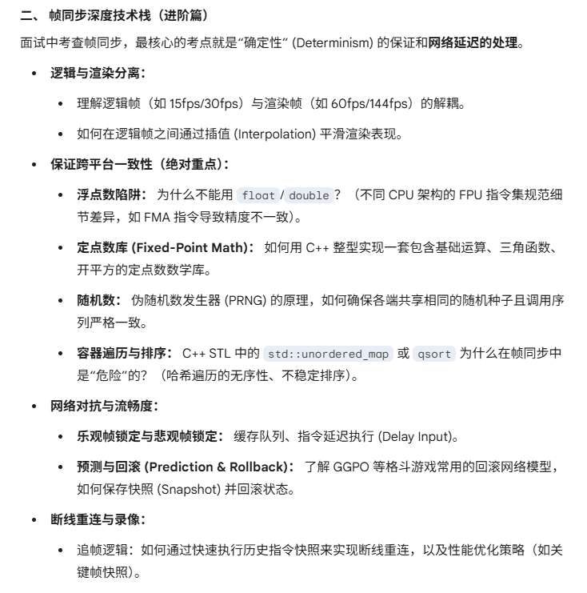
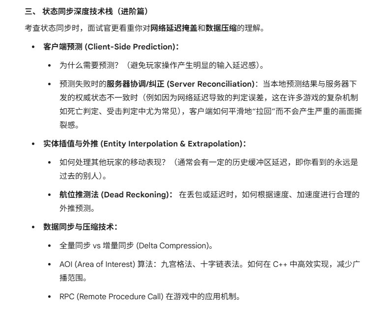

# 帧同步

## 确定性计算基础

禁用浮点数

避免非确定性函数

使用确定性容器与算法

随机数

容器遍历与排序

## 逻辑与渲染分离

逻辑层与表现层分离

帧同步核心模型

逻辑帧插值

## 网络对抗与延迟处理

乐观帧锁定与悲观帧锁定

输入延迟

时间轴同步：加速循环/暂停循环

回滚与预测：状态快照：增量快照

# 状态同步

## 延迟掩盖

客户端预测

服务器协调

延迟补偿

### 表现平滑策略

实体插值

状态同步服务器算例成本高，手感不行